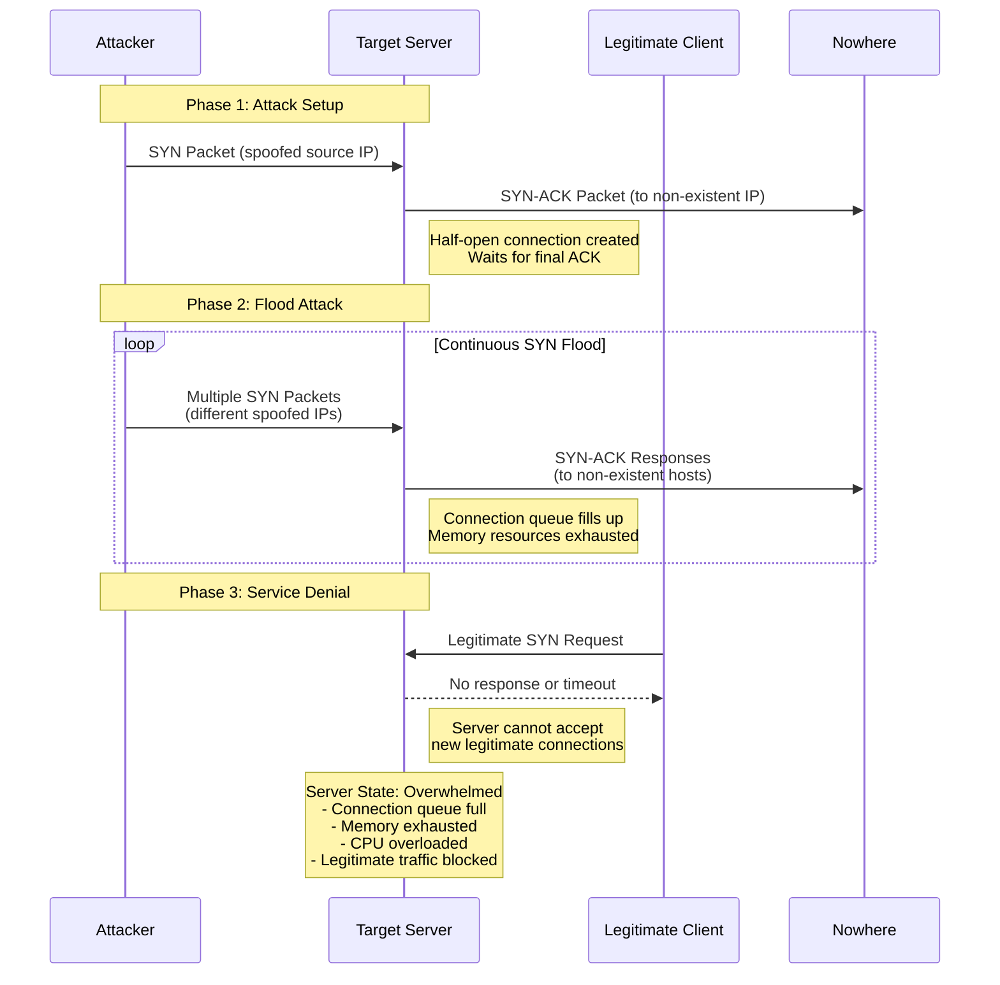
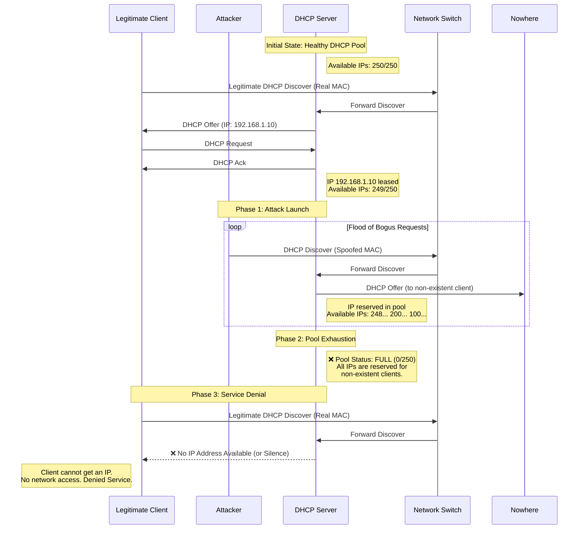
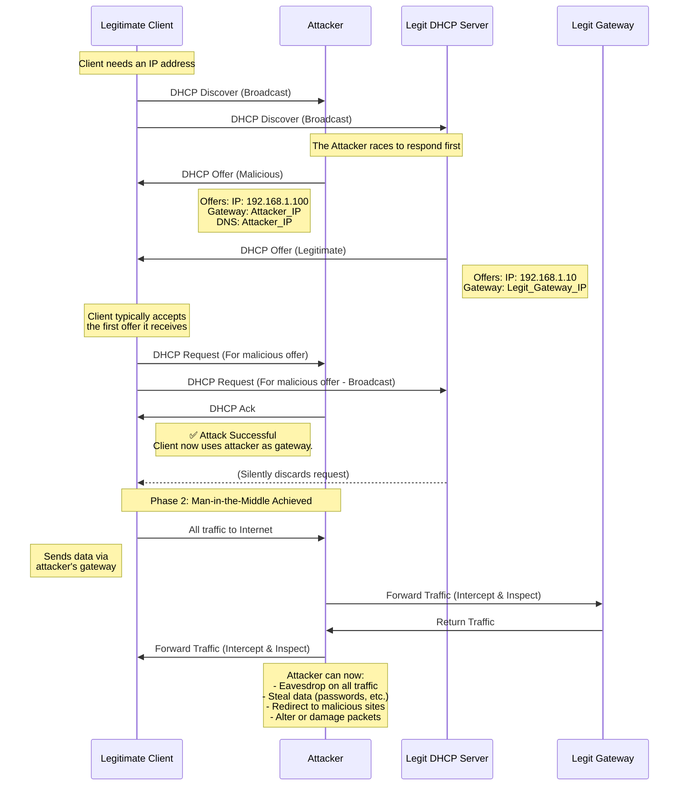

# Common cyber attacks

## Learning objectives

* Become familiar with common cyber attacks
* Become familiar with common malware types

This section looks at common cyber attacks (reconnaissance, social engineering, password attacks, DoS, reflection and amplification, MITM, and spoofing) and malware types (viruses, worms, and ransomware).

## Topics covered in this section

* **Common cyber attacks**
  * **Reconnaissance**
  * **Social engineering**
  * **Password attacks**
  * **Denial of service (DoS)**
  * **Reflection and amplification**
  * **Man in the middle (MITM)**
  * **Spoofing attacks**
* **Malware types**
  * **Viruses and worms**
  * **Ransomeware**

### Common cyber attacks

Attack types are threats which can potentially exploit vulnerabilities to compromise the CIA of an enterprise’s information assets and network system. This discussion explores how attackers can threaten the CIA of enterprise systems and information by looking at the following common types of attacks: Reconnaissance, social engineering, password attacks, denial of service (DoS), reflection and amplification, MITM, and spoofing attacks. There are many more potential attacks than these, but these are some of the main attack categories.

#### Reconnaissance

Reconnaissance “attacks” are used to gather information about a target. The information gathered in this initial stage is often publicly available information and can be used to launch a targeted social engineering attack.

You can perform an NSLOOKUP to learn the IP address of a site. From there, you can probe for open ports which are potential vulnerabilities. You could also perform a WHOIS query to learn email addresses, phone numbers, physical addresses, etc. at this website: https://lookup.icann.org/en.

#### Social engineering

Social engineering attacks do not directly exploit a company’s IT systems, instead they exploit the employees. No matter how many security features you configure on your routers, switches, firewalls, servers, PCs, etc., people are always a vulnerability that can be exploited.

Social engineering attacks involve psychological manipulation to make the target reveal confidential information or perform some action the attacker wants the target to do. As with the previous attack types, there are various kinds of social engineering attacks. Here are a few common ones.

\*Phishing involves fraudulent emails that appear to come from a legitimate business, such as your bank or your credit card company. These emails contain links to a fraudulent website that seems legitimate. The website may look identical to the real login page of your bank’s website, for example. Users are told to login to the fake website, therefore providing their login credentials to the attacker.

Spear phishing is a type of phishing that is more targeted. This can take the form of personalized emails sent to employees of a specific company.

Whaling is another kind of phishing targeted at high-profile individuals, for example a company president.

Vishing, voice phishing, is phishing performed over the phone. The attacker could pretend to be from the target’s bank or from the IT department in the company. For example, an attacker may impersonate an IT department employee who says they need to know the password to reset it.

Mishing, SMS phishing, which is phishing performed using SMS text messages to the target’s cell phone.

\*Watering hole attacks compromise sites that the target victim frequently visits. If a malicious link is placed on a website the target trusts, they might not hesitate to click it. So, this kind of attack is taking advantage of the user’s trust in the website they frequently visit.

\*Tailgating attacks involve entering restricted, secure areas by simply walking in behind an authorized person as they enter. Any company that has restricted areas will have rules against this, but often the target will hold the door open for the attacker to be polite, assuming the attacker is also authorized to enter.

#### Password attacks

Most systems use a username and password combination to authenticate users. The username itself is often simple and easy to guess, for example the user’s email address. So, often, the strength and secrecy of the password is relied on to provide the necessary security.

However, attackers can learn a user’s password through multiple methods. They could guess the password. A dictionary attack can also be used, in which a program runs through a dictionary, which is a list of common words and passwords, to guess the target’s password. The program tries each word, hoping to find the correct password.

A brute force attack involves trying every possible combination of letters, numbers, and special characters to find the target’s password. This requires a very powerful computer, and if the password is sufficiently strong, the chances of it working are very low, because it takes so much time.

A strong password should contain at least 8 characters, preferably more than 8. The more characters, the harder it is to brute force attack the password. A strong password should have a mix of uppercase and lowercase letters and a mix of letters and numbers. It should also have one or more special characters such as question marks, exclamation points, etc. Finally it should be changed regularly.

Most enterprises will enforce rules like these on their employees, but it’s also recommended that you follow rules like these when making your own personal passwords.

#### Denial of service (DoS)

There are many types of DoS attacks, such as TCP SYN flood, DHCP exhaustion attack, UDP flood, HTTP flood, and Ping of death. DoS and DDoS attacks threaten the availability of information systems. A prime mitigation method for DoS attacks is network segmentation.

**TCP SYN flood**

The TCP SYN flood is a common type of DoS attack (often directed against ISPs) which exploits the TCP three-way handshake process used by TCP connections. The attacker likely spoofs their IP address, meaning the attacker uses a fake IP address, making this a spoofing attack. By spoofing the source IP address in the SYN, the malicious client causes the server to send the SYN-ACK to a falsified IP address – which will not send an ACK because it knows that it never sent a SYN. Or the malicious client can simply not send the expected ACK.

The three-way handshake is SYN, SYN-ACK, and ACK. The attacker sends a large number of SYN packets to a target server. The target server sends a SYN-ACK message in response to each SYN it receives. But the attacker never replies with the final ACK of the handshake.

The target waits for the final ACK of each handshake, and the incomplete connections fill up the target’s TCP connection table. The incomplete connections will timeout and be removed from the table after a certain period of time, but the attacker continues sending SYN messages. This exhausts the server’s resources and prevents legitimate users from accessing it.

In the end, the target is no longer able to make legitimate TCP connections because it has reached the maximum number of TCP connections it can maintain.

For each SYN message the attacker sends, the target puts an entry in its TCP connection table and sends a SYN-ACK message, then waits for an ACK to complete the connection. But the ACK never comes. The attacker keeps sending SYN messages, and the target keeps sending SYN-ACK messages. Then the target’s TCP connection table fills up, and the denial-of-service has been achieved.

A much more powerful version of this attack type is the DDoS. In a distributed denial-of-service attack, the attacker infects many target computers with malware and uses the computers to initiate a denial-of-service attack such as a TCP SYN flood attack. The group of infected computers is called a botnet. The PCs infected with malware together start flooding the target with TCP SYN messages, so the target server is no longer able to respond to legitimate TCP connection requests.&#x20;

For mitigation of TCP SYN flood attacks, you would need methods that focus on managing the connection setup process itself. A layered approach combining these methods is most effective in mitigating TCP SYN flood attacks. Here are some common mitigation methods:

1. Rate limiting: This limits the number of incoming SYN requests to a manageable rate, preventing the attacker from overwhelming your system.
2. SYN cookies: This is a technique where the server generates a temporary challenge instead of allocating resources for a full connection handshake in case of a suspected SYN flood.
3. Firewalls and Intrusion Prevention Systems (IPS): These can be configured to identify and block suspicious SYN flood traffic patterns.

**DHCP exhaustion attack**

DHCP exhaustion attack, also known as a DHCP starvation attack, is similar to the TCP SYN flood attack. An attacker uses spoofed MAC addresses to flood a DHCP server with DHCP Discover messages. Attackers send DHCP Discover messages with fake source MAC addresses at a very quick pace. The server will reply to each Discover with a DHCP Offer message, and while it is offering an IP address it will not assign that address to other devices. The target server’s DHCP pool becomes full, resulting in a denial-of-service to other devices which are no longer able to get an IP address. Mitigation: DHCP snooping, Switch Port Security.

So if some PCs send DHCP Discover messages to get IP addresses, the server is not able to give them their IP addresses because its DHCP pool is full. Maybe it had 250 IP addresses to lease to clients, but they are all taken by the attacker.

The goal of a DHCP starvation attack is to overwhelm the DHCP server with a flood of bogus DHCP requests, exhausting the pool of available IP addresses. This prevents legitimate clients from obtaining an IP address and essentially denies them access to the network.

DHCP snooping helps mitigate DoS attacks by limiting the rate of DHCP messages and filtering out suspicious traffic (DHCP messages received on an untrusted port, as normally sent by a DHCP client, may be filtered if they appear to be part of an attack). This makes it more difficult for attackers to flood the server and disrupt network operations.

**UDP flooding**

In a direct UDP flooding attack, the **attacker directly targets a victim’s server or host** by flooding it with a high volume of UDP packets. Since UDP is connectionless, the target must process each incoming packet, consuming bandwidth, CPU, and memory. Attackers often **spoof the source IP address** to hide their identity and make mitigation harder. The goal is to exhaust the victim’s resources, causing slowdowns or a complete denial of service (DoS). Mitigation strategies include rate limiting UDP traffic, deploying firewalls to filter malicious packets, and using intrusion detection/prevention systems (IDS/IPS) to identify and block suspicious activity. Cloud-based DDoS protection services can also help absorb and disperse the attack traffic before it reaches the target.

In a UDP Reflection/Amplification attack, the **attacker does not target the victim directly**. Instead, they send small, spoofed UDP requests (e.g., DNS or NTP queries) to publicly accessible servers, **forging the victim’s IP as the source**. These servers then respond with much larger replies, reflecting and amplifying the attack traffic toward the victim. The attacker leverages misconfigured servers as unwitting "proxies" to multiply the attack’s impact, potentially achieving 10x–100x amplification with minimal effort. Mitigation strategies include disabling open DNS/NTP resolvers, implementing source IP validation, and using cloud-based scrubbing.

**HTTP flooding**

A layer 7 DoS attack where bots send massive HTTP requests (GET/POST) to a web server, exhausting its resources. Unlike brute-force attacks, these requests look like legitimate traffic, making them harder to block.

**Ping of death**

A layer 3 DoS attack where an attacker sends oversized or malformed ICMP ping packets to a target host, crashing systems that fail to handle them properly. Modern systems now block such packets, but legacy devices may still be vulnerable.

#### Reflection and amplification

In a reflection attack, the attacker sends traffic to a reflector such as a DNS server and spoofs the source address of the sent packets using the target’s IP address. Then the reflector sends the reply to the target’s IP address. If the amount of traffic is large enough this can result in a DoS to the target.

There is a more powerful variant of the reflection attack called an amplification attack. A reflection attack becomes an amplification attack when the amount of traffic sent by the attacker is small, but it triggers a large amount of traffic to be sent from the reflector to the target. This triggers a denial of service. For example, there are DNS and NTP vulnerabilities which can be exploited for such amplification attacks.

#### Man in the middle (MITM)&#x20;

**DHCP poisoning**

In a DHCP poisoning attack a malicious device impersonates a legitimate DHCP server and offers IP addresses to clients. The spurious DHCP server leases a useful IP address to the target device, in the correct subnet, with the correct mask, but assigns its own IP address as the default gateway. Once a client accepts the attacker's offer, their communication gets routed through the attacker's device, allowing them to potentially eavesdrop on traffic, steal data, redirect the user to malicious websites, or tamper with (damage) or alter the captured traffic. Mitigation: DHCP snooping.

DHCP snooping is a security feature that helps prevent MITM attacks by identifying and discarding unauthorized DHCP messages, thereby stopping the attacker from establishing themselves as a fake server. DHCP snooping helps to prevent unauthorized DHCP servers from providing IP addresses to devices on a network. It does this by classifying ports on a switch as either trusted or untrusted. Untrusted ports are only allowed to forward DHCP discover messages.

A DHCP server can only send DHCP offers and acknowledgements to ports that are trusted. If a DHCP server tries to send a DHCP offer or acknowledgement to an untrusted port, the switch will drop the packet. This helps to prevent unauthorized DHCP servers from providing IP addresses to devices on the network.

A further illustration of the DHCP poisoning attack (also covering DHCP snooping configuration and verification): [A spurious DHCP server and a malicious MITM](https://itnetworkingskills.wordpress.com/2023/05/14/dhcp-snooping-configuration-verification/)

**ARP spoofing**

ARP spoofing, also known as ARP poisoning, is a MITM attack that allows attackers to intercept communication between network devices. In this kind of attack the attacker places himself between the source and destination to eavesdrop on communications or to modify traffic before it reaches the destination. Mitigation: Dynamic ARP Inspection (DAI).

The attacker sends fake ARP replies (gratuitous ARP) to associate their own MAC address with someone else’s IP address (e.g., the gateway’s IP). The attacker spoofs the source IP address of the target device as their own (impersonates a legitimate IP address). This tricks other devices into sending traffic intended for the victim’s IP to the attacker’s MAC instead.

In an ARP spoofing attack, a host sends an ARP request asking for the MAC address of another device. PC1 is asking for the MAC address of host 10.0.0.1, which is SRV1. Because ARP request messages are broadcast, the switch floods the frame, so both SRV1 and the attacker receive it. SRV1 sends an ARP reply to PC1.

<figure><figcaption>
Image courtesy of Jeremy’s IT Lab (Free CCNA | Security Fundamentals | Day 48)
</figcaption></figure>

The attacker waits briefly and then sends another ARP reply (called **gratuitous ARP**) after the legitimate reply. If the attacker’s ARP reply arrives last, it will overwrite the legitimate ARP entry in PC1’s ARP table.&#x20;

Now in PC1’s ARP table, the entry for 10.0.0.1 will have the attacker’s MAC address, not the MAC address of the real 10.0.0.1, SRV1. So when PC1 tries to send traffic to SRV1, traffic will be forwarded to the attacker instead. Then, the attacker can inspect the messages, read their contents and then forward them to SRV1. Or the attacker can modify the messages before forwarding them to SRV1.

DAI (Dynamic ARP Inspection) validates ARP packets by checking them against a trusted DHCP snooping binding table or a manually configured ARP ACL. DAI ensures that the IP-to-MAC mappings in ARP replies are correct, stopping attackers from spoofing another host's IP address (a key technique in ARP poisoning attacks).

Since DAI verifies that an ARP reply matches a legitimate IP-MAC binding, it prevents a malicious host from falsely claiming a MAC address that does not belong to it (thus indirectly helping to prevent MAC spoofing).

Man in the middle attacks < CCNA security fundamentals\
[https://itnetworkingskills.wordpress.com/2023/05/06/ccna-security-fundamentals/](https://itnetworkingskills.wordpress.com/2023/05/06/ccna-security-fundamentals/)

DAI configuration and verification\
[https://itnetworkingskills.wordpress.com/2023/05/16/dynamic-arp-inspection-configuration-and-verification/](https://itnetworkingskills.wordpress.com/2023/05/16/dynamic-arp-inspection-configuration-and-verification/)

#### Spoofing attacks

To spoof an address is to use a fake source address, for example a fake IP or MAC address. There are various types of spoofing attacks:&#x20;

* Denial-of-Service (DoS)
* Reflection and Amplification&#x20;
* Man-in-the-Middle&#x20;

Each of the following spoofing attack types involves either IP spoofing or MAC spoofing as a mechanism of action.

#### Spoofing Attacks Summary Table

| Spoofing Attack Type                       | Primary Spoofing Method | Mitigation                                           | Explanation                                                                                                                                                               |
| ------------------------------------------ | ----------------------- | ---------------------------------------------------- | ------------------------------------------------------------------------------------------------------------------------------------------------------------------------- |
| TCP SYN Flood (DoS)                        | **IP Spoofing**         | Filtering with ACLs, TCP SYN cookies, IPS/IDS        | The attacker uses a spoofed source IP to hide their identity and overwhelm the target with connection requests, making the attack difficult to trace.                     |
| DHCP Exhaustion Attack (DoS)               | **MAC Spoofing**        | DHCP Snooping, Port Security                         | The attacker spoofs many different MAC addresses to request all available IP addresses from a DHCP server, exhausting the pool and denying service to legitimate clients. |
| Reflection and Amplification Attacks (DoS) | **IP Spoofing**         | Anti-spoofing ACLs, BCP38 (network egress filtering) | The attacker spoofs the victim's IP address as the source. This causes reflection servers to send large responses to the victim, amplifying the attack traffic.           |
| ARP Spoofing (MITM)                        | **IP Spoofing**         | Dynamic ARP Inspection (DAI)                         | The attacker sends gratuitous ARP replies to link their MAC address to the IP address of a legitimate host, intercepting traffic.                                         |
| DHCP Poisoning (MITM)                      | **IP Spoofing**         | DHCP Snooping                                        | The attacker spoofs a legitimate DHCP server to provide clients malicious DHCP responses to redirect traffic for a MITM attack.                                           |

**Clarification:**

Man-in-the-Middle attacks like ARP Spoofing and DHCP Poisoning are a prime example of how MAC spoofing and IP spoofing can be used in conjunction.

### Malware types

Malware, malicious software, refers to a variety of harmful programs that can infect a computer. There are many types of malware. Here are a few types.

\*Viruses are malware that infects other software, called a host program. The virus spreads as the software is shared by users or downloaded from malicious websites. Once the virus has infected a device it can corrupt or modify files on the target computer.

\*Worms are different from viruses in that they don’t require a host program. They are standalone malware and are also able to spread on their own, without user interaction. The spread of worms from device to device can congest the network, but in addition to that if the worm has a payload, other malicious code within the worm, it can cause additional harm to target devices.

\*A Trojan horse is harmful software disguised as legitimate software. Trojan horses spread through user interaction such as opening email attachments or downloading a file from the Internet.

These types of malware are defined by how the malware infects a system and how it spreads, not the attacks they carry out after infecting the system.

### Key takeaways

* Common cyber attacks include social engineering, password, and spoofing attacks
* Common malware types include viruses, worms, and ransomeware

### References

Odom, W. (2020). CCNA 200-301 Official Cert Guide, Volume 2. Cisco Press.

Odom, W. (2020). Chapter 4. Security Architectures, CCNA 200-301 Official Cert Guide (pp. 68-85), Volume 2. Cisco Press.
