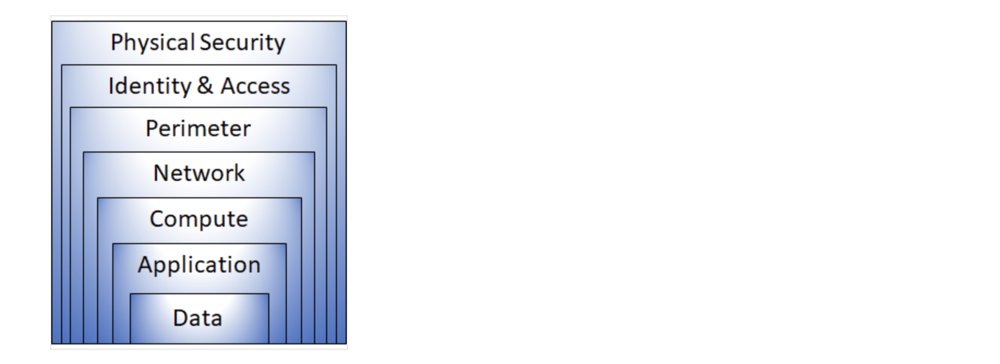
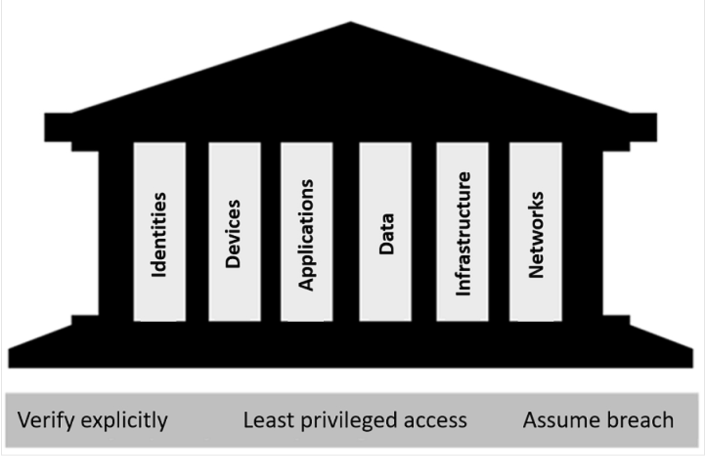

# Network security risk mitigation best practices

## Learning objectives

* List and describe network security risk mitigation best practices
* Develop an appreciation for the need for a defense in depth approach to cybersecurity
* Describe the three principles and six foundational pillars of the Zero Trust model
* Explain the principle of least privilege and its role in mitigating insider threats and limiting attack surfaces
- Describe the complementary roles of IAM (Identity & Access Management) and NAC (Network Access Control) in ensuring robust enterprise access management
- Differentiate the function of AAA (Authentication, Authorization, and Accounting) as the operational framework within IAM for network-level enforcement
* Compare the goals and techniques of IDS/IPS and NTA (Network Traffic Analysis)
* Outline the four phases of the NIST SP 800-61r2 incident response lifecycle and describe the key activities in each phase
* Describe the role of automation in ensuring consistent and compliant patch management processes
- Identify key physical security controls used to protect network infrastructure from unauthorized access and environmental threats

This section discusses network security risk mitigation best practices, beginning with the foundational strategies of defense in depth and the Zero Trust model. The section then examines core technical controls, including robust access control (least privilege, Identity and Access Management, automated policy enforcement, and Multi-Factor Authentication) and network security monitoring. The discussion continues by covering the essential processes of incident response management, timely software patching, and physically securing the network, before concluding with the supporting practices of using multiple vendors and Quality Assurance.

## Topics covered in this section

* **Defense in depth (layered security)**
* **The Zero Trust model**
* **Robust access control**
* **Network security monitoring**
* **Network Traffic Analysis (NTA)**
* **Incident response management**
* **Timely software patching**
* **Physically securing the network**
* **Using multiple vendors**
* **Quality Assurance**

### Defense in depth (layered security)

The terms defense in depth and layered security are often used interchangeably to describe a multi-layered security architecture. However, it's useful to think of them as two sides of the same coin: defense in depth is the overarching strategy, while layered security represents the practical implementation of that strategy through a combination of procedural, technological, and physical controls.

The core idea behind defense in depth is that no single security control is perfect. A firewall can be misconfigured, an IDS can miss a novel attack, and a user can fall for a phishing email. A defense-in-depth strategy acknowledges this reality and builds resilience by creating multiple, overlapping layers of protection. If one layer fails or is bypassed, the next layer is already in place to stop the attack, slowing its progress and providing defenders with more time to detect and respond. This approach transforms security from a single barrier into a series of interconnected hurdles for an attacker.

A layered security architecture implements controls across multiple security domains. These domains can be visualized as a stack of defensive layers, starting from the physical infrastructure and moving up to the data itself. A practical layered security architecture can be comprised of the following layers:

<figure><figcaption>
Defense in depth model (courtesy of learn.microsoft.com)
</figcaption></figure>

* **Physical layer:** This is the foundation of security. It involves protecting the physical assets that house your data and systems. Controls here include limiting access to data centers and network closets to only authorized personnel, using security badges, biometrics, mantraps, and 24/7 surveillance. If an attacker cannot physically touch a server, many attack vectors are immediately neutralized.
* **Identity and access layer:** This layer focuses on ensuring that only the right people (and devices) have access to the right resources. It's where the principles and technologies of robust access control are implemented. Key controls include:
  * **Identity and Access Management (IAM)** systems that define and manage user identities and their permissions (e.g., Role-Based Access Control).
  * **Multi-Factor Authentication (MFA)** , which requires users to provide something they know (a password) plus something they have (a phone) or something they are (a fingerprint).
  * **Conditional access policies** that grant or deny access based on specific conditions, such as the user's location, device health, or risk level.
* **Perimeter layer:** This layer secures the boundary between your corporate network and the public internet (or other untrusted networks). Its goal is to filter out attacks and unwanted traffic before they can reach internal resources. Controls here include next-generation firewalls (NGFWs), Intrusion Prevention Systems (IPS), and Distributed Denial of Service (DDoS) protection services that can absorb and filter large-scale volumetric attacks.
* **Network layer:** This layer focuses on security within the network. Its primary goals are to limit the "blast radius" of a successful breach and restrict the lateral movement of attackers. Key controls include:
  * **Network segmentation:** Dividing the network into smaller, isolated zones (e.g., separating the finance department's network from the guest Wi-Fi network).
  * **Network Access Control (NAC):** Enforcing security policies on devices before they are granted network access, such as checking for up-to-date antivirus or operating system patches.
  * **Virtual Local Area Networks (VLANs)** and firewalls between internal segments to control traffic flows.
* **Compute layer:** This layer involves securing the virtual machines, containers, and servers where your applications run. Controls here focus on hardening these systems against attack. Examples include securing remote access protocols (like RDP and SSH) by closing unnecessary ports, enforcing host-based firewalls, and ensuring that virtual machine images are built from secure, hardened baselines.
* **Application layer:** This layer aims to ensure that the applications themselves are secure. It involves integrating security into the software development lifecycle (DevSecOps). Key activities include regular application security testing (static and dynamic analysis), vulnerability scanning, and employing a Web Application Firewall (WAF) to protect against common web-based attacks like SQL injection and cross-site scripting.
* **Data layer:** This is the innermost layer, focused on protecting the crown jewels—the data itself. Controls here are the last line of defense and are critical for maintaining confidentiality and integrity, even if all other layers are compromised. They include:
  * **Data classification and rights management:** Labeling data based on sensitivity and controlling who can view, edit, or share it.
  * **Encryption:** Protecting data at rest (on hard drives), in transit (over the network), and in use (in memory). This ensures that even if data is exfiltrated, it remains unreadable without the proper keys.

By implementing controls across these layers, an organization creates a robust and resilient security posture. A failure in the perimeter layer, for example, does not automatically spell disaster because the network layer can limit the attacker's movement, and the data layer can prevent the exfiltration of sensitive information. This multi-layered approach is the essence of defense in depth.

### The Zero Trust model

The traditional security model often operated like a medieval castle. It had a strong perimeter (the castle walls with firewalls and VPNs) to keep attackers out, but once inside the walls, users and devices were often trusted implicitly. This model is no longer sufficient. Attackers have become adept at breaching the perimeter through phishing, stolen credentials, or exploiting vulnerabilities in web applications. Once inside, they can move laterally, undetected, to access sensitive data.

The **Zero Trust model** is a modern security strategy built on the principle of **"never trust, always verify."** It assumes that breach is inevitable, or has perhaps already happened, and that the network is inherently hostile. Therefore, no user, device, or application—whether inside or outside the corporate network—is trusted by default. Every access request must be explicitly verified before granting access to any resource.

#### Zero Trust guiding principles

The Zero Trust model is guided by three core principles that shape how security is architected and enforced:

1. **Verify explicitly:** Always authenticate and authorize access based on all available data points. This goes far beyond a simple username and password. It means continuously verifying the user's identity, the health and compliance of their device, their physical location, the sensitivity of the data they're requesting, and even detecting anomalous behavior in real-time.
2. **Use least privilege access:** This principle is a cornerstone of Zero Trust. It means limiting user access with **just-in-time (JIT)** and **just-enough-access (JEA)**. JIT ensures that privileged access is granted only for a limited time window when needed, while JEA ensures users have the minimum permissions required for a specific task, not broad, standing access.
3. **Assume breach:** This principle fundamentally changes the security mindset. Instead of solely focusing on prevention, Zero Trust assumes that a breach has already occurred or will occur. The strategy, therefore, shifts to **minimizing the blast radius** and preventing lateral movement. This is achieved by segmenting access (by network, user, and application), using end-to-end encryption to protect data, and employing advanced analytics to rapidly detect, investigate, and respond to threats.

<figure><figcaption>
Zero Trust model (courtesy of learn.microsoft.com)
</figcaption></figure>

#### The six foundational pillars of Zero Trust

To put these principles into practice, the Zero Trust model provides a framework of six foundational pillars—six elements that work together to provide end-to-end security. These pillars represent the key areas of an IT environment that must be secured in an integrated way.

| Pillar             | Description and Key Focus                                                                                                                                                                                                                                                          |
| ------------------ | ---------------------------------------------------------------------------------------------------------------------------------------------------------------------------------------------------------------------------------------------------------------------------------- |
| **Identities**     | Whether a user, service, or IoT device, an identity is the new perimeter. It must be verified with strong authentication (like MFA) and its access must be strictly governed by least privilege principles.                                                                        |
| **Devices**        | Devices create a vast attack surface. Zero Trust requires continuous monitoring of device health and compliance. A compromised or non-compliant device should not be trusted, regardless of who is using it.                                                                       |
| **Applications**   | This pillar focuses on discovering all applications in use (including "shadow IT" not managed by IT) and managing permissions. It ensures applications are secure, and that access to them is dynamically controlled and audited.                                                  |
| **Data**           | Data is the ultimate asset to protect. Using a Zero Trust model, data should be classified, labeled, and encrypted based on its sensitivity. Security controls should move with the data, protecting it even when it leaves the organization's direct control.                     |
| **Infrastructure** | Whether on-premises or in the cloud, infrastructure is a threat vector. Security is improved by assessing configurations and versions, enforcing just-in-time access for administrative functions, and using telemetry to detect and automatically block risky behavior.           |
| **Networks**       | The network should no longer be considered a trusted zone. Zero Trust mandates deep network segmentation (including micro-segmentation within data centers), real-time threat protection, end-to-end encryption, and robust monitoring to detect and respond to malicious traffic. |

By applying the three guiding principles across these six pillars, an organization can build a cohesive and robust security posture that protects its modern, distributed resources, regardless of where users work or where data resides. Zero Trust is not a single product, but a strategic, holistic approach to security that aligns with the layered defense (defense-in-depth) model.

### Robust access control

A critical aspect of network design is enforcing strict access controls to prevent unauthorized entry. Best practices for access control in network design include least privilege access control, Identity and Access Management (IAM), automated policy enforcement, and Multi-Factor Authentication (MFA).

- **Least privilege access control:** Granting the minimal access required for users to perform their duties.
- **Identity and Access Management (IAM):** The core framework for defining and managing digital identities and their permissions across the enterprise.
- **Automated policy enforcement:** The mechanisms—such as Network Access Control (NAC) and cloud security groups—that execute IAM policies in real-time without manual intervention.
- **Multi-Factor Authentication (MFA):** A critical control that requires multiple verification methods, directly implementing the Zero Trust mandate to verify explicitly.

#### Least privilege access control

The principle of least privilege rules that only the necessary and sufficient level of access privilege is granted to each authorized user or user group. Establishing and enforcing the least-privilege principle for access management and access control is the principal preventive measure against insider threats. Giving users the least amount of access they need to do their jobs enhances data security because it limits what they can accidentally or deliberately access and ensures that if their passwords are compromised, a hacker does not have all keys to the kingdom. It is easier to stay secure by enabling access when needed than to revoke access and mitigate damage after an incident. Network administrators should regularly audit access logs and revoke unnecessary privileges to maintain a least-privilege environment.

#### Identity and Access Management (IAM)

IAM is a comprehensive system for identification, authentication, authorization, accounting, and identity management. IAM is a comprehensive discipline and set of technologies focused on managing digital identities and their access rights across systems.

IAM is the broad, enterprise-wide strategy for governing identity and access policies. It is responsible for establishing user identities, assigning access privileges, and defining the business rules that govern those privileges across all systems (applications, data, and network). Technologies like Microsoft Active Directory are core components that implement the identity repository aspect of this IAM strategy. AAA is a critical functional framework within IAM, focused specifically on the operational enforcement of Authentication, Authorization, and Accounting for network access. It is the "how" for controlling access to network devices and services. This AAA framework is implemented using specific technologies and protocols. Cisco ISE is a prime example of a comprehensive AAA server that also performs Automated Policy Enforcement. This enforcement is a key capability of modern Network Access Control (NAC) systems, which use AAA protocols like RADIUS and TACACS+ to dynamically apply the broader IAM policies at the network level.

**IAM vs AAA**

| Feature        | IAM (Identity and Access Management)                                                                                                                                  | AAA (Authentication, Authorization, and Accounting)                                                                                                                                                                  |
| -------------- | --------------------------------------------------------------------------------------------------------------------------------------------------------------------- | -------------------------------------------------------------------------------------------------------------------------------------------------------------------------------------------------------------------- |
| **Scope**      | **Enterprise-wide.** Covers applications, data, files, cloud services, and network infrastructure.                                                                    | **Network-centric.** Primarily focused on controlling access to network devices and network access itself (e.g., Wi-Fi, VPN).                                                                                        |
| **Function**   | **Governance and Strategy.** Manages the complete identity lifecycle (onboarding, role changes, offboarding), defines access policies, and ensures compliance.        | **Operational Enforcement.** The specific process of checking credentials (AuthN), granting permissions (AuthZ), and logging activity (Acct) for network access.                                                     |
| **Components** | Identity Providers (IdP), Single Sign-On (SSO), User Provisioning/De-provisioning systems, Identity Governance tools.                                                 | AAA Servers (like Cisco ISE), Network Access Devices (NADs) like switches and WLCs, and protocols like RADIUS and TACACS+.                                                                                           |
| **Analogy**    | **The entire corporate security policy and HR department.** It defines that a user is an employee, what their role is, and what resources they should have access to. | **The security guard at the building door.** They don't decide the policy, but they enforce it by checking your ID badge (AuthN), verifying you're allowed to enter (AuthZ), and noting the time you entered (Acct). |

**Core capabilities of IAM include:**

* **User Lifecycle Management:** Provisioning, de-provisioning, and updating user accounts.
* **Role-Based Access Control (RBAC):** Assigning permissions based on a user's role in the organization. RBAC ensures that users and devices only have permissions necessary for their functions, minimizing insider threats and credential misuse.
* **Attribute-Based Access Control (ABAC):** A more dynamic model that grants access based on attributes (user, resource, environment).
* **Federation:** Allowing users to use a single identity across different systems (e.g., using your corporate login for cloud apps).
* **Privileged Access Management (PAM):** A subset of IAM focused on securing highly privileged accounts.

IAM systems—such as Microsoft Active Directory, Microsoft Entra ID, Okta, and Ping Identity—serve as the authoritative source of truth for identity policy across the organization.

#### Automated policy enforcement

IAM defines the policies, users, roles, and permissions. Automated policy enforcement uses the rules defined in the IAM system to automatically allow, deny, or restrict access in real-time. Automated policy enforcement refers to the tools and mechanisms that implement the policies defined in the IAM system without manual intervention. This is crucial for scalability and security in modern networks. Examples of automated policy enforcement tools leveraged by IAM include:

* **Network Access Control (NAC):** Enforces security policies at the point of network connection.
* **Cloud Security Groups and Firewalls:** Rules that automatically allow or deny traffic based on security tags derived from IAM roles.
* **Endpoint Detection and Response (EDR) platforms:** Automatically isolates a compromised endpoint from the network based on a policy.

* **SIEM Automation:** A SIEM (Security Information and Event Management) tool automatically disabling a user account after detecting multiple failed login attempts, based on a pre-defined policy.

A NAC system (like Cisco ISE, Aruba ClearPass, FortiNAC) will:

  1. **Check a device's identity** - is it a corporate laptop, a guest phone, an IoT sensor?
  2. **Check its compliance** - is its OS patched? does it have antivirus running?
  3. **Query the IAM system** - what is this user's role? Sales? Engineering?
  4. **Automatically enforce policy:** Based on the answers, it places the device on the correct VLAN, grants full internet access, restricts it to only specific applications, or blocks it entirely.

**Network Access Control (NAC)**

NAC restricts network access to only those devices that comply with security policies, such as having up-to-date antivirus or OS patches. Non-compliant devices may be blocked, quarantined, or automatically remediated (e.g., by redirecting to a patch server). NAC works best in tightly controlled environments like corporate offices or government networks but can be challenging in dynamic settings like hospitals or universities, where device types and users change frequently, which complicates policy enforcement.

**Examples of NAC Technologies:**

* **Open Source:**
  1. **PacketFence** – A widely used open-source NAC that enforces policies via VLAN assignment, captive portals, and device profiling.
  2. **FreeRADIUS** – A flexible authentication server often integrated with NAC to control network access via protocols like 802.1X.
* **Commercial:**
  1. **Cisco ISE (Identity Services Engine)** – A leading enterprise NAC solution that enforces policies, profiles devices, and automates threat responses.
  2. **Aruba ClearPass** – A policy-based NAC platform that supports BYOD, IoT security, and dynamic role-based access.

**NAC vs IAM**

**Network Access Control (NAC)** and **Identity and Access Management (IAM)** are both security frameworks, but they serve different purposes and operate at different layers of IT infrastructure. Here’s how they differ, with concrete examples:

**1. Primary Focus**

* **NAC:** Controls **device access to the network** based on compliance (e.g., antivirus status, OS patches).
  * _Example:_ A hospital blocks an unpatched laptop from connecting to the network until it updates its OS.
* **IAM:** Manages **user identities and their access to systems/applications** (e.g., logins, permissions).
  * _Example:_ An employee uses single sign-on (SSO) to access Salesforce but is denied entry to the HR system due to their role.

**2. Scope of Enforcement**

* **NAC:** Operates at the **network layer** (ports, VLANs, Wi-Fi).
  * _Tools:_ Cisco ISE, Aruba ClearPass, PacketFence.
  * _Use case:_ A university grants students Wi-Fi access only after their devices pass an antivirus check.
* **IAM:** Operates at the **application/cloud layer** (user logins, APIs, databases).
  * _Tools:_ Okta, Microsoft Entra ID (Azure AD), Keycloak.
  * _Use case:_ A contractor can log in to Google Workspace but can’t access the company’s AWS admin console.

**3. Key Functions**

| **NAC**                                      | **IAM**                                              |
| -------------------------------------------- | ---------------------------------------------------- |
| Authenticates _devices_                      | Authenticates _users_                                |
| Checks device health (e.g., firewall status) | Manages roles/permissions (e.g., "Read-only" access) |
| Assigns VLANs or restricts network segments  | Enforces multi-factor authentication (MFA)           |
| Often uses 802.1X, MAC filtering             | Uses SAML, OAuth, OpenID Connect                     |

**4. Overlap & Integration**

Modern systems often combine both:

* A **NAC** (like Cisco ISE) might integrate with an **IAM** (like Microsoft Entra ID) to enforce:
  * _Step 1:_ Device compliance (NAC) → "Is your laptop patched?"
  * _Step 2:_ User authentication (IAM) → "Is this employee allowed to use the finance app?"

**Example:** A bank might use:

* **NAC** to block a teller’s personal tablet from the corporate network.
* **IAM** to ensure the same teller can’t approve transactions in the banking software.

**When to Use Which?**

* **Use NAC** when you need to:
  * Secure network ports/Wi-Fi against rogue devices.
  * Enforce endpoint compliance (e.g., HIPAA-mandated encryption).
* **Use IAM** when you need to:
  * Manage user access to cloud apps (e.g., SaaS like Slack).
  * Implement least-privilege access (e.g., "Developer" vs. "Admin" roles).

#### Multi-Factor Authentication (MFA)

Multi-factor authentication (MFA) requires verification beyond passwords. No matter how secure is a password, there is still a chance it gets into the hands of an attacker. That’s why Multi-Factor Authentication is becoming more and more wide-spread.

Multi-factor authentication involves using at least two authentication methods from at least two of the following categories to prove your identity.

* Something you know, for example a username and password combination.
* Something you have, for example pressing a notification that appears on your phone using an authenticator app, or using a badge that is scanned.
* Something you are, these are unique characteristics about you. For example, biometrics such as a face scan, palm scan, fingerprint scan, retina scan, etc.

### Network security monitoring

There are three broad kinds of network monitoring: network performance and health monitoring, network security monitoring, and network visibility.

Network monitoring is the practice of continuously observing a computer network for availability, performance, and reliability. Its key goal is to answer the questions: "Is the network operational, and is it performing well?" This is achieved by collecting and analyzing specific, predefined metrics such as device uptime, bandwidth usage, CPU/memory load on routers and switches, and error rates. For example, a network monitoring tool might alert an administrator if a critical server goes offline.

Network security monitoring focuses on detecting, investigating, and responding to security threats. It uses tools like IDS/IPS and SIEM platforms to analyze traffic for malicious patterns, enforce security policies, and aid in post-incident recovery. While standard monitoring might flag a high bandwidth spike, network security monitoring would investigate if that spike is caused by a legitimate backup or a malicious denial-of-service attack.

Network visibility is a broader, more proactive approach that encompasses both performance and security monitoring. It involves gaining a comprehensive, often granular, real-time understanding of all traffic flows across the entire network infrastructure. This is achieved through advanced telemetry data, flow analysis (NetFlow, sFlow) and packet inspection. Where basic monitoring might track if a link is up/down, visibility reveals which applications, users, and protocols are consuming that link's capacity, providing the essential context needed to troubleshoot complex issues and optimize the network holistically.

#### Network security monitoring technologies

A secure network design must incorporate robust monitoring to detect and respond to threats in real time. SIEM solutions aggregate and correlate system logs/alerts from IDS, firewalls, endpoints, etc. for centralized threat detection, while endpoint detection and response (EDR) solutions track suspicious behavior across devices for signs of compromise. IDS/IPS solutions help identify/block malicious traffic. Network traffic analysis (NTA) solutions provide visibility into data flows, helping detect lateral movement by attackers. By integrating these technologies, organizations can proactively identify vulnerabilities and mitigate risks before they escalate.

**Intrusion Detection Systems (IDS)**

An IDS is a device or software application that monitors a network or systems for malicious activity or policy violations. Any intrusion activity or violation is typically either reported to an administrator or collected centrally using a security information and event management (SIEM) system. A SIEM system combines outputs from multiple sources and uses alarm filtering techniques to distinguish malicious activity from false alarms. (Wikipedia)

IDS types range in scope from single computers to large networks. The most common classifications are network intrusion detection systems (NIDS) and host-based intrusion detection systems (HIDS). (Wikipedia)

A Network Intrusion Detection System (**NIDS**) is a security mechanism that monitors network traffic for malicious activity or policy violations by analyzing packet headers and payloads, using signature-based detection (known threats) or anomaly-based detection (deviations from baseline behavior). It operates in passive mode, alerting administrators without directly blocking traffic (unlike an IPS). A NIDS can be deployed inline (span port) or via network taps, leveraging protocols like Deep Packet Inspection (DPI) for enhanced threat detection. By comparison, a Host-Based Intrusion Detection System (**HIDS**) monitors important operating system files. A HIDS is capable of monitoring and analyzing the internals of a computing system as well as the network packets on its network interfaces.

**Network Intrusion Detection System (NIDS)**

NIDS can be classified based on their detection approach. The primary variants are signature-based detection (identifying patterns associated with known threats, such as exploitation attempts), anomaly-based detection (identifying deviations from a established model of benign traffic, often using machine learning), and reputation-based detection (assessing potential malicious activity based on reputation scores).

**A. Signature-Based Detection (IDS/IPS)**

* **Example Tools:** Snort (open source), Suricata (open source), Cisco Firepower (commercial)
* **How it works:**
  * Compares network traffic or system activity against known attack patterns (signatures).
  * **IDS (Intrusion Detection System):** Passive monitoring and alerting.
  * **IPS (Intrusion Prevention System):** Actively blocks malicious traffic.
* **Strengths:** Effective against known threats, low false positives for well-defined attacks.
* **Limitations:** Struggles with zero-day attacks and advanced threats that evade signatures.

**B. Anomaly-Based Detection (Network Behavior Analysis)**

* **Example Tools:** Darktrace (commercial), Cisco Stealthwatch (commercial)
* **How it works:**
  * Uses machine learning or statistical baselining to detect unusual behavior.
  * Can identify novel attacks but may have higher false positives.
* **Best for:** Detecting insider threats, lateral movement, and unknown attacks.

**SIEM (Security Information and Event Management)**

The most fundamental approaches to detecting cyber intrusions are to monitor server logs for signs of unauthorized access, to monitor firewall or router logs for abnormal events, and to monitor network performance for spikes in traffic. SIEM can integrate and correlate distributed events and alert on hostile or abnormal behavior.

* **Example Tools:** Wazuh (open source), Splunk (commercial), IBM QRadar (commercial), Elastic SIEM (open core)
* **How it works:**
  * **Aggregates logs** from multiple sources (e.g., network devices, cloud services, IDS, servers).
  * **Correlates events** to detect complex attack patterns (e.g., multiple failed logins followed by a successful one).
  * Provides **real-time alerting**, historical analysis, and compliance reporting.
* **Strengths:**
  * Holistic visibility across the environment.
  * Helps with **incident response** and **forensics**.
* **Limitations:**
  * Requires fine-tuning to reduce noise.
  * Not a direct replacement for IDS/IPS but complements them.

**Endpoint Detection and Response/Extended Detection and Response (EDR/XDR)**

* **Example Tools:** CrowdStrike (commercial), SentinelOne (commercial), Microsoft Defender for Endpoint (commercial)
* **How it works:**
  * Monitors **endpoint behavior** (processes, file changes, registry edits).
  * Uses behavioral analysis to detect malware and suspicious activity.
* **Best for:** Detecting advanced threats on endpoints/workstations/servers.

### Network Traffic Analysis (NTA)

NTA (also called Network Detection and Response, NDR) is a broad process of monitoring network activity to understand what is happening on the network. Its primary goal is visibility and discovery.

NTA is an operationalization or implementation of network visibility. Network visibility is the ability to see, understand, and contextualize all activity and data traversing a network. It is not a single tool, but a capability achieved through a combination of tools, processes, and policies. The key pillars of network visibility include:

* **Knowing what's on your network:** All devices, users, and applications.
* **Understanding behavior:** How those devices, users, and applications normally interact.
* **Identifying anomalies:** Spotting deviations from normal behavior that could indicate a problem.
* **Providing evidence:** Having the data to investigate alerts and perform forensics.
* **Measuring performance:** Ensuring the network is functioning as required for business.

NTA focuses on analyzing raw network traffic to detect suspicious behavior that evades traditional tools. Network visibility is a capability a level above the more traditional network monitoring. For example, an IDS/IPS might block 99% of the obvious, automated attacks at the perimeter. A NTA solution would then be used to discover the sophisticated, stealthy attacker that bypassed the IPS by finding their unusual command-and-control traffic hidden in normal web requests.

**Key Technologies & Tools**

| Technology              | Type                                    | Description                                                                                                                                                                      |
| ----------------------- | --------------------------------------- | -------------------------------------------------------------------------------------------------------------------------------------------------------------------------------- |
| **Zeek (formerly Bro)** | **Open Source/Free**                    | A powerful, widely-used network analysis framework. Generates high-level network logs (e.g., HTTP requests, DNS queries).                                                        |
| **Suricata**            | **Open Source/Free**                    | A high-performance Network Threat Detection engine (IDS/IPS/NSM). Analyzes traffic for anomalies beyond just signatures.                                                         |
| **Zenarmor**            | **Commercial/Proprietary/Free Edition** | A next-generation firewall (NGFW) that provides application control, user/group policies, and web filtering. It is a commercial product built on top of open-source foundations. |
| **Darktrace**           | **Commercial/Proprietary**              | A market leader in AI-driven network security. AI-driven anomaly detection (e.g., unusual data exfiltration).                                                                    |
| **Cisco Stealthwatch**  | **Commercial/Proprietary**              | Cisco's enterprise-grade NTA/NDR solution. Typically licensed as part of the Cisco ecosystem.                                                                                    |
| **Moloch / Arkime**     | **Open Source/Free**                    | Arkime (Moloch) is a packet capture (PCAP) analysis tool for forensic investigations (PCAP capturing, indexing, and database system).                                            |

**How NTA Complements Other Tools Example:**

| Scenario                                               | Firewall                     | IDS/IPS                         | SIEM                                     | NTA                                 |
| ------------------------------------------------------ | ---------------------------- | ------------------------------- | ---------------------------------------- | ----------------------------------- |
| **A hacker slowly exfiltrates data via DNS**           | Allows it (DNS is permitted) | Likely misses it (no signature) | Might miss it (unless logs are detailed) | Detects unusual DNS query patterns  |
| **Lateral movement via RDP (Remote Desktop Protocol)** | Blocks if port is closed     | May detect brute-forcing        | Logs the event (if logging is enabled)   | Flags abnormal internal connections |

**NTA’s Strengths:**

* Detects **low-and-slow attacks** (e.g., data exfiltration, C2 beaconing).
* Helps with **post-breach investigations** (e.g., reconstructing attacker movements).
* Works well with **encrypted traffic analysis** (via JA3 fingerprints, TLS metadata).

**NTA's Limitations:**

* Requires **high storage** for full packet capture (PCAP).
* Can be **noisy** without proper tuning.

**Network Traffic Analysis (NTA) vs IDS/IPS**

The network visibility vs network security monitoring dichotomy can be better understood through concrete examples. NTA is more closely related to network visibility, while IDS/IPS is more closely related to network security monitoring.

**Network Visibility vs Security Monitoring**

|                         | **Security Monitoring (IDS/IPS's Goal)**    | **Network Visibility (NTA's Goal)**    |
| ----------------------- | ------------------------------------------- | -------------------------------------- |
| **Question it Answers** | "Is something bad happening on my network?" | "What is happening on my network?"     |
| **Scope**               | Narrow, focused on threats                  | Broad, holistic, contextual            |
| **Mindset**             | Reactive, defensive, enforcement            | Proactive, curious, investigative      |
| **Output**              | Alarms and blocks                           | Dashboards, maps, baselines, anomalies |

**NTA vs IDS/IPS Summary Table**

| Feature           | Intrusion Detection/Prevention System (IDS/IPS)                                                   | Network Traffic Analysis (NTA)                                                                                                                                    |
| ----------------- | ------------------------------------------------------------------------------------------------- | ----------------------------------------------------------------------------------------------------------------------------------------------------------------- |
| **Primary Goal**  | **Detection & Prevention.** To identify and stop known attacks and policy violations.             | **Visibility, Discovery, Investigation.** To understand normal behavior, find anomalies, and perform forensic analysis.                                           |
| **Core Function** | Signature-based detection, anomaly-based detection, and policy-based blocking.                    | Behavioral analysis, baselining, flow analysis (NetFlow, IPFIX), metadata examination, and deep packet inspection.                                                |
| **Focus**         | **Specific Events.** "Did this packet or stream match a known attack signature?"                  | **Big Picture & Context.** "Who talked to whom, when, for how long, and what was the result?"                                                                     |
| **Output**        | **Alerts** (IDS) or **Blocks** (IPS) on specific malicious activities.                            | Dashboards, maps of network communication, behavioral profiles, alerts on deviations from a baseline.                                                             |
| **Mindset**       | **Reactive & Defensive.** "Stop this specific bad thing I know about."                            | **Proactive & Investigative.** "Let's see what's going on and find what we don't know about."                                                                     |
| **Example**       | A tool blocks a packet because its signature matches the "CVE-2023-1234 Exploit" in its database. | A tool flags that a corporate workstation is sending an unusually large amount of data to a cloud storage service in a foreign country outside of business hours. |

Both NTA and IDS/IPS rely on packet capture and analysis, but they use it in different ways and to different extents.

**How NTA Uses Packets:**

1. **Full Packet Capture:** Some advanced NTA solutions perform **full PCAP** and store the packets for a period of time. This allows for deep forensic investigation _after_ an alert is generated. You can go back and replay exactly what happened.
2. **Flow Data & Metadata:** More commonly, NTA tools analyze **network flow data** (like NetFlow, sFlow, IPFIX). This is metadata about the traffic (who are the source/destination, what ports, how many bytes/packets, timestamps) rather than the full packet payload. This is less resource-intensive and perfect for building a behavioral baseline.
3. **Statistical Analysis:** NTA uses the captured data (both full packet and flow data) to perform statistical modeling to establish what "normal" looks like for every device and user on the network.

**How IDS/IPS Uses Packets:**

1. **Real-Time Packet Inspection:** IDS/IPS engines **must** capture and inspect packets in real-time. They compare each packet or stream of packets against a massive database of known attack signatures (patterns).
2. **Pattern Matching:** The analysis is focused on finding a precise match for a malicious pattern (e.g., a specific string of code in an exploit, a known malicious domain).
3. **Decision & Action:** Once a match is found, the system takes immediate action: an **IDS** will generate an alert, while an **IPS** will actively drop the malicious packet and block the connection.

**NTA for Visibility:** The primary value proposition of NTA is to provide **deep, contextual visibility** into what is happening across the entire network. NTA is focused on Comprehensive Visibility and Behavioral Analysis. It's a tool for learning, investigation, and discovering the unknown. NAT answers questions like:

* What is the baseline of "normal" behavior for every device?
* How are all the parts of my network connected and communicating?
* What are the trends in traffic flow over time?
* It's about **understanding** the environment first and foremost. Visibility is the foundation.

**IDS/IPS for security monitoring** or **threat monitoring:** Its job is to constantly scrutinize traffic for threats. IDS/IPS is focused on Targeted Detection and Enforcement. It's a tool for automated alerting and blocking based on known rules and signatures.

**How NTA and IDS/IPS Contribute to Visibility**

NTA and IDS/IPS are complementary approaches to a robust security posture. Both approaches contribute to the security aspect of visibility.

Both NTA and IDS/IPS contribute to network visibility, but they do so in very different ways, providing different "lenses" to look through.

| Feature                            | How it Provides Visibility                                                                                                                                                                                                                                                                                                                                                                                                                                                                                                                                                                                               | Analogy                                                                                                                                                                                                                                                                       |
| ---------------------------------- | ------------------------------------------------------------------------------------------------------------------------------------------------------------------------------------------------------------------------------------------------------------------------------------------------------------------------------------------------------------------------------------------------------------------------------------------------------------------------------------------------------------------------------------------------------------------------------------------------------------------------ | ----------------------------------------------------------------------------------------------------------------------------------------------------------------------------------------------------------------------------------------------------------------------------- |
| **Network Traffic Analysis (NTA)** | 
<strong>Provides a wide-angle, contextual lens.</strong>  1. <strong>Behavioral Baseline:</strong> It first learns what "normal" looks like for every device (e.g., "This server only talks to these three other servers on port 443"). 2. <strong>Anomaly Detection:</strong> It then flags deviations from that baseline (e.g., "That server is now trying to send data to a new country on a strange port"). 3. <strong>Forensic Detail:</strong> It often stores packet-level data or rich flow data, allowing you to "rewind time" and investigate exactly what happened during an incident.
     | **A detailed map and a timeline.** It shows you all the roads (connections), how much traffic is on them (volume), and can tell you if a car is driving in an unusual pattern, even if it's not breaking a specific law.                                                      |
| **IDS/IPS**                        | 
<strong>Provides a targeted, focused lens.</strong>  1. <strong>Signature-Based Detection:</strong> It looks for specific, known malicious patterns (e.g., "This packet contains the exact signature of the latest ransomware"). 2. <strong>Policy Enforcement:</strong> It alerts on or blocks traffic that violates pre-defined rules (e.g., "Block any traffic from the internal network to known malicious IP addresses"). 3. <strong>Point-in-Time Alerts:</strong> It provides high-fidelity alerts on <em>specific known bad</em> things, but with less context about the overall environment.
 | **A burglar alarm and a bouncer.** It knows the specific faces of known criminals (signatures) and has a list of rules (policies). It screams (alert) or physically blocks (prevent) when it sees a match, but it doesn't necessarily track everyone's movements in the club. |

### Incident response management

One of the biggest challenges facing today's IT professionals is planning and preparing for the almost inevitable security incident. Incident Response (IR) is a structured methodology for handling security breaches, cyber threats, and policy violations. The goal is to manage the situation in a way that limits damage, reduces recovery time and costs, and prevents future occurrences. A standard IR process follows a lifecycle, often based on the NIST framework (NIST SP 800-61r2: Computer Security Incident Handling Guide) which includes:

1. **Preparation**
2. **Detection and Analysis**
3. **Containment, Eradication & Recovery**
4. **Post-Incident Activity**

#### 1. Preparation

This is the proactive phase focused on getting ready for a potential incident _before_ it happens.

* **What it entails:** Establishing a Security Incident Response Team (SIRT), developing and writing an IR plan, acquiring necessary tools (forensic software, communication systems), and providing training through drills and simulations. This phase also includes implementing general security controls to prevent incidents.

The first consideration in an incident response plan is **preparation**. There should be a manifesto or playbook outlining a structured approach to managing security incidents. Typically an organization should have a SIRT, which will investigate and document incidents. SIRT can be cross functional assembled from various IT related departments or units, and it can be part of or an extension of a SOC team.

The playbook will provision responses commensurate with established risk levels to data assets. For instance, it is important to rank incidents by severity level. It is critical to differentiate between security events (less serious) and security incidents (serious and requiring immediate action). A security event, like a virus on endpoint, might escalate to incident level, but typically it can be addressed via standard procedures or even automation.

#### 2. Detection and Analysis

This is the phase where potential security events are identified and investigated to confirm an incident and understand its scope.

* **What it entails:** Monitoring systems for alerts (from IDS/IPS, SIEM, antivirus), analyzing the evidence to determine the cause, assessing the impact (what systems/data are affected), and prioritizing the incident's severity to allocate appropriate resources.

#### 3. Containment, Eradication & Recovery

This is the reactive core of the IR process where the incident is actively handled and resolved.

* **Containment:** Taking immediate, short-term actions to limit the damage (e.g., isolating a network segment, disabling accounts). This is often split into short-term and long-term containment strategies.
* **Eradication:** Removing the root cause of the incident from the environment (e.g., deleting malware, disabling breached user accounts, addressing vulnerabilities that were exploited).
* **Recovery:** Restoring systems and data to normal operation and confirming they are no longer compromised (e.g., restoring from clean backups, rebuilding systems, bringing services back online).

Organizations should schedule data backups in order to guarantee business continuity in the case of a security incident or disaster. Backups should be created on a yearly, monthly, and weekly basis, and stored in an offsite location. It is critical to encrypt backup data in order to prevent untrusted access to it.

#### 4. Post-Incident Activity

This critical phase occurs after the incident is resolved and focuses on learning from the event to improve future response.

* **What it entails:** Conducting a "lessons learned" meeting to review what happened, what was done well, and what could be improved. This phase results in a formal incident report that is used to update the IR plan, policies, and security controls to prevent a recurrence.

### Timely software patching

Timely software patching is critical for maintaining a secure network, as unpatched systems are prime targets for cyberattacks. Vulnerabilities in software, whether in operating systems, applications, or firmware, are frequently exploited by threat actors to gain unauthorized access, deploy malware, or exfiltrate data. For example, zero-day vulnerabilities—flaws unknown to vendors until exploited—require immediate patching to mitigate risks. Additionally, compliance frameworks such as NIST, CIS, and ISO 27001 mandate regular patch management to meet security standards. Delayed patching can lead to:

* **Increased attack surface**: Unpatched systems expose networks to known exploits.
* **Regulatory penalties**: Non-compliance with security standards may result in fines.
* **Operational disruptions**: Exploits like ransomware can cripple business continuity.

#### Automation and patch management

Automation is a game-changer in patch management. Automation enhances consistency and compliance in patching, ensuring patches are deployed promptly and uniformly across an organization’s infrastructure. Manual patching is error-prone and often inconsistent, especially in large or hybrid environments. Automated patch management tools (e.g., WSUS, SCCM, or third-party solutions like Qualys or Tanium) streamline the process by:

* **Scheduling and deploying patches** during maintenance windows to minimize downtime.
* **Prioritizing critical updates** based on CVSS scores or vendor advisories.
* **Generating audit logs** for compliance reporting, proving adherence to regulatory requirements.

Automation also enables **continuous monitoring** for missing patches and **rollback capabilities** if updates cause instability. By integrating with SIEM or IT service management (ITSM) platforms, automated patching systems can trigger alerts for failed deployments, ensuring no asset is left unprotected. In essence, automation reduces human error, enforces policy adherence, and strengthens overall security posture.

### Physically securing the network

To protect an enterprise network from physical threats, organizations must implement robust **physical security controls** to prevent unauthorized access, theft, or tampering with critical infrastructure. Below are key strategies used in real-world environments:

#### 1. Controlled access to facilities

Physical access control protects equipment and data from potential attackers by only allowing authorized users into protected areas such as network closets or data center floors. This is not just to prevent people outside of the organization from gaining access to these areas. Even within the company, access to these areas should be limited to those who need access.

* **Badge & Biometric Systems** – Require employees to use **smart cards, key fobs, or biometric scans** (fingerprint/retina) to enter secure areas. Multifactor locks can protect access to restricted areas. For example, a door that requires users to swipe a badge and scan their fingerprint to enter. That’s something you have, a badge, and something you are, your fingerprint. Badge systems are very flexible, and permissions granted to a badge can easily be changed. This allows for strict, centralized control of who is authorized to enter where.
* **Mantraps & Turnstiles** – Use double-door entry systems (mantraps) to prevent tailgating and ensure only one person enters at a time.
* **Visitor Logs & Escorts** – All guests must sign in, present ID, and be accompanied by authorized personnel while inside restricted zones.

#### 2. Securing network infrastructure

* **Locked Server Rooms & Cabinets** – Critical network devices (servers, routers, switches) should be housed in **access-controlled, monitored rooms** with **rack-mounted locks**.
* **Tamper-Evident Seals** – Use security screws, seals, or sensors to detect unauthorized hardware modifications.
* **Disable Unused Ports** – Physically block or disable unused Ethernet, USB, and console ports to prevent unauthorized connections.

#### 3. Surveillance and monitoring

* **24/7 CCTV with AI Analytics** – Deploy high-resolution cameras with **motion detection and facial recognition** to monitor sensitive areas.
* **Security Guards & Patrols** – On-site personnel should conduct **random checks** and verify access permissions.
* **Environmental Sensors** – Monitor for **temperature, humidity, and smoke** to prevent equipment damage.

#### 4. Preventing data and hardware theft

* **Asset Tagging & RFID Tracking** – Tag all equipment with **barcodes or RFID chips** to track movement and detect unauthorized removal.
* **Checkpoint Inspections** – Security staff should inspect bags and devices when employees exit the building to prevent data theft.
* **Secure Disposal Policies** – Destroy decommissioned drives (shredding/degaussing) and enforce strict e-waste handling procedures.

#### 5. Redundancy and disaster preparedness

* **Offsite Backup Storage** – Keep backups in a **geographically separate, access-controlled facility** to ensure recovery in case of physical damage.
* **UPS & Backup Power** – Use **uninterruptible power supplies (UPS)** and generators to maintain operations during outages.
* **Fire Suppression Systems** – Install **gas-based (e.g., FM-200) or waterless suppression systems** in server rooms to avoid damage from traditional sprinklers.

#### Enforcement and best practices

* **Regular Audits** – Conduct surprise inspections to verify compliance with physical security policies.
* **Employee Training** – Educate staff on social engineering risks (e.g., impersonators) and proper access protocols.
* **Zero Trust for Physical Access** – Apply the principle of least privilege—only grant access to personnel who absolutely need it.

By implementing these measures, enterprises can significantly reduce the risk of physical breaches, insider threats, and unauthorized data exfiltration, ensuring the integrity of their network infrastructure.

### Using multiple vendors

To enhance security, it is best practice to diversify your vendor choices. For instance, when defending against malware, deploy antimalware solutions from different vendors across various layers—such as individual computers, the network, and the firewall. Since a single vendor typically uses the same detection algorithms across all its products, relying on just one provider (e.g., Vendor A) for all three layers means that if one product fails to detect a threat, the other vendor products likely will too. A more effective strategy is to use Vendor A for the firewall, Vendor B for the network, and Vendor C for workstations. This way, the likelihood of all three solutions—each with distinct detection algorithms/methods—missing the same malware is significantly lower than if you depended on a single vendor.

### Quality Assurance

Implementing quality assurance (QA) in enterprise information security risk management involves systematically evaluating processes, controls, and policies to ensure they meet defined security standards and effectively mitigate risks. QA aligns with established frameworks like NIST SP 800-37 (Risk Management Framework), NIST CSF (Cybersecurity Framework), and ISO/IEC 27001 by incorporating continuous monitoring, audits, and compliance checks to validate that security controls are functioning as intended. For example, NIST SP 800-37 emphasizes ongoing assessment and authorization, while ISO 27001 requires regular internal audits and management reviews to maintain certification. By integrating QA practices—such as control testing, gap analysis, and corrective action plans—organizations can proactively identify weaknesses, improve security postures, and ensure adherence to regulatory requirements. This structured approach not only enhances risk management maturity but also fosters a culture of continuous improvement, reducing vulnerabilities and strengthening overall information assurance.

### Key takeaways

* Network security risk mitigation best practices include Identity and Access Management, network monitoring, incident response and disaster recovery, and layered security.
* A Layered Defense (Defense in Depth) is Essential: No single security control is perfect. A robust security posture requires multiple, overlapping layers of defense, including technical, administrative, and physical controls.
* Enforce Least Privilege and Robust Access Control: Users and systems should only have the minimum level of access necessary to perform their functions. This is a fundamental preventive measure against the spread of attacks and insider threats.
* Visibility is the Foundation of Security: You cannot protect what you cannot see. Comprehensive network visibility through monitoring, NTA, and SIEM is crucial for detecting anomalies, investigating incidents, and understanding normal network behavior.
* Automation is Key for Scalability and Consistency: Automated policy enforcement and patch management reduce human error, ensure consistent application of security rules, and allow for a rapid response to threats.
* Be Prepared to Respond: Having a formal, tested Incident Response plan is critical for managing a security breach effectively to limit damage, reduce recovery time, and learn from the event to improve future resilience.
* Security Extends to the Physical World: Network security is not just digital. Physically securing critical infrastructure through access controls, surveillance, and environmental monitoring is a vital part of a comprehensive security strategy.

### References

Center for Internet Security (CIS). _CIS Controls_. Retrieved from https://www.cisecurity.org/controls

International Organization for Standardization/International Electrotechnical Commission (ISO/IEC). (2022). _Information security, cybersecurity and privacy protection — Information security management systems — Requirements_ (ISO/IEC 27001:2022).

Intrusion detection system. (n.d.). In _Wikipedia_. Retrieved from https://en.wikipedia.org/wiki/Intrusion\_detection\_system

National Institute of Standards and Technology (NIST). (2012). _Computer Security Incident Handling Guide_ (SP 800-61 Rev. 2).

National Institute of Standards and Technology (NIST). (2018). _Risk Management Framework for Information Systems and Organizations_ (SP 800-37 Rev. 2).

National Institute of Standards and Technology (NIST). (2018). _Framework for Improving Critical Infrastructure Cybersecurity (Cybersecurity Framework)_ Version 1.1.
