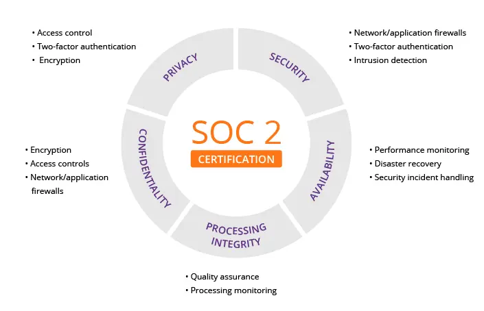
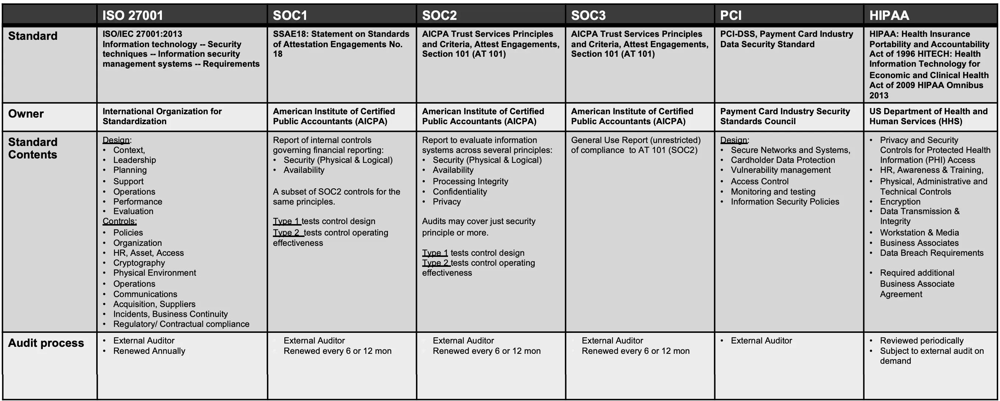

# Key cybersecurity regulations and standards

## Learning objectives

* Understand the strategic, ethical, and legal importance of cybersecurity regulations and standards for businesses
* Differentiate between formal regulations and industry standards
* Describe the basic elements of a compliance process
* Describe key cybersecurity regulations CFAA, HIPAA/HITECH, FISMA, and GDPR
* Describe key cybersecurity industry standards ISO 2700x, SOC, PCI DSS, NIST SP 800-53, NIST CSF, and CIS Critical Security Controls
* Explain the applicability of Cybersecurity Maturity Model Certification (CMMC)

This section covers salient cybersecurity regulations and standards. Cybersecurity regulations and standards govern the creation, processing, and management of data to ensure certain security or privacy requirements or expectations are met.

Key cybersecurity **regulations (statutory and regulatory)** include CFAA (Computer Fraud and Abuse Act), HIPAA/HITECH (Health Insurance Portability and Accountability Act/Health Information Technology for Economic and Clinical Health Act), FISMA (Federal Information Security Management Act), GLBA (Gramm-Leach-Bliley Act), SOX (Sarbanes-Oxley Act), FACTA (Fair and Accurate Credit Transactions Act), FedRAMP (Federal Risk and Authorization Management Program), CCPA (California Consumer Privacy Act), NYDFS-23 NYCRR 500 (New York Department of Financial Services - Title 23, New York Codes, Rules and Regulations, Part 500), EU GDPR (European Union General Data Protection Regulation), and Data Protection Act (UK).

Key cybersecurity **industry standards (contractual requirements or legally-binding obligations)** include PCI DSS (Payment Card Industry Data Security Standard), SOC2 (Service Organization Control Type 2), ISO 2700x (International Organization for Standardization), NIST SP 800-53 (National Institute of Standards and Technology Special Publication 800-53), NIST CSF (National Institute of Standards and Technology Cybersecurity Framework), and CIS (Center for Internet Security) Critical Security Controls.

Specifically, this section covers the following cybersecurity regulations: CFAA, HIPAA/HITECH, FISMA, and GDPR; and the following cybersecurity industry standards: ISO 2700x, SOC, PCI DSS, NIST SP 800-53, NIST CSF, and CIS Critical Security Controls. Finally, this section covers CMMC (Cybersecurity Maturity Model Certification), which can be both regulatory and contractual.

## Topics covered in this section

* **The strategic importance of cybersecurity regulation**
* **Formal regulations vs industry standards**
* **Compliance basics**
* **Cybersecurity regulations**
  * **The Computer Fraud and Abuse Act (CFAA)**
  * **Federal Information Security Management Act (FISMA)**
  * **Health Insurance Portability and Accountability Act (HIPAA)**
  * **General Data Protection Regulation (GDPR)**
* **Cybersecurity industry standards**
  * **International Organization for Standardization (ISO) 2700x**
  * **System and Organization Controls Report (SOC)**
  * **Payment Card Industry Data Security Standard (PCI DSS)**
  * **NIST Special Publication 800-53 Catalog of Security Controls**
  * **NIST Cybersecurity Framework (CSF)**
  * **CIS Critical Security Controls**
* **Cybersecurity Maturity Model Certification (CMMC)**
* **Regulations and industry standards summary**

### The strategic importance of cybersecurity regulation

About 45% of hackers are outsiders. The other 55% represent insiders comprised of malicious insiders and inadvertent actors. To manage hacking and security risks, organizations design and implement physical, technical (or technological), and procedural (or operational) controls. Cybersecurity governance frameworks, including formal regulations and industry-driven standards, serve as structured and effective authorities for designing such controls.

Cybersecurity regulations and standards are designed to protect sensitive data and ensure the resilience of critical infrastructure, creating a structured framework for organizational responsibility. Their **ethical and legal importance** is fundamentally intertwined, translating moral imperatives into enforceable mandates. Ethically, these rules codify a business's duty of care, demanding transparency, justice, and respect for the autonomy of individuals whose data is processed. Legally, they operationalize these ethical principles, holding organizations accountable for negligence. Regulations like the GDPR or sector-specific laws such as HIPAA establish clear legal liabilities for failures, ensuring that ethical obligations—to protect privacy, prevent harm, and be accountable—have tangible consequences. This legal scaffolding not only punishes non-compliance but also elevates data protection from a best practice to a non-negotiable requirement of corporate citizenship.

From a **strategic and financial perspective**, compliance is a critical business enabler rather than a mere technical checklist. Strategically, adhering to recognized standards like ISO 27001 provides a systematic methodology for risk management, strengthening operational continuity and resilience against attacks. Financially, while implementing these controls requires investment, the cost of non-compliance is exponentially greater. This includes direct regulatory fines, which can reach millions of dollars, but also the serious indirect costs of reputational damage, loss of customer trust, and competitive disadvantage. Conversely, robust compliance can become a market differentiator, fostering trust with partners and customers, reducing insurance premiums, and creating a more secure foundation for digital innovation and growth.

### Formal regulations vs industry standards

This section differentiates between formal regulations (laws and government rules) and industry standards and frameworks based on their source of legal authority and enforceability. Regulations derive force from law, while standards derive force from contract or voluntary commitment.

Formal cybersecurity regulations are statutory or regulatory. They are created and enforced by a legislative or government body (e.g., EU Parliament, U.S. Congress, and State of California). Non-compliance can result in legal penalties, fines, or criminal charges. In comparison, cybersecurity industry standards are established through consensus by expert bodies, consortia, or government technical agencies to define best practices, processes, and technical controls. Their authority is primarily contractual or market-driven, becoming binding when stipulated in agreements with clients, partners, or government entities.

CMMC is a special case where a government agency (U.S. Department of Defense) mandates a specific certification standard for its contractors.

| Aspect                  | Cybersecurity Regulations                                                                                                                            | Cybersecurity Standards                                                                                                                                                                                   |
| ----------------------- | ---------------------------------------------------------------------------------------------------------------------------------------------------- | --------------------------------------------------------------------------------------------------------------------------------------------------------------------------------------------------------- |
| **Source of Authority** | Law per se.                                                                                                                                          | Contract or agreement.                                                                                                                                                                                    |
| **Descriptor**          | Statutory and Regulatory                                                                                                                             | Contractual Requirements or Legally-Binding Obligations                                                                                                                                                   |
| **What This Means**     | Legal mandates created and enforced by a governmental or legislative body (e.g., U.S. Congress, EU Parliament, a federal agency, state legislature). | Frameworks, controls, or specifications developed by industry groups or standards bodies (e.g., ISO, PCI SSC, NIST). They are not law by themselves.                                                      |
| **Enforcement**         | Compliance is mandatory because it is the law. Non-compliance can result in fines, penalties, lawsuits, or other legal actions from the government.  | They become legally binding when incorporated into a contract. Compliance is enforced through contractual agreements (e.g., with a business partner, client, or as a condition of a government contract). |
| **Examples**            | 
HIPAA (U.S. law) GDPR (EU law) CCPA (California state law) SOX (U.S. law)
                                                            | 
PCI DSS (required by contract with payment card brands) ISO 27001 (often a contractual requirement for vendors) SOC 2 (frequently requested by clients in contracts)
                         |

Finally, a distinction can be made between standards and frameworks. Standards are typically specific low level requirements, while frameworks are typically high level categories or criteria that can be used to streamline the implementation of standards and controls.

### Compliance basics

Compliance is the process of adhering to a specific set of standards or regulations by identifying, implementing, and validating a targeted subset of security and privacy controls. Security focuses on protecting an organization's environment and systems from theft, damage, and disruption.

Privacy is more focused on data: how it is being used, who has access to it, how it is stored, how it is transferred, and how it may be used to track people. Security and privacy objectives are achieved through the implementation of safeguards known as controls. These controls are generally organized into **three** primary categories:

**Physical controls** involve the physical containment and protection of infrastructure, such as servers, data centers, and cloud access points. **Technical controls** consist of software, tooling, and technological features designed to restrict access and protect data integrity. Examples include encryption, log management, and password management systems. **Operational controls** are the procedural rules that govern daily security practices. This includes configurations, patch management schedules, log monitoring responsibilities, and staff training protocols.

Compliance involves selecting a specific subset of these controls—and other business governance requirements—based on a particular regulatory standard. As the total universe of possible controls is vast (e.g., it can range from 50 to 500), a compliance goal dictates which specific subset must be implemented and validated.

This validation is accomplished through formal assessment, conducted either by an internal assessor or an external auditor, to verify that the required controls are properly in place and functioning as mandated.

A structured compliance process typically follows these key phases:

1. **Scope Definition:** The first step is to establish clear boundaries for the assessment. This defines precisely which systems, data, and processes are included within the compliance effort and which are not. This step also involves defining compliance requirements and relevant control subsets.
2. **Readiness Assessment:** Next, you evaluate your defined scope against all requirements of the chosen standard. This involves reviewing the relevant controls and assessing how well your current environment meets each one. The outcome is a clear understanding of your compliance posture and a list of identified gaps.
3. **Gap Remediation:** In this phase, you address the gaps identified in the assessment. This may involve implementing new controls, such as adding encryption, or adjusting existing ones, such as reviewing user access privileges to enforce the principle of least privilege.
4. **Testing and Validation:** Once controls are implemented, they must be validated. This involves a period of testing, which may be conducted through internal self-assessment with subject matter experts or by engaging an external auditor for an independent review.
5. **Ongoing Recertification:** Compliance is not a one-time event. To maintain certification, you must undergo periodic recertification, which may occur annually, quarterly, or on another schedule dictated by the specific standard.

### Cybersecurity regulations

There are three broad categories under this label. First, truly mandatory U.S. federal laws and regulations (statutory/regulatory), which are laws passed by Congress or specific regulations issued by agencies with the force of law for their defined scope. Examples under this category include CFAA, HIPAA/HITECH, and FISMA. Second, U.S. state-level laws (statutory/regulatory), which are mandatory for organizations operating in those states and meeting specific criteria. Examples under this category include CCPA and NYDFS 23 NYCRR 500. Third, international laws (statutory/regulatory), which are mandatory for organizations processing the data of individuals in those jurisdictions, often with extraterritorial reach. Examples under this category include EU GDPR and UK Data Protection Act 2018.

**Scope of Cybersecurity Regulations**

| Item                       | Mandatory Regulation?      | Scope / Key Note                                                                      |
| -------------------------- | -------------------------- | ------------------------------------------------------------------------------------- |
| **CFAA**                   | **Yes** (Criminal Statute) | U.S. Federal - Prohibits unauthorized access                                          |
| **HIPAA/HITECH**           | **Yes**                    | U.S. Federal - Healthcare                                                             |
| **FISMA**                  | **Yes**                    | U.S. Federal Government agencies                                                      |
| **GLBA**                   | **Yes**                    | U.S. Federal - Financial Institutions                                                 |
| **SOX**                    | **Yes**                    | U.S. Publicly Traded Companies                                                        |
| **FACTA (Red Flags Rule)** | **Yes** (Conditional)      | U.S. Federal - Specific for certain creditors/financial institutions                  |
| **FedRAMP**                | **Yes** (Conditional)      | Program, mandatory for cloud service providers wishing to serve U.S. federal agencies |
| **CCPA**                   | **Yes**                    | California State (for qualifying businesses)                                          |
| **NYDFS 500**              | **Yes**                    | New York State - DFS-regulated entities                                               |
| **EU GDPR**                | **Yes**                    | European Union                                                                        |
| **UK Data Protection Act** | **Yes**                    | United Kingdom                                                                        |

#### The Computer Fraud and Abuse Act (CFAA)

The Computer Fraud and Abuse Act (CFAA) of 1986 is a foundational **U.S. federal criminal statute** (Title 18, U.S. Code § 1030). Its primary authority and enforcement body is the **U.S. Department of Justice (DOJ)**, specifically through the Criminal Division’s Computer Crime and Intellectual Property Section (CCIPS). The CFAA establishes the legal boundaries for computer-related activities. Its significance is dual: it serves as the legal basis for prosecuting malicious cyber actors and, conversely, defines the standard of care that organizations must meet to demonstrate they have implemented reasonable security measures to protect their systems from unauthorized access.

Unlike regulations that dictate specific controls (like HIPAA's safeguards), the CFAA's **compliance requirements are prohibitive in nature**. It criminalizes specific acts, primarily focusing on **unauthorized access** to protected computers. For security professionals, "compliance" with the CFAA translates to implementing a governance structure that prevents, detects, and responds to these prohibited acts. This involves establishing clear policies and technical measures that define and enforce authorization. Key prohibited acts under the CFAA include:

* Intentionally accessing a computer without authorization or exceeding authorized access.
* Obtaining national security information.
* Committing computer fraud.
* Knowingly causing the transmission of a program, code, or command that intentionally causes damage to a protected computer.
* Trafficking in passwords or other access devices with intent to defraud.

The **scope** of the CFAA is broad, applying to any "protected computer," which is defined to include computers used in interstate or foreign commerce or communication—a definition that encompasses most internet-connected systems. From a security control perspective, adherence to the spirit of the law requires a holistic approach across **people, process, and technology**. Organizations must define authorization through **procedural controls** like acceptable use policies and access review processes. **Technical controls** such as robust identification and authentication (e.g., multi-factor authentication), network segmentation, and intrusion detection systems are critical for enforcing these boundaries and detecting breaches. Furthermore, **physical controls** to secure facilities housing critical systems are also implied, as unauthorized physical access could lead to a CFAA violation.

The CFAA does not prescribe a specific **audit frequency** or detailed **reporting requirements** for organizations in the manner of FISMA or HIPAA. Instead, its enforcement is triggered reactively by incidents. Key reporting is done **to law enforcement** (e.g., the FBI or Secret Service) when an organization is a victim of a covered computer crime. There is no standardized "CFAA audit report," but the evidentiary elements required for prosecution underscore the importance of comprehensive **audit logs, incident response documentation, and detailed records of access controls and policies**. These artifacts are crucial for investigators to establish that access was indeed "without authorization" or in "excess of authorization," which are central elements of the statute.

The CFAA is a **U.S. federal law** with a **global impact** due to the interconnected nature of the internet. Its primary **industry focus** is not sector-specific; it applies universally to any entity operating protected computers in the United States. However, it is particularly relevant to technology companies, financial institutions, critical infrastructure operators, and any organization holding sensitive data. **Non-compliance penalties and fines** are severe and can be both criminal and civil. Criminal penalties vary based on the specific subsection violated and factors like intent and loss amount, ranging from misdemeanors to felonies with penalties including fines and imprisonment for **up to 10 or 20 years**. Civil actions allow any person who suffers damage or loss to sue for compensatory damages and injunctive relief. The law's potency lies in this combination of criminal prosecution by the state and the threat of private lawsuits, making a strong security posture essential for legal risk management.

#### Federal Information Security Management Act (FISMA)

The Federal Information Security Management Act (FISMA) is a cornerstone U.S. federal law enacted in 2002, with significant modernization through the Federal Information Security Modernization Act of 2014. Its primary authority rests with the U.S. federal government, specifically managed and overseen by the Office of Management and Budget (OMB). The law delegates the development of specific security standards and guidelines to the National Institute of Standards and Technology (NIST), making NIST Special Publication 800-53 the foundational control catalog for FISMA compliance.

FISMA's **compliance requirements** mandate a comprehensive, risk-based approach to securing federal information systems. Agencies must implement security programs that span **people, process, and technology**, organized around key families of controls. These include conducting regular risk assessments, selecting and implementing appropriate security controls from frameworks like NIST SP 800-53, and maintaining continuous monitoring of system security. A core procedural requirement is the development and maintenance of a System Security Plan (SSP) for each information system, along with a structured process for authorizing systems to operate (Authorization to Operate - ATO). Continuous monitoring and incident reporting are critical, ongoing operational requirements under this framework.

[FISMA compliance roadmap](fisma-compliance-roadmap.md) (example)

Regarding **audit frequency and reporting**, FISMA requires annual evaluations. Federal agencies must conduct yearly assessments of their security programs and report their compliance status to OMB. OMB then consolidates this information and reports on the government-wide state of cybersecurity to Congress. This cycle ensures ongoing oversight. The key reporting artifacts include the Agency Head's Annual FISMA Report, which details the agency's security posture, the results of continuous monitoring activities, and a summary of security incidents as part of the incident reporting mandate.

In terms of **region and relevant industry**, FISMA's scope is explicitly defined. FISMA is a **U.S.** regulation that applies principally to all federal executive branch agencies. Crucially, its reach also extends to **third-party contractors, state agencies, and other entities** that manage federal information or operate systems on behalf of the government. Therefore, while its **industry focus** is government IT security, its impact is felt across the private sector technology and defense industrial base that supports federal operations.

**Non-compliance penalties and fines** under FISMA are not typically monetary fines levied on agencies. Instead, consequences are operational and strategic. Non-compliance can result in failing an agency's annual FISMA audit score, which is publicly reported. This can lead to reduced funding for IT programs, increased oversight from OMB and Congress, and the withholding of an Authorization to Operate (ATO) for critical systems, effectively shutting them down. For contractors, failure to meet FISMA requirements can result in loss of current contracts and disqualification from future federal business.

#### Health Insurance Portability and Accountability Act (HIPAA)

The Health Insurance Portability and Accountability Act (HIPAA) was enacted as a U.S. federal law in **1996**. Its security and privacy provisions were significantly strengthened by the **Health Information Technology for Economic and Clinical Health (HITECH) Act in 2009**, which introduced stricter enforcement and higher penalties. The primary authority and managing body for HIPAA is the **U.S. Department of Health and Human Services (HHS)**, specifically through its **Office for Civil Rights (OCR)**, which is responsible for enforcing the rules and investigating complaints.

HIPAA's **compliance requirements** are centered on protecting **Protected Health Information (PHI)**—any individually identifiable health information. The law establishes three primary rules that dictate comprehensive safeguards across people, processes, and technology:

* **The Privacy Rule**: Governs the use and disclosure of PHI.
* **The Security Rule**: Mandates specific administrative, physical, and technical safeguards to ensure the confidentiality, integrity, and availability of electronic PHI (ePHI).
* **The Breach Notification Rule**: Requires notification to individuals, HHS, and sometimes the media following a breach of unsecured PHI.\
  These rules apply to two key entities: **"covered entities"** (healthcare providers, health plans, clearinghouses) and their **"business associates"** (any vendor or contractor that handles PHI). Compliance requires a holistic program involving workforce training (people), policies like access management and incident response (process), and controls like encryption and audit logs (technology).

There is no mandated annual **audit frequency** for all entities. Instead, enforcement is primarily driven by **complaint investigations** and the OCR's **random audit program**. When audits or investigations occur, they examine the entity's compliance with all HIPAA Rules, requiring evidence of risk assessments, implemented safeguards, and documentation of policies and training. The OCR provides protocols that serve as de facto audit guides for these assessments.

A critical **reporting requirement** is for breaches of unsecured PHI. Covered entities must notify:

* **Affected individuals** without unreasonable delay, and no later than **60 days** after discovery.
* **The Secretary of HHS** annually for smaller breaches, or within 60 days for breaches affecting 500 or more individuals.
* **The media** for breaches affecting 500+ residents of a state or jurisdiction.\
  Key internal reporting elements include maintaining an **incident log** and documentation of all breach risk assessments, even for incidents determined not to be reportable breaches.

HIPAA is a **U.S. federal regulation** with a primary **industry focus on healthcare**. However, its extraterritorial effect and broad definition of business associates mean it impacts a wide ecosystem, including cloud service providers, software developers, and billing companies that serve the healthcare industry. Many U.S. states also have laws that may impose stricter requirements. **Non-compliance penalties** are severe and tiered based on the level of negligence, ranging from **$100 to $50,000 per violation**, with an annual maximum of **$1.5 million for repeated violations of the same provision**. Penalties can reach into the millions. Willful neglect can also lead to **criminal penalties**, including fines and imprisonment.

**HIPAA Cybersecurity Guide**

[Cyber-Attack Quick Response Guide](https://www.hhs.gov/sites/default/files/cyber-attack-quick-response-infographic.gif) (U.S. Department of Health & Human Services)

#### General Data Protection Regulation (GDPR)

The General Data Protection Regulation (GDPR) is a comprehensive data privacy law enacted by the **European Parliament and Council in 2016**, which became **enforceable on May 25, 2018**. It supersedes the 1995 Data Protection Directive. The authority is decentralized, with overarching governance by the **European Commission** and direct enforcement by **national Data Protection Authorities (DPAs)** in each EU member state (e.g., the CNIL in France, the ICO in the UK). The **European Data Protection Board (EDPB)** ensures consistent application across the Union.

GDPR's **compliance requirements** are principle-based and focus on the lawful, fair, and transparent processing of **personal data** (any information relating to an identifiable person). Its core is built on **seven key principles**: lawfulness, fairness and transparency; purpose limitation; data minimization; accuracy; storage limitation; integrity and confidentiality; and accountability. Compliance mandates a holistic approach across **people, process, and technology**:

* **Lawful Basis**: Requiring a justified legal ground (e.g., consent, contractual necessity, legitimate interest) for all processing.
* **Data Subject Rights**: Empowering individuals with rights to access, rectification, erasure ("right to be forgotten"), portability, and objection.
* **Privacy by Design and by Default**: Requiring data protection to be integrated into the development of business processes and systems.
* **Organizational Measures**: Implementing appropriate technical controls (e.g., encryption, pseudonymization) and robust internal policies, while maintaining detailed records of processing activities (ROPA).

The regulation does not prescribe a specific **audit frequency**. Instead, it operates on a principle of **demonstrable accountability**, where organizations must be able to prove compliance at all times. **Supervisory authorities (DPAs)** have the power to conduct investigations and audits based on complaints, data breaches, or sectoral inquiries. The key reporting requirement is for **personal data breaches**. Controllers must notify the relevant DPA of a breach **within 72 hours of becoming aware of it**, unless the breach is unlikely to result in a risk to individuals. If the breach poses a high risk to individuals' rights, they must also be notified without undue delay.

​[Understanding the 7 Principles of the GDPR](https://www.onetrust.com/blog/gdpr-principles/)​

While the GDPR is an **EU regulation**, its **scope is global** due to its extraterritorial principle. It applies to all organizations that process the personal data of individuals in the EU, regardless of the organization's physical location. This means a company based in the U.S., Asia, or elsewhere must comply if it offers goods/services to, or monitors the behavior of, EU data subjects. There is no single **industry focus**; it applies universally to all sectors, including technology, finance, retail, healthcare, and beyond. Its core focus is the **protection of personal data and privacy of EU residents**.

**Non-compliance penalties and fines** are the most stringent globally, designed to be "effective, proportionate, and dissuasive." Infringements can result in administrative fines of up to **€20 million or 4% of the company's total global annual revenue of the preceding financial year, whichever is higher**. As evidenced by major enforcement actions, such as the **€183 million (later reduced) fine against British Airways** and the **€99 million fine against Marriott** for insufficient security measures leading to data breaches, these provisions are actively enforced. Beyond fines, DPAs hold corrective powers, including ordering data processing to cease.

**Examples of GDPR Fines**

​[ICO statement: Intention to fine British Airways £183.39m under GDPR for data breach](https://www.databreaches.net/ico-statement-intention-to-fine-british-airways-183-39m-under-gdpr-for-data-breach/)​

​[Marriott Faces $123 Million GDPR Fine for 2018 Data Breach](https://www.bleepingcomputer.com/news/security/marriott-faces-123-million-gdpr-fine-for-2018-data-breach/)​

​[Polish DPA fines Virgin Mobile Polska €460,000: Incidental safeguards review is not regular testing of technical measures](https://www.databreaches.net/polish-dpa-fines-virgin-mobile-polska-e460000-incidental-safeguards-review-is-not-regular-testing-of-technical-measures/)

### Cybersecurity industry standards

Cybersecurity industry standards can be broadly categorized by their origin and purpose: international consensus-based standards (e.g., the ISO/IEC 27000 series) that provide certifiable management system frameworks; industry-consortium standards (e.g., PCI DSS) created to protect specific data types across a sector; government-developed frameworks (e.g., NIST SP 800-53, NIST CSF) that are often adopted voluntarily or by reference for their comprehensive control catalog and risk management structure; and audit and assurance frameworks (e.g., SOC 2) that generate standardized reports for stakeholder trust. Adherence to these standards demonstrates security maturity, fulfills due diligence requirements, and serves as a key competitive differentiator in the marketplace.

#### International Organization for Standardization (ISO) 2700x

The **ISO/IEC 27000 series** is a family of international standards for information security management, with the cornerstone **ISO/IEC 27001** first published in **2005** and most recently revised in **2022**. The standards are developed and maintained by the **International Organization for Standardization (ISO)** and the **International Electrotechnical Commission (IEC)** through a global consensus process involving national standards bodies. A critical distinction is that **ISO itself does not certify organizations**; certification is conducted by independent, accredited third-party audit firms.

As a **voluntary industry standard**, ISO 27001's **compliance requirements** center on establishing, implementing, maintaining, and continually improving an **Information Security Management System (ISMS)**. Its core mandate is a systematic, risk-driven approach to managing people, processes, and technology:

* **The ISMS Framework**: Organizations must define the scope of their ISMS and systematically manage information security risks through the **Plan-Do-Check-Act (PDCA)** cycle.
* **Risk Assessment & Treatment**: A formal risk assessment process is required to identify threats and vulnerabilities, leading to a risk treatment plan that selects appropriate controls from **Annex A** (which contains 93 controls grouped into 4 themes: organizational, people, physical, and technological).
* **Management System Requirements**: The standard requires documented policies, defined roles and responsibilities, and comprehensive internal audits and management reviews to ensure ongoing effectiveness.

The **audit and certification process** is rigorous and multi-staged. An organization seeking certification undergoes:

1. **Stage 1 Audit (Document Review)**: Auditors review the ISMS documentation for completeness and compliance with the standard's requirements.
2. **Stage 2 Audit (Main Audit)**: Auditors perform an on-site assessment to verify that the ISMS is properly implemented and operational.
3. **Certification Decision**: Upon successful completion, the certification body issues an ISO 27001 certificate, typically valid for **three years**.
4. **Surveillance Audits**: To maintain certification, **annual surveillance audits** are required to confirm the ISMS is maintained and continually improved.

**Reporting requirements** are primarily internal and procedural. Key outputs include the **Statement of Applicability (SoA)**, which documents the Annex A controls selected and justified for the ISMS, and the **risk treatment plan**. The main external report is the **certification audit report** from the accredited body, culminating in the certificate itself. Certified organizations often use the certificate and the SoA (under NDA) to demonstrate assurance to clients and partners.

The **ISO 27001 standard is globally applicable and not industry-specific**. Its adoption is driven by contractual requirements, competitive advantage, and the need for a structured risk management framework. While universal, it is particularly prevalent in the **technology, cloud services, finance, and healthcare sectors**, where demonstrating security maturity to clients is crucial. Related standards in the series include **ISO 27002** (guidance on controls), **ISO 27017** (cloud security), and **ISO 27018** (protection of personal data in the cloud).

As a voluntary standard, there are no direct regulatory **penalties or fines** for non-compliance from a governing body. However, the consequences of failing an audit or having a certification withdrawn are significant in the marketplace. They include **loss of the certification status**, damage to reputation and client trust, potential **breach of contractual obligations** with partners who require certification, and loss of competitive edge in procurement processes. The primary enforcement is market-driven, not legal.

#### System and Organization Controls Report (SOC)

The **System and Organization Controls (SOC)** framework is not a single standard but a suite of **voluntary audit standards** developed and maintained by the **American Institute of Certified Public Accountants (AICPA)**. The most relevant for cybersecurity is the **SOC 2** examination, established under the AICPA's existing **Trust Services Criteria**. The authority and management of the framework reside entirely with the AICPA, and audits must be performed by licensed **CPA (Certified Public Accountant)** firms.

SOC compliance is **driven by contractual and market demands** rather than law. The core requirement for a SOC 2 examination is for a service organization to design and operate effective controls relevant to one or more of the five **Trust Services Criteria (TSCs)**: Security, Availability, Processing Integrity, Confidentiality, and Privacy. "Security" (common criteria) is mandatory for any SOC 2 audit, while the others are optional based on the service commitment. The framework mandates a comprehensive system description and evidence that controls are suitably designed (**Type I**) and operating effectively over a specified period (**Type II**).

The **audit frequency** is typically **annual**. A SOC 2 **Type II** report covers a continuous period of operation, almost always **6 to 12 months**. During this period, the CPA firm tests the operating effectiveness of the controls. Organizations undergo this annual audit cycle to produce a current report for their customers and stakeholders. There is no permanent "certification"; instead, assurance is provided through the successive issuance of periodic audit reports.

**Reporting requirements** are formalized through the CPA firm's opinion and the detailed description of the system and controls. A key distinction exists between report types:

* **SOC 2 Type I**: Reports on the **design suitability** of controls at a specific point in time.
* **SOC 2 Type II**: Reports on the **operational effectiveness** of controls over a minimum 6-month period.\
  Crucially, the **SOC 2 report is a restricted-use document** intended for the organization's management, existing customers, and prospective customers under NDA. It contains detailed information on the control environment, tests performed, and results, which is considered sensitive. For public consumption, organizations can obtain a **SOC 3 report**, which is a general-use seal that provides the auditor's opinion without the detailed testing information.

As an **industry standard**, SOC 2 has a **global reach** but is most prevalent in **North America**. Its primary **industry focus** is **technology and cloud service providers** (e.g., SaaS, IaaS, data centers) that need to demonstrate security and compliance to enterprise clients. It is also widely adopted by financial services, healthcare tech, and any B2B company handling sensitive client data. Demand is driven by client due diligence and procurement requirements.

<figure><figcaption>
SOC 2 trust service principles (image courtesy of imperva.com)
</figcaption></figure>

SOC 2 defines criteria for managing customer data based on five trust service principles – security, availability, processing integrity, confidentiality, and privacy.

There are no direct governmental **penalties or fines** for not obtaining a SOC report, as it is not a regulation. However, the **business consequences of non-compliance** with client contractual requirements can be severe. These include **loss of current and future business**, failure during security procurement reviews, significant reputational damage, and a competitive disadvantage in markets where SOC 2 is a baseline expectation. The "penalty" is commercial, not legal.

The following table summarizes the key differences between SOC report types to aid in understanding their application:

| Report Type       | Purpose & Focus                                                                                 | Key Deliverable                                      | Primary Audience                                |
| ----------------- | ----------------------------------------------------------------------------------------------- | ---------------------------------------------------- | ----------------------------------------------- |
| **SOC 2 Type I**  | Assess **design** of controls relevant to security, availability, etc., **at a point in time**. | Auditor's opinion on design suitability.             | Management, clients (under NDA).                |
| **SOC 2 Type II** | Assess **operational effectiveness** of controls over a **period of time** (6-12 months).       | Detailed report on design, tests, and effectiveness. | Management, clients, prospects (under NDA).     |
| **SOC 3**         | Provide a **general assurance seal** for public distribution.                                   | Brief seal or report with auditor's opinion only.    | Public, website visitors, general stakeholders. |

**American Institute of CPAs (AICPA) Website Research**

AICPA develops the guidelines for SOC reporting. Explore some of the resources available on the AICPA website for CPAs, users, and organizations.

[SOC for Cybersecurity](https://www.aicpa-cima.com/topic/audit-assurance/audit-and-assurance-greater-than-soc-for-cybersecurity)

[​SOC 2® examinations and SOC for Cybersecurity examinations: Understanding the key distinctions](https://www.aicpa-cima.com/resources/download/learn-about-the-key-distinctions-between-a-soc-2-examination-and-a-soc-for-cybersecurity-examination) (report)

#### Payment Card Industry Data Security Standard (PCI DSS)

The **Payment Card Industry Data Security Standard (PCI DSS)** is a **global, industry-mandated security standard** established in **2004** by the founding payment card brands (Visa, Mastercard, American Express, Discover, JCB). It is managed and developed by the **PCI Security Standards Council (PCI SSC)**, an independent body formed by these brands. While not a government law, its authority is derived from **contractual agreements** between merchants, payment processors, and the card brands.

**Compliance requirements** are highly prescriptive and technical, focusing on protecting **Cardholder Data (CHD)**, primarily the Primary Account Number (PAN). Its 12 high-level requirements, encompassing over **200 specific controls**, mandate a comprehensive security program:

* **Build and Maintain a Secure Network**: Require firewalls and secure system configurations.
* **Protect Cardholder Data**: Mandate encryption of transmitted data and secure storage.
* **Maintain a Vulnerability Management Program**: Require anti-virus software and secure development practices.
* **Implement Strong Access Control Measures**: Enforce strict access controls via unique IDs, least privilege, and physical security.
* **Regularly Monitor and Test Networks**: Mandate tracking of all access, regular security testing, and **quarterly external vulnerability scans by an Approved Scanning Vendor (ASV)**
* **Maintain an Information Security Policy**.

Compliance scope is defined by the **Cardholder Data Environment (CDE)**—any system, process, or person that stores, processes, or transmits CHD. A core strategy is **network segmentation** to isolate the CDE and reduce audit scope.

**Audit frequency and validation requirements** are stratified based on an organization's **merchant level** (determined by transaction volume). Key validation methods include:

* **Report on Compliance (ROC)**: An annual on-site audit conducted by a **PCI SSC Qualified Security Assessor (QSA)** for the highest-level merchants (Level 1).
* **Self-Assessment Questionnaire (SAQ)**: An annual self-assessment for smaller merchants (Levels 2-4), with the specific SAQ type dependent on payment channel.
* **Quarterly ASV Scans**: Required for all externally-facing systems.
* **Attestation of Compliance (AOC)**: The formal document submitted to acquirers to validate compliance status.

The primary **reporting requirement** is the submission of the **AOC and either the ROC or appropriate SAQ** to the acquiring bank (merchant bank) annually. Organizations must also provide evidence of passing quarterly ASV scans. These reports are confidential documents shared between the merchant, its acquirer, and the QSA.

PCI DSS is a **global standard** enforced worldwide. Its **industry focus** is any entity involved in payment card processing, including **merchants (retail, e-commerce), financial institutions, payment processors, and any third-party service provider** that handles CHD. Its applicability is defined by function, not geographic location.

**Non-compliance penalties** are not direct fines from the PCI SSC but are levied by **payment card brands and acquiring banks**. They can include:

* Significant **monthly fines** (e.g., $5,000 to $100,000+) imposed by card brands on the acquiring bank, often passed on to the non-compliant merchant.
* Increased **transaction fees**.
* Placing the merchant on a **remediation plan** or **terminating the merchant account**, effectively halting the ability to process card payments.
* Liability for **fraud-related losses** and costs associated with a data breach, including forensic investigations, card re-issuance, and potential regulatory fines.

The following table summarizes the validation paths based on merchant level, which directly determines audit rigor:

| Merchant Level (Based on Transaction Volume) | Primary Validation Requirement                 | Conducted By                          |
| -------------------------------------------- | ---------------------------------------------- | ------------------------------------- |
| **Level 1** (Over 6M transactions/year)      | Annual **Report on Compliance (ROC)**          | External **QSA**                      |
| **Level 2 & 3** (1M to 6M transactions/year) | Annual **Self-Assessment Questionnaire (SAQ)** | Internal Staff (may require QSA help) |
| **Level 4** (Under 1M transactions/year)     | Annual **Self-Assessment Questionnaire (SAQ)** | Internal Staff                        |

#### NIST Special Publication 800-53 Catalog of Security Controls

**NIST Special Publication 800-53**, titled "Security and Privacy Controls for Information Systems and Organizations," is a comprehensive control catalog published by the U.S. **National Institute of Standards and Technology (NIST)**. The current authoritative version, **Revision 5**, was published in September 2020, with continuous updates (e.g., Release 5.2.0 in August 2025). As a non-regulatory federal agency, NIST develops this framework under mandates like the **Federal Information Security Modernization Act (FISMA)**. Its primary managing body is NIST's **Information Technology Laboratory (ITL)**, and while it is a standard, it becomes legally binding when **incorporated into law or government contracts**, most notably for all U.S. federal information systems.

The **compliance requirements** of SP 800-53 are centered on the selection, implementation, and assessment of a tailored set of security and privacy controls. It provides a vast, **unified catalog of over 1,000 controls** designed to protect organizational operations, assets, and individuals across three foundational components: **people, processes, and technology**. Organizations conduct a **risk assessment** to identify which controls are necessary, crafting a tailored baseline. The controls are organized into 20 families, covering the entire security and privacy landscape:

* **Technical/Technological Controls:** Access Control (AC), Identification & Authentication (IA), System & Communications Protection (SC).
* **Operational/Process Controls:** Risk Assessment (RA), Planning (PL), Incident Response (IR), Contingency Planning (CP).
* **Management/People Controls:** Awareness & Training (AT), Personnel Security (PS), Program Management (PM), and the integrated **Privacy Controls**.

For U.S. federal agencies, the **audit frequency** is governed by FISMA, which requires **annual assessments** of security controls. For each system, this involves ongoing **continuous monitoring** and formal **re-authorization** every three years or when significant changes occur. In non-federal contexts, audit frequency is dictated by the contracting or adopting organization's requirements (e.g., annually for a contract based on SP 800-53).

The key **reporting requirements** are intrinsically linked to its use for FISMA compliance. Agencies must report their security postures annually to the **Office of Management and Budget (OMB)** and Congress. The fundamental reporting artifacts are the **System Security Plan (SSP)** and the **Plan of Action and Milestones (POA\&M)**. The SSP details the implemented controls and how they are employed, while the POA\&M documents any known weaknesses and the scheduled remediation plans.

While developed as a **U.S. federal standard**, SP 800-53's influence is **global**. Its primary **industry focus** is **U.S. government agencies and their contractors** (especially in defense and critical infrastructure). However, due to its comprehensiveness, it is widely adopted voluntarily by **private sector organizations** in highly regulated industries like finance, healthcare, and energy as a gold-standard control framework for managing high-risk environments.

There are no direct **fines or penalties** from NIST for non-compliance, as it is a guidance publication. However, when mandated by law (e.g., FISMA) or contract (e.g., DFARS for defense contractors), **non-compliance carries significant consequences**. For federal agencies, this can mean failing their FISMA audit, receiving a poor score on the Federal Cybersecurity Report Card, reduced funding, and suspension of system Authorizations to Operate (ATO). For contractors, non-compliance can result in **breach of contract, loss of current and future government business, and financial liabilities**.

National Institute of Standards and Technology (NIST) Special Publication 800-53 Catalog of Security Controls

[Security and Privacy Controls for Information Systems and Organizations SP 800-53 Rev. 5](https://csrc.nist.gov/publications/detail/sp/800-53/rev-5/final)

#### NIST Cybersecurity Framework (CSF)

The **NIST Cybersecurity Framework (CSF)** is a **voluntary risk management framework** first published by the U.S. **National Institute of Standards and Technology (NIST)** in **February 2014**, following Presidential Executive Order 13636. The framework was significantly updated to **Version 2.0 in February 2024**, expanding its scope from critical infrastructure to all organizations. As a non-regulatory agency, NIST develops and maintains the framework, but it carries no inherent legal authority. Its power derives from **widespread voluntary adoption** and its **incorporation by reference** into other regulations, contracts, and industry standards.

The core **compliance requirement** is inherently flexible, as the CSF is not a prescriptive checklist but a framework for improving an organization's cybersecurity posture. Its primary function is to help organizations **align their cybersecurity activities with business needs, risk tolerances, and resources**. The framework is structured around six high-level **Functions**—Govern, Identify, Protect, Detect, Respond, Recover—which are implemented through Categories and Subcategories. These Functions provide a holistic view of the lifecycle for managing cybersecurity risk across **people, process, and technology**:

* **Govern (New in v2.0):** Establishes and monitors cybersecurity strategy, policy, and risk management.
* **Identify:** Develops organizational understanding of systems, assets, data, and associated risks.
* **Protect:** Implements safeguards (e.g., access control, training, data security) to limit impact.
* **Detect:** Defines activities to identify cybersecurity events in a timely manner.
* **Respond:** Outlines actions to take during and after a confirmed incident.
* **Recover:** Plans for resilience and timely restoration of capabilities after an incident.

Since it is a voluntary framework, there is no mandated **audit frequency**. Organizations typically integrate CSF assessment into their **existing risk management and governance cycles** (e.g., annually or quarterly). The "audit" is often an **internal or third-party gap assessment** comparing current practices to the CSF's "Target Profile." Similarly, formal **reporting requirements** are not imposed by the framework itself. Key reporting outputs are for internal and executive use, such as the **Current Profile** (as-is state), **Target Profile** (desired state), and an **implementation plan** to close gaps. These profiles are crucial for communicating risk and progress to business leaders.

While developed in the **U.S.**, the NIST CSF has seen **global adoption** across both public and private sectors. Its primary design was for **U.S. critical infrastructure** sectors (energy, financial services, healthcare, etc.), but Version 2.0 explicitly broadened its applicability to **any organization, regardless of size, sector, or maturity**. It is commonly used as a **communication bridge** between technical teams and business executives and as an overlay to map and harmonize other regulations like FISMA, HIPAA, and PCI DSS.

As a voluntary framework, there are **no direct fines or penalties** for non-adoption from NIST. However, the **consequences of not using it** are strategic and risk-based. Organizations may face **increased cyber risk**, poor resource allocation, and a lack of clear communication about cybersecurity posture. In contexts where the CSF is referenced in contracts or sector-specific guidance, non-conformance could lead to **loss of business, failure to meet due diligence expectations, or regulatory scrutiny** under other, more prescriptive mandates that the CSF helps fulfill.

The table below illustrates how the CSF's core functions translate into actionable outcomes for an organization:

| CSF Function | Key Organizational Outcome                                    | Example Activity                                    |
| ------------ | ------------------------------------------------------------- | --------------------------------------------------- |
| **Govern**   | Cybersecurity strategy is established, funded, and monitored. | Board-level risk reporting; Policy development.     |
| **Identify** | Systems, data, and risks are inventoried and understood.      | Asset management; Risk assessment.                  |
| **Protect**  | Safeguards are implemented to manage risk.                    | Employee training; Access control; Data encryption. |
| **Detect**   | Anomalies and events are identified promptly.                 | Security monitoring; Threat hunting.                |
| **Respond**  | Incidents are contained and managed.                          | Incident response plan execution.                   |
| **Recover**  | Operations are restored and improved after an event.          | Disaster recovery; Post-incident review.            |

#### CIS Critical Security Controls

The Center for Internet Security (CIS) is a U.S. based non-profit organization composed of a global community of cybersecurity professionals from both public and private sectors. These experts collaborate through a consensus-driven process to develop its widely adopted security standards and controls.

The CIS publishes the **CIS Critical Security Controls**, a prioritized set of best practices designed to mitigate the most common cyber attacks against systems and networks. A primary focus is secure configuration.

The CIS provides two key resources: the high-level **Controls** for strategic guidance and specific **Configuration Benchmarks** (such as settings for password complexity) that detail the technical implementation for systems, especially those exposed to the public Internet. These Controls are widely adopted across industries like retail, manufacturing, and healthcare. Examples of fundamental control categories include:

* Password policies and management
* Vulnerability management
* Boundary (network) defense
* Application security
* Incident response

The current CIS Critical Security Controls (CIS Controls v8, released in 2021), often called CIS Safeguards, consist of 18 overarching control categories (the logical grouping of Safeguards). These 18 categories are the high-level, strategic security practices designed to stop today's most pervasive and dangerous attacks, providing the essential security framework.

To prioritize their adoption, the 18 Controls are organized into three **Implementation Groups (IG1, IG2, IG3)**, which align with an organization's resources and risk profile:

* **IG1:** Suitable for smaller, less complex organizations (e.g., a small business).
* **IG3:** Designed for mature, enterprise-level organizations.

Each Control is thoroughly documented, explaining its purpose, components, suggested tools, and implementation guidance.

**CIS Critical Security Controls Research**

​[The CIS Critical Security Controls – CIS Controls V7.1](https://www.cisecurity.org/blog/v7-1-introduces-implementation-groups-cis-controls/)​

The CIS Critical Security Controls (CIS Controls) are internationally-recognized cybersecurity best practices for defense against common threats. They are a consensus-developed resource that brings together expert insight about cyber threats, business technology, and security. The CIS Controls are used by organizations with varying resources and risk exposure to build an effective cyber defense program.

### Cybersecurity Maturity Model Certification (CMMC)

The **Cybersecurity Maturity Model Certification (CMMC)** is a mandatory **unified security standard for the U.S. Defense Industrial Base (DIB)**. The Department of Defense (DoD) introduced the initial model in **January 2020**, and following an intensive review, announced a streamlined **CMMC 2.0 framework in November 2021**. Final rulemaking to implement CMMC 2.0 is in progress. The sole authority and managing body is the U.S. **Department of Defense (DoD)**, specifically through the **Office of the Under Secretary of Defense for Acquisition and Sustainment (OUSD(A\&S))**. Its authority is enforced by being embedded into the **Federal Acquisition Regulation (FAR)** and the **Defense Federal Acquisition Regulation Supplement (DFARS)**, making it a **legally binding contractual requirement**.

**Compliance requirements** are tiered and designed to protect sensitive defense information. CMMC 2.0 consolidates the model into three clear maturity levels, each requiring the implementation of specific security practices from established NIST standards:

* **Level 1 (Foundational):** Requires the implementation of **17 basic cybersecurity hygiene practices** from FAR 52.204-21 to protect **Federal Contract Information (FCI)**. Annual self-assessment is required.
* **Level 2 (Advanced):** The core level for most contractors, requiring implementation of **110 security controls** from **NIST SP 800-171** to protect **Controlled Unclassified Information (CUI)**. Compliance can be validated via **self-assessment (for select programs)** or, for priority acquisitions, a **triennial third-party assessment** by a C3PAO.
* **Level 3 (Expert):** For contractors supporting the highest-priority programs, requiring implementation of **110+ controls** from **NIST SP 800-171**, plus a subset from **NIST SP 800-172** to reduce risk from advanced persistent threats (APTs). Requires triennial **government-led assessments**.

The **audit frequency** depends on the required CMMC Level and the associated assessment method:

* **Self-Assessments (Level 1 & some Level 2):** Must be conducted **annually** and affirmed by a company executive.
* **Third-Party Assessments (Majority of Level 2):** Conducted by an accredited **CMMC Third-Party Assessment Organization (C3PAO)**, with certification valid for **three years**.
* **Government-Led Assessments (Level 3):** Conducted by DoD assessors, also valid for **three years**.

The primary **reporting requirement** is the formal **CMMC Certification** issued by a C3PAO or the DoD following a successful assessment. For self-assessed levels, the key requirement is the annual submission of a **self-assessment score** into the DoD's **Supplier Performance Risk System (SPRS)**. All contractors must also flow down CMMC requirements to their **subcontractors** in the supply chain.

CMMC is both a regulation and a standard. CMMC is a mandatory requirement for U.S. Defense Industrial Base contractors, but it is a certification program built upon NIST standards (specifically NIST SP 800-171). For U.S. Department of Defense contractors, the requirement to implement NIST 800-171 and achieve CMMC certification is embedded in federal acquisition regulations (DFARS). This makes it a regulatory requirement. The CMMC model itself is a detailed set of security controls (a standard). For other contexts, it could be adopted as a contractual requirement between private parties.

CMMC is a **U.S. regulation and certification standard** with a tightly defined **industry focus**: it applies exclusively to all **non-federal organizations** that are part of the **Defense Industrial Base (DIB)**. This includes **prime contractors, subcontractors, and suppliers** at any tier that handle FCI or CUI as part of a DoD contract.

**Non-compliance penalties** are severe and contractual in nature. Failure to meet the CMMC level specified in a contract can result in:

* **Loss of current and future DoD contracts.**
* Being deemed **ineligible for contract award**.
* **Breach of contract** allegations and associated legal remedies.
* Potential liability under the **False Claims Act** for falsely representing compliance, which can lead to treble damages and significant fines.

The following table summarizes the three levels of CMMC 2.0:

| CMMC Level  | Protects                                  | Required Controls                             | Assessment Method                                     | Certification Frequency                  |
| ----------- | ----------------------------------------- | --------------------------------------------- | ----------------------------------------------------- | ---------------------------------------- |
| **Level 1** | Federal Contract Information (FCI)        | 17 basic practices from FAR 52.204-21         | Annual Self-Assessment                                | Annual Affirmation                       |
| **Level 2** | Controlled Unclassified Information (CUI) | 110 controls from NIST SP 800-171             | Self-Assessment **or** Third-Party Assessment (C3PAO) | Annual (Self) or Triennial (Third-Party) |
| **Level 3** | CUI from High-Priority Programs           | NIST SP 800-171 + subset from NIST SP 800-172 | Government-Led Assessment                             | Triennial                                |

### Regulations and industry standards summary

<figure><figcaption>
Cybersecurity regulations and industry standards summary (courtesy of IBM Security Learning Services)
</figcaption></figure>

### Key takeaways

* Strategic & Legal Foundation: Compliance is a strategic business enabler that manages risk, protects reputation, and avoids severe financial penalties, whereas non-compliance can result in massive fines, legal action, and loss of competitive advantage.
* Regulations vs. Standards: The fundamental distinction lies in their source of authority.
  * Regulations (e.g., HIPAA, GDPR, FISMA, CFAA) are statutory laws. Compliance is mandatory, enforced by government bodies, with penalties for non-compliance including fines and criminal charges.
  * Industry Standards (e.g., ISO 27001, PCI DSS, SOC 2, NIST CSF) are contractual or voluntary frameworks. Their authority comes from business agreements or adoption as best practices, with enforcement through market forces (e.g., loss of contracts or certification).
* The Compliance Process: Achieving and maintaining compliance is a structured, cyclical process involving five key phases:
  1. Scope Definition
  2. Readiness/Gap Assessment
  3. Gap Remediation
  4. Testing and Validation (often via audit)
  5. Ongoing Recertification and Monitoring
* Salient Regulation Profiles:
  * CFAA: A U.S. criminal statute prohibiting unauthorized computer access; compliance focuses on implementing preventive controls and reporting incidents to law enforcement.
  * FISMA: Mandates a risk-based security program for U.S. federal agencies and their contractors, centered on NIST SP 800-53 controls, continuous monitoring, and annual reporting.
  * HIPAA: Protects Protected Health Information (PHI) through Privacy, Security, and Breach Notification Rules, applying to covered entities and business associates in healthcare.
  * GDPR: A principles-based EU regulation with global reach, protecting personal data through stringent requirements for lawful processing, data subject rights, and breach notification within 72 hours.
* Salient Industry Standard Profiles:
  * ISO 27001: A certifiable international standard for an Information Security Management System (ISMS), focused on risk management and continuous improvement.
  * SOC 2: A voluntary audit framework (not a certification) for service organizations, reporting on the design and operating effectiveness of controls related to Security, Availability, Confidentiality, Processing Integrity, and Privacy.
  * PCI DSS: A prescriptive, global standard mandated by payment card brands to protect cardholder data, requiring strict controls, defined validation methods (ROC/SAQ), and quarterly ASV scans.
  * NIST SP 800-53: A comprehensive catalog of security and privacy controls that forms the technical foundation for U.S. federal systems (via FISMA) and is widely adopted as a best-practice framework.
  * NIST CSF: A voluntary risk management framework (Identify, Protect, Detect, Respond, Recover, Govern) used to align cybersecurity activities with business needs and communicate posture.
  * CIS Critical Security Controls: A prioritized set of actionable best practices (Safeguards) designed to mitigate the most common cyber attacks, organized by Implementation Groups for organizations of different sizes and maturities.
* The Hybrid Case - CMMC: The Cybersecurity Maturity Model Certification is a mandatory certification program for U.S. Defense Industrial Base contractors. It is a unique hybrid where a government regulation (DFARS) mandates adherence to a specific standard (based on NIST SP 800-171), with tiered levels and required third-party or government assessments.

### References

[Cybersecurity Compliance Framework & System Administration](https://www.coursera.org/learn/cybersecurity-compliance-framework-system-administration)​

​[IT Fundamentals for Cybersecurity Specialization](https://www.coursera.org/specializations/it-fundamentals-cybersecurity)
