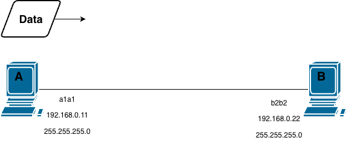
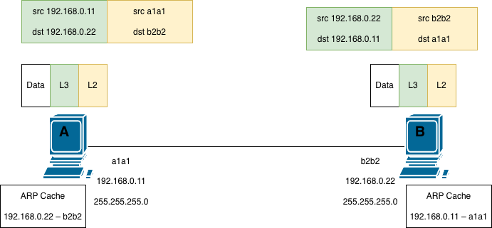
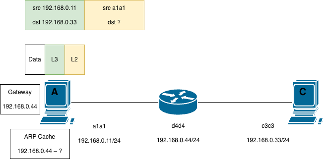

# Host to host communication in networking

## Learning objectives

* Understand how ARP resolves IP addresses to MAC addresses
* Understand how hosts in the same network send and receive data
* Understand how hosts in different networks communicate over the wire

This section explains what happens when one IP host sends data to another—whether the two devices sit on the same local network or are separated by routers. We begin by following a host’s first decision: using its own IP address and subnet mask to determine if the destination is local or remote. If local, the host uses the Address Resolution Protocol (ARP) to discover the destination’s MAC address and then builds the Layer 2 and Layer 3 headers that carry the data to its final endpoint. If remote, the host instead resolves the MAC address of its default gateway and hands the packet to the router, which repeats the process toward the ultimate destination. By working through these two scenarios you will learn not only the mechanics of ARP but also why the steps a host performs are identical regardless of how many switches, hubs, or routers make up the path.

## Topics covered in this section

* **Host to host communication in networking**
* **Hosts connected directly to each other**
* **Hosts connected through a router**

### Host to host communication in networking

A host is a computer or other device connected to a computer network and which sends or receives traffic. In typical network traffic, two hosts in communication are often called client and server. The client initiates a request and is looking to acquire some data or a service. The server is the entity receiving the request and has the data or service that the client wants.

A computer participating in networks that use the [Internet Protocol suite](https://itnetworkingskills.wordpress.com/2023/01/15/network-protocols-their-functions/) may be called an IP host. A computer participating in the Internet may be called an Internet host. 

Hosts perform both high-level application processing and low-level physical transmission of data. As a result, they interact with—and are said to operate across—all seven layers of the OSI model, from the user-facing application layer to the wire-level physical layer.

This discussion will focus on host to host communication, explaining each step involved in the process. Two scenarios are considered:

1\. Hosts connected directly to each other: hosts communicating with other hosts on the same network. All the steps hosts take to communicate with other hosts on the same network regardless of how they are connected – whether host A is directly connected to host B or whether there is one switch or multiple switches in between.

2\. Hosts connected through a router: hosts communicating with other hosts on a foreign network. What a host does to speak to any other host on a foreign network – whether what hosts are trying to speak to is on the other side of one router or multiple routers or on opposite sides of the Internet.

### Hosts connected directly to each other

This section discusses everything hosts do to communicate with other hosts in the same network regardless of how they are connected. We will examine how two directly connected hosts, A and B, communicate. While directly connected hosts are uncommon in networks, understanding this simple case is essential for establishing the foundational principles that apply whenever hosts communicate—whether through switches, routers, or across the Internet.

Host A has some data it wants to send to host B. Host A and host B are directly connected to each other. The two hosts do not know whether they are directly connected or whether there are hubs or switches in between. Each host has a NIC and therefore a MAC address (for simplicity, MAC addresses are shown in abbreviated form, e.g., a1a1 represents a full 48-bit MAC address such as a1a1:a1a1:a1a1). 

Both hosts are configured with an IP address and a subnet mask (255.255.255.0). A subnet mask identifies the size of a particular network. This is done through the process of subnetting.

<figure><figcaption>
An illustration of direct host to host communication
</figcaption></figure>

Host A knows the IP address of host B (`192.168.0.22`). Host A learned this address perhaps because a user typed a command like `ping SRVB` or perhaps because host B's IP address was resolved from a domain name by DNS. Next, host A determines whether host B is on its own local network or on a remote network. Host A makes this decision by calculating its own network ID and the network ID of the target host. Host A compares the result of applying its subnet mask to its own IP address with the result of applying the same subnet mask to the destination IP address. In other words, Host A compares the network IDs. If the network IDs are identical, host B is on the same local network. Host A will then attempt to communicate with it directly (using ARP to find the MAC address). If the network IDs are different, host B is on a remote network, and host A will forward the traffic to its default gateway.

Host A can create a L3 header to attach to the data it wants to send to host B, that is, to accomplish end to end delivery. The L3 header will include the IP address of host A (the source) and the IP address of host B (the destination).

L3 cannot interact with the wire. We need L2 for that. So host A needs to add a L2 header to this packet. But host A does not know host B’s MAC address. Host A is going to have to figure out the MAC address of host B on its own. Host A must use the ARP to resolve host B’s MAC address. ARP links a L3 address to a particular L2 address.

Host A will send out an ARP request which asks for the MAC address associated with the target IP address (192.168.0.22). Host A will include its own IP address and MAC address in the ARP request which will allow host B to directly respond to host A.

The ARP request includes a L2 header which is meant to take the ARP payload and get it delivered to host B. But that L2 header does not have a destination MAC address of host B. The ARP request is sent as a broadcast, that is, to everyone on the network. As such, it has a destination MAC address of all Fs (ffff.ffff.ffff), which is a specially reserved MAC address for broadcasts (sending a packet to everyone on a local network).

ARP mappings are stored in an ARP cache (ARP table). Every device which has an IP address has an ARP cache. Hosts A and B both have an IP address and therefore both have an ARP cache.

Initially, host A's ARP cache is empty (lacks an entry for 192.168.0.22). Host B's ARP cache is also initially empty. When host A’s ARP request makes it across the wire to host B, host B’s ARP cache begins to populate an entry: the IP 192.168.0.11 maps to the MAC address a1a1. In the original ARP request host A provided its own MAC address.

Host B now sends back an ARP response which includes the mapping host A was trying to resolve, that is, the MAC address b2b2 associated with the IP address 192.168.0.22. The ARP response is sent unicast, meaning directly back to host A. Since host B knows the MAC address of host A, it can create a L2 header which will take the ARP response directly to host A.

Host A can now create the ARP mapping which was listed in the ARP response. Now host A has all the information it needs to create a L2 header for the data it was trying to send to host B. The L2 header is going to include a source MAC address and destination MAC address. The L2 header will accomplish the goal of hop to hop delivery.

<figure><figcaption>
A host communicating with another host in the same network
</figcaption></figure>

Upon arriving to host B, host B will discard the L2 header as it has fulfilled its purpose of NIC to NIC delivery and is no longer needed. Likewise host B will discard the L3 header as it too has fulfilled its purpose of delivering the packet from host A to host B. Now the application on host B can process the data it has received.

Any further communication between host A and B can happen easily, as they both now have the information they need to create L2 and L3 headers.

### Hosts connected through a router

This section discusses everything hosts do to communicate with other hosts in foreign networks regardless of how they are connected. We’re going to use the following topology to understand everything host A does to send data to host C.

Both hosts A and C and the router have a MAC address and an IP address. The slash 24 (/24) is a way of representing the subnet mask 255.255.255.0. A subnet mask defines the size of a network.

Focusing on host A: it has some data to send to host C. Host A knows host C’s IP address (it was provided by the user or the application that is creating the data to be sent to host C). Host A knows the destination IP address is on a foreign network – it knows this by calculating its own network ID and the network ID of the target host.

Hence host A is able to create a L3 header identifying the two endpoints of the communication. The L3 header contains the IP address of host A and the IP address of host C. Host A needs to create a L2 header to transport the package to the next hop.

Since the communication target is on a foreign network, our next hop is the router. So the purpose of the L2 header is to transport the packet to the router. But since host A’s ARP cache is empty, it is not able to complete the L2 header.

<figure><figcaption>
A host communicating with another host in a foreign network
</figcaption></figure>

Host A will have to use ARP to resolve the MAC address of the router. But how does host A know the router’s IP address? The router’s IP address is already configured on host A as host A’s default gateway. 

A computer needs three pieces of information to operate on an IP network: an IP address, a subnet mask, and a default gateway. These are often assigned automatically by DHCP, but they can also be configured manually. On a Windows computer if you type C:\\> ipconfig into the command prompt you will see these three things listed. (The default gateway is the IP address of our router – that’s the IP address that host A will need to resolve with ARP.)

So host A will send out an ARP request with the general message: “if anyone out there has the IP 192.168.0.44 send me your MAC. My IP/MAC is 192.168.0.11/a1a1” – that is, the ARP request will ask for the MAC address that correlates with the router’s IP address. When the ARP request gets to the router, the router will generate a response that includes the mapping that host A was interested in learning – “I am 192.168.0.44 my MAC is d4d4.”

When the ARP response arrives on host A, host A is able to populate its ARP cache with the mapping for its default gateway. It can use the mapping to complete a L2 header, with the router’s MAC address as the destination. Recall, it’s L2’s job to deliver data from one hop to the next. L2 uses MAC addresses for this process.

In our example, host A wants to send some data to host C, so host A creates a L3 header with its IP address as the source IP address and host C’s IP address as the destination IP address. The ARP process is necessary to create L2 headers that encapsulate the L3 packet and move it from hop to hop to its final destination.

Upon receiving the packet, the router strips the L2 header, examines the L3 header to determine the next hop, and then encapsulates the packet with a new L2 header for the next segment of the journey. The router adds a new L2 header to deliver its payload to the next hop, whether that hop is directly to host C or is across multiple routers on the Internet.

The ARP entry that host A resolved in order to get the packet to the router can be reused to speak to any host in foreign networks. Suppose our router is connected to the Internet and a terminal on the Internet is our new destination, host D with an IP address 10.8.8.55.

In this case, host A needs to create a new L3 header with the new destination IP address of host D. But the L2 header does not need to change, as host A’s first hop is going to be to the first router. So the ARP process to resolve the router’s IP address needs to happen only once.

The first step any host takes when it’s trying to send data on a network is to determine if the target IP address is on its local or foreign network. If it’s trying to speak to a host on the same network ARP will try to resolve the target IP directly (the first scenario). If it’s on a foreign network ARP will try to resolve the gateway’s IP address (Scenario 2).

### Key takeaways

- Every host begins with a local‑vs.‑remote decision. A host uses its IP address and subnet mask to calculate its own network ID and compares it to the destination’s network ID. If the IDs match, the target is on the same network; if they differ, the target is on a foreign network.
- Same‑network communication relies on direct ARP resolution. When the destination is local, the host broadcasts an ARP request for the target’s MAC address, receives a unicast ARP reply, and populates its ARP cache. With both IP and MAC known, it can construct a complete L2 frame and L3 packet to deliver the data end‑to‑end.
- Foreign‑network communication uses the default gateway. For any destination outside the local network, the host uses ARP to resolve the MAC address of its default gateway (router). The L2 frame is then addressed to the router, while the L3 packet retains the final destination’s IP address, allowing the router to forward the packet toward its ultimate goal.
- ARP entries are reusable. Once a host learns the MAC address of a local peer or its default gateway, that mapping stays in the ARP cache, eliminating the need for repeated ARP requests for subsequent transmissions.
- The host’s steps are the same regardless of the in‑between devices. When two hosts are on the same network, the process is identical whether they are directly connected, or there are one or more switches or hubs between them. When the destination is on a foreign network, the process is identical whether the target is behind a single router or many routers across the Internet.

### References

[Everything Hosts do to speak on the Internet – Part 1 – Networking Fundamentals – Lesson 3 (PracNet, Part 1)](https://www.youtube.com/watch?v=gYN2qN11-wE)

[Everything Hosts do to speak on the Internet – Part 2 – Networking Fundamentals – Lesson 3 (PracNet, Part 2)](https://www.youtube.com/watch?v=JI9Zm2tbUoE)

[Host (network). (2022, November 17). Wikipedia, The Free Encyclopedia. Retrieved 20:16, December 31, 2022, from https://en.wikipedia.org/wiki/Host\_(network)](https://en.wikipedia.org/wiki/Host_\(network\))

Odom, W. (2020). CCNA 200-301 Official Cert Guide, Volume 1. Cisco Press.
