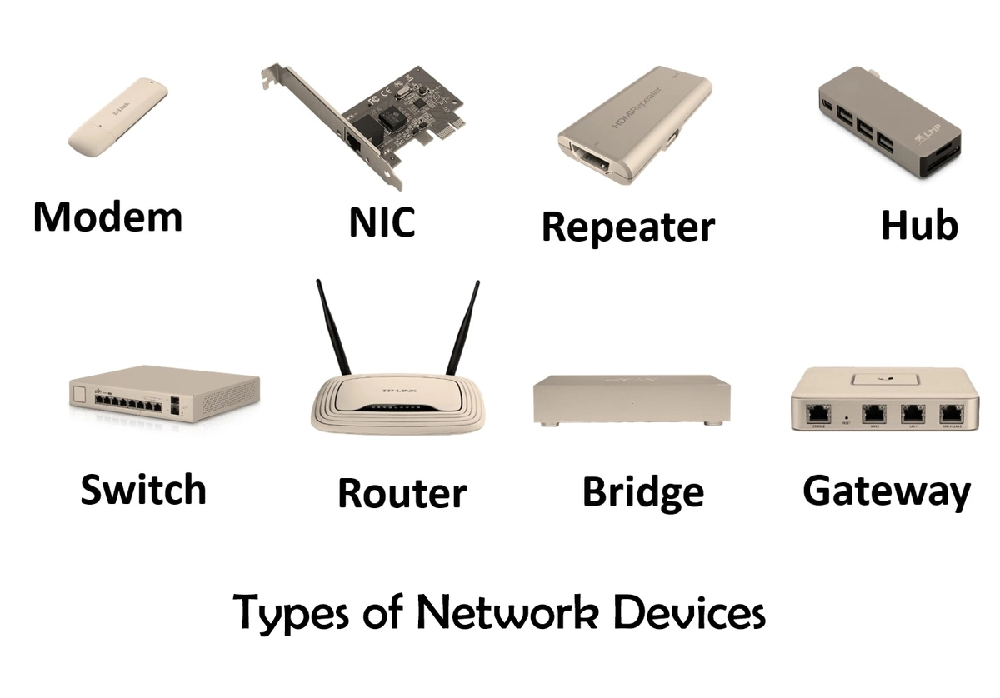

# Network devices and their functions

## Learning objectives

* Develop a basic understanding of the concepts of host, client, server, IP address, and network
* Define network devices
* Compare the functions of repeaters, hubs, bridges, switches, and routers
* Become familiar with major network devices and their role in network operations

This section explores the building blocks of modern computer networks. The discussion begins by clarifying fundamental concepts—hosts, clients, servers, and IP addresses—and shows how these pieces come together to form networks and subnets. From there, the section defines network devices. A detailed comparison of repeaters, hubs, bridges, switches, and routers illustrates how each device handles traffic, overcomes scalability limits, and fits into a network hierarchy. The section then distinguishes between network nodes and endpoints, introduces the standard icons used in network diagrams, and examines real-world examples drawn from Cisco’s router and switch families. Finally, firewalls are covered—both network-based appliances and host-based software—as indispensable security devices that enforce traffic policies at the network’s edge and on individual endpoints.

## Topics covered in this section

* **Host, client, server, IP address, network**
* **Network devices definition**
* **Repeaters, hubs, bridges, switches, and routers**
* **Nodes and endpoints**
* **Network device icons**
* **Cisco devices examples**
* **Firewalls**

### Host, client, server, IP address, network

A host is any device that sends or receives traffic. It can be a client or a server. A client initiates a request for some data or a service. A server responds. A server is a computer that runs software specifically designed to listen for and respond to client requests.

Every host must have an IP address to communicate over an IP network (including the Internet). IP stands for [Internet Protocol](https://itnetworkingskills.wordpress.com/2023/01/15/network-protocols-their-functions/). An IP (specifically, IPv4) address is comprised of 32 bits (4 bytes), represented as four octets. The value of each octet is represented in decimal numbers (e.g., 136.22.17.98). The smallest value an octet can represent is 0 (binary 00000000) and the largest is 255 (binary 11111111).

IP addresses are typically assigned in some sort of hierarchy. The breaking up of IP addresses into their different hierarchies is done through a process known as subnetting.

A network is what transports traffic between hosts. A computer network delivers data from one device to another. Any time you connect two hosts you have a network. A network is a logical grouping of hosts which require similar connectivity. Networks can contain other networks called sub-networks or subnets. The Internet is a collection of interconnected networks.

Each network has its own IP address space (range) and each host in the network has an IP address in that network’s IP address space (hosts on a network share the same IP address space). For example, a network can own all IP addresses which start with 192.168.1.x.

### Network devices definition

Network devices are components of electronic networks required for communication and interaction between devices on computer networks. Network devices mediate data transmission in a computer network.

Network devices are also known as network equipment or network hardware or networking hardware because traditionally they were physical components. Today, many network devices are virtualized or software-based.

![[network-devices-their-functions.webp]]

<figure><figcaption>
Network devices examples (image courtesy of itrelease.com)
</figcaption></figure>

There are many types of network devices, such as access points, firewalls, IDS/IPS, routers, and switches.

### Repeaters, hubs, bridges, switches, and routers

Repeaters regenerate signals, allowing devices to communicate across great distances by extending the physical reach of a network (e.g., allowing Ethernet to go beyond the standard 100m limit). Repeaters are typically used in long-distance cabling (e.g., fiber optic repeaters).

Repeaters regenerate signals without interpreting data. Hubs, which are multi-port repeaters, also do not interpret data but broadcast incoming signals out all ports. Switches, however, forward frames based on MAC addresses and thus do interpret frame headers. 

Hubs connect multiple hosts in a single collision domain. When a host sends data, the hub repeats the signal out all other ports (no MAC learning). Everybody receives everybody else’s data. Connecting hosts directly to each other does not scale. Hubs partially address this scaling problem by connecting multiple devices together, but they introduce a new scaling challenge. This design leads to collisions and wasted bandwidth, so hubs do not scale well as the network grows.

To overcome these scaling limitations, networks use bridges and, more commonly today, switches, which segment collision domains and allow multiple devices to communicate simultaneously without collisions.

- **Bridges** segment collision domains, reducing collisions and allowing simultaneous conversations on different segments, which improves scalability.
- **Switches** take this further: each port is its own collision domain (micro-segmentation), and with full-duplex operation, collisions are eliminated entirely. Switches also provide dedicated bandwidth per port and can forward multiple frames simultaneously, making them highly scalable.

A bridge sits between hub-connected hosts, connecting two hub segments. Bridges only have two ports—each facing a different hub segment. Bridges learn which hosts are on which side, that is, which MAC addresses are on each side. A MAC (Media Access Control) address is a unique hardware identifier assigned to a network interface controller (NIC) by the manufacturer. It is typically a 48-bit address written as 12 hexadecimal digits (e.g., 00:1A:2B:3C:4D:5E), and is often called the burned-in address (BIA). This allows bridges to filter traffic and keep frames local to the appropriate segment.

Bridges will forward frames only if the destination is on the other segment. Bridges and switches both forward broadcasts. Switches, which are much more efficient, have largely replaced bridges.

A switch is a multi-port bridge with dedicated bandwidth per port. A switch maintains a full MAC address table for all ports and forwards traffic only to the destination port (unless it is flooding frames—more on the concept of flooding later on). 

A switch is a device that facilitates communication within a network. A router is a device that facilitates communication between different networks. 

Routers connect networks together, including providing access to the Internet. Routers provide traffic control points (security, filtering, redirecting) between networks. Routers sit on the boundary between networks, providing a logical location to apply security policies.

Routers learn which networks they are attached to. The knowledge of each different network is a route. Routes are stored in a routing table. A routing table is all the networks a router knows about. A router uses the routing table to funnel traffic to the appropriate interface.

Routers use the hierarchical structure of IP addresses (created by subnetting) to forward traffic between networks. This hierarchy lets routers summarize routes and keep routing tables manageable.

Routers have an interface assigned an IP address in every network they are attached to, and typically those interfaces act as a gateway for the connected networks. A gateway is a host’s way out of their local network.

If a host in the sales team of a corporation wants to speak to a host in the marketing team, it’s going to use its gateway, which is its closest router IP address, which is then going to send a packet to the next router, to the next router, and finally to the host in the marketing team.

Routing is the process of moving data between networks. A router is a device that performs routing. Switching is the process of moving data within networks. A switch is a device that performs switching. 

### Nodes and endpoints

A network can be defined as the interconnection between various network devices. All devices connected to a network are called network nodes. This includes routers, switches, firewalls, servers, and client devices such as desktops and laptops.

Among these, servers and clients are often referred to as end hosts or endpoints. An endpoint is a device that sits at the “edge” of the network—it originates or terminates communications, acting as a source or destination of data. Typical endpoints include desktop computers, laptops, smartphones, tablets, and servers. Intermediate nodes like routers and switches forward traffic between endpoints but are not themselves considered endpoints.

### Network device icons

For illustration, here are the network device icons used in Wendell Odom’s (2020) CCNA 200-301 Official Cert Guide.

<figure><figcaption>
Icons of common network devices/technologies used in network diagrams (Odom, 2020)
</figcaption></figure>

### Cisco devices examples

Enterprise networks are typically composed of two main types: local area networks (LANs) and wide area networks (WANs). LANs connect devices in a limited physical space, such as the same floor of a building, while WANs connect networks across much greater distances.

Within a LAN, standard Layer 2 switches provide connectivity to end hosts within the same LAN and forward data locally. However, switches cannot route traffic to the Internet or between LANs on their own; they require a router to reach networks outside their local segment.

Routers connect different LANs together and forward data between them, including providing access to the Internet. In a typical design, end devices connect to a switch, the switch connects to a router, and the router links to the Internet. In network diagrams, usually a cloud is used to represent the Internet.

The following image shows some models of Cisco routers and switches. You can see router models ISR 1841 and ISR 2921, and switch models Catalyst 3560 and Catalyst Express 520.

<figure><figcaption>
Cisco routers and switches (image courtesy of allbids.com.au)
</figcaption></figure>

Notice that switches have many more network interfaces (ports) than routers. This is typical. For example, the Catalyst Express 520 shows 24 network interfaces we can connect end hosts or servers to. Switches typically have many RJ-45 ports because switches give user devices a place to connect to the Ethernet LAN. 

Other Cisco switch models include Catalyst 9200 and Catalyst 3650. And other Cisco router models include ISR 1000, ISR 900, and ISR 4000.

### Firewalls

Firewalls monitor and control network traffic based on configured rules. You explicitly configure which network traffic should be allowed into your network, and which should not.

Firewalls can be placed inside the network or outside the network. Meaning, the firewall can filter traffic before it reaches the router or after it has passed through the router. 

The ASA (Adaptive Security Appliance) is Cisco’s classic firewall. The following image shows the Cisco ASA 5500-X series firewall model.

Although the ASA is Cisco’s classic firewall, modern ASAs include modern features of next generation firewalls, including features such as an intrusion prevention system (IPS).

<figure><figcaption>
ASA 5500-X series firewall (image courtesy of cisco.com)
</figcaption></figure>

Firewalls are known as next-generation firewalls when they include more modern and advanced filtering capabilities.

Another example of an enterprise grade next-generation firewall is the Cisco Firepower 2100 series. 

ASA 5500-X and Firepower 2100 are network firewalls, which are hardware devices that filter traffic between networks. However, there are also host-based firewalls.

Host-based firewalls are software applications that filter traffic entering and exiting a host machine, like a PC. Your PC almost certainly has a software firewall installed. Even in a network with a hardware firewall, each PC should include a software firewall as an extra line of defense.

### Key takeaways

- A host is any device that sends or receives traffic. A client initiates a request; a server responds.
- Every host on an IP network must have an IP address. IPv4 addresses are 32-bit values represented in dotted-decimal (e.g., 136.22.17.98).
- A network is a logical grouping of hosts that share the same connectivity requirements and IP address space. Networks can be subdivided into smaller sub-networks (subnets).
- Network devices mediate data transmission:
    - Repeaters regenerate signals to extend a network’s physical reach.
    - Hubs are multiport repeaters that create a single collision domain, broadcasting data to all ports.
    - Bridges connect two network segments, learn MAC addresses, and forward frames only when necessary, reducing collisions.
    - Switches are multiport bridges that provide dedicated collision domains per port and forward frames based on MAC addresses, enabling simultaneous communication within a network.
    - Routers connect different networks, forward packets using IP addresses and routing tables, and serve as gateways.
- All devices connected to a network are called network nodes. Endpoints (end hosts such as clients and servers) originate or terminate traffic, whereas intermediate nodes (switches, routers) forward it.
- Firewalls monitor and control traffic based on configured security rules. They can be hardware appliances that filter traffic between networks (network firewalls) or software applications that protect individual hosts (host-based firewalls).

### References

[Free CCNA | Network Devices | Day 1 | CCNA 200-301 Complete Course](https://www.youtube.com/watch?v=H8W9oMNSuwo\&list=PLxbwE86jKRgMpuZuLBivzlM8s2Dk5lXBQ\&index=1)

[Hub, Bridge, Switch, Router – Network Devices – Networking Fundamentals – Lesson 1b](https://www.youtube.com/watch?v=H7-NR3Q3BeI\&ab_channel=PracticalNetworking)

[Network devices part 1: Network Devices – Hosts, IP Addresses, Networks – Networking Fundamentals – Lesson 1a](https://www.youtube.com/watch?v=bj-Yfakjllc\&ab_channel=PracticalNetworking)

Odom, W. (2020). CCNA 200-301 Official Cert Guide, Volume 1. Cisco Press.
