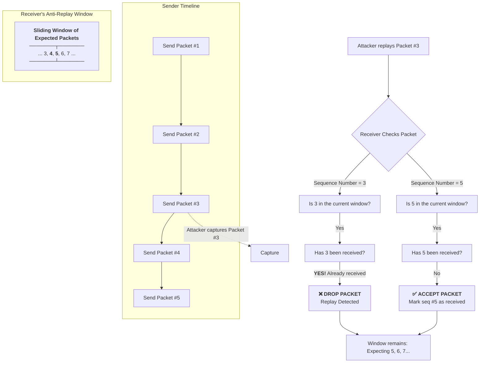

# Replay attacks and anti-replay methods

## Learning objectives

* Understand what are replay attacks and what security risks they pose
* Become familiar with major anti-replay methods
* Develop a basic understanding of how replay attacks can threaten SSL/TLS security
* Develop a basic understanding of how TLS 1.3 closes most replay attack vectors

This section discusses replay attacks and the mechanisms to defend against them. Replay attacks pose a critical threat to data confidentiality and integrity, and session and identity authenticity. This section explores key replay attack mechanisms, the risks they pose—especially to protocols like SSL/TLS—and the fundamental anti-replay methods used to mitigate them. Anti-replay measures are deployed to protect against various types of cybersecurity threats. For example, they are deployed to secure financial transactions, where they block attackers from intercepting and re-playing a transaction authorization to drain funds multiple times. They are also essential for hardening VPN tunnels, preventing an adversary from capturing and injecting old packets to hijack a secure connection or impersonate an authorized user. Furthermore, these measures are key to protecting sensitive data transfers, ensuring that a file can't be stolen by an attacker who simply replays the request for it after the initial transfer. Anti-replay methods are often used in combination and include sequence number windowing, timestamps, nonces, cryptographic hashes, and rotating secret keys. This discussion culminates in an analysis of how modern protocols, particularly TLS 1.3, have integrated these defenses to close historic vulnerabilities.

## Topics covered in this section

* **Replay attacks**
* **Anti-replay methods**
* **Anti-replay methods and SSL/TLS security**

### Replay attacks

A replay attack is a type of cyberattack in which an attacker intercepts and retransmits valid data transmissions to gain unauthorized access, steal information, or disrupt services. Replay attacks exploit the inherent trust systems have in properly formatted messages, bypassing authentication by repeating it rather than breaking it. For example, an attacker could capture a financial transaction approval and replay it to fraudulently withdraw funds multiple times.

A replay attack is an umbrella term for various techniques involving various attack vectors. Here’s a breakdown:

* **Network replay:** Attacks low-level network protocols (e.g., TCP sequence numbers, IPSec AH/ESP packets, WPA2 handshakes). The goal is often to hijack a connection, disrupt service (DoS), or decrypt traffic. Network replay attacks are common in academic research and targeted attacks against specific infrastructure (e.g., VPNs, Wi-Fi networks). 
* **Wireless replay:** Specifically targets wireless protocols like Wi-Fi (e.g., replaying WPA2 handshake messages to crack the password) or Bluetooth. The wireless medium makes interception trivial. Wireless replay attacks are common. Tools like Wireshark and Aircrack-ng automate the capture and replay of Wi-Fi handshakes, making this a standard technique in wireless penetration testing and attacks.
* **Session replay (often over HTTP):** Attacks the application layer. The attacker steals a session token (like a cookie) and replays it in their own browser to impersonate a logged-in user and hijack their session. This is the most straightforward impersonation attack. Session replay attacks are very common. This is one of the most prevalent web application security issues. It's the primary reason websites use short-lived sessions and CSRF tokens.
* **HTTP replay (a method for session replay):** This is not a separate type but rather the method used for a session replay attack. The attacker replays an entire HTTP request (e.g., `POST /transfer?amount=1000`). If the request lacks freshness (like a nonce or timestamp), the server will process it again. HTTP replay is the mechanism behind most session and transaction replay attacks on the web.

While replay attacks can be categorized by their target (e.g., web sessions), they universally follow three core phases:

1. **Interception:** The attacker captures a legitimate transmission between a client and server. This could be a login request, a financial transaction, or an authentication handshake.
2. **Extraction:** The relevant data is extracted from the captured transmission. This could be an entire packet, a security token, or a specific protocol message.
3. **Injection:** The attacker injects (replays) the captured data into the network channel. The receiving system accepts it because it appears to be a legitimate, valid message.

This section delves into SSL/TLS, session tickets, and authentication tokens. The primary type of replay attack this section focuses on is the session replay attack (and its specific method, HTTP replay). The section's emphasis on threats to authenticity via replayed authentication tokens or handshake messages directly maps to the session hijacking and TLS handshake replay scenarios, which are the most relevant and common replay threats in modern web security.

### Anti-replay methods

Suppose we have some packets we want to securely transmit over the wire. We start sending the packets to their destination over the wire. The packets use a 16 bit sequence number field, allowing for sequence number range of 1 – 65536. A malicious hacker manages to capture some packets from our transmission with the sequence numbers 10,000-10,099. The malicious hacker can wait for the sequence number to loop past 65536 and restart at 0, count 9,999 packets, and then inject the replayed packets with the sequence numbers 10,000-10,099. Since the replayed packets would have arrived at the right time, they would have been accepted by the receiver. 

Anti-replay methods are essential for maintaining data integrity and for preventing attackers from capturing and retransmitting legitimate data packets to gain unauthorized access or disrupt communications. Here are the common anti-replay methods:

**1. Sequence numbers windowing:**

Each packet that is sent over a secure connection is assigned a unique sequence number by the sender. The receiver maintains a window of expected sequence numbers and discards any packets with numbers outside that window or those already received.

The size of the anti-replay window is the number of packets that are kept track of by the receiving end of the connection. The larger the window size, the more packets that can be protected from replay attacks. However, a larger window size also means that more memory is required to keep track of the sequence numbers. The default anti-replay window size is 64 packets. This is a good balance between security and performance. For more demanding applications, the window size can be increased.

The unique sequence number typically starts at 1, and increases with every packet sent, uniquely identifying one packet from the prior one. The receiving end of the connection keeps track of the sequence numbers of the packets that it receives.

If a packet with a sequence number that has already been received is received, then the anti-replay mechanism will drop the packet. This prevents the attacker from retransmitting a packet that has already been sent and received.

The packet with sequence number 3 is a replayed packet. The receiver can detect this because they have already received a packet with sequence number 3, and was expecting 5 next.

The sequence number is a finite field, meaning, it has a predefined range based on the number of bits allocated in the data packet. For example, if the data packet only allows a 16 bit field for the sequence number, you would have a total range of 1 – 65536. The maximum sequence number imposes a limit on the number of packets that can be sent. If exceeded, it can result in a looped sequence number vulnerability when the sequence number rolls back to zero.

Modern networking protocols use larger sequence numbers (e.g., IPSec uses 32-bit) to reduce rollover risk (sequence number looping vulnerability).

**2. Timestamps:**

The sender includes a timestamp in each packet, indicating the time of transmission. The receiver compares the timestamp with its own clock and rejects packets with timestamps older than a certain threshold.

**3. Nonces:**

The sender includes a random number (nonce) in each packet. The receiver keeps track of received nonces and discards any packets with duplicate nonces.

**4. Cryptographic hashes:**

Cryptographic hashes are typically Message Authentication Codes (MACs) or HMACs, ensuring both integrity and authenticity.

The sender includes a cryptographic hash of the packet’s contents (message authentication code or MAC). The receiver verifies the hash to ensure the packet has not been modified in transit.

The sequence number, along with the data, can be protected by a hashing algorithm to prevent a malicious user from tampering with the numbers in order to send a replayed packet. The message, the secret key, and the sequence number together are run through a hashing algorithm. In this way, any illicit modification of any of these fields will be detected.

**5. Rotating the secret keys**:

Keys should be rotated before sequence number exhaustion to prevent replay attacks during the reset.

Rotating the secret keys used in the hashing algorithms is a way to prevent replayed packets. When the secret keys are rotated, the hash values of the packets will also change. This is because the secret keys are used to encrypt the data before it is hashed. If an attacker tries to replay a packet that was encrypted with the expired secret keys, the hash value of the packet will not match the hash value that is expected by the receiver.

This will allow the receiver to detect the replay attack and drop the packet. If the secret keys are rotated when the sequence number resets to zero, replayed packets injected after the reset are identified by their sequence numbers (these replayed packets, with their specific sequence numbers, have an old/wrong hash value than legitimate packets).

### Anti-replay methods and SSL/TLS security

Robust security protocols implement anti-replay measures as a core part of their design. For instance, modern protocols like WireGuard employ a cryptographic nonce system to guarantee message freshness and prevent replays. IPSec implements anti-replay measures within its ESP protocol, using sequence numbers and a sliding window, while SSH and TLS/SSL leverage sequence numbers and timestamps. 

Anti-replay methods are a fundamental part of how SSL/TLS secures data. SSL/TLS relies on cryptographic tools to ensure **confidentiality, integrity, and authenticity** of data in transit. Replay attacks pose a threat to these guarantees, so SSL/TLS incorporates anti-replay mechanisms as part of its security design. 

#### **How Replay Attacks Threaten SSL/TLS Security Guarantees and Modern Defenses**

SSL/TLS provides three core security guarantees:

1. **Confidentiality** – Data is encrypted and cannot be read by eavesdroppers.
2. **Integrity** – Data cannot be altered in transit without detection.
3. **Authenticity** – Parties can verify each other’s identity.

Replay attacks undermine these guarantees by allowing an attacker to reuse previously captured legitimate traffic, potentially bypassing security controls. Below is a breakdown of how replay attacks threaten each guarantee and how modern TLS (especially TLS 1.3) mitigates them.

#### **1. Threat to Data Confidentiality**

Even if traffic is encrypted, replaying an old session could allow an attacker to reuse an old session key (if session resumption is insecure) or to decrypt future traffic if key material is compromised. A session in TLS refers to a temporary secure connection between a client and server, established via the TLS handshake. It includes session keys (used for encryption), and session tickets/resumption IDs (for faster reconnection). Replaying a session means reusing these components maliciously to bypass authentication or decrypt data.

**Example:**

* In TLS 1.2, if an attacker captures a session ticket and replays it, they might resume a session without a full handshake, gaining access to encrypted data.

**Mitigation:**

✔ **Ephemeral Key Exchanges (ECDHE, DHE)**

* Ensures forward secrecy—even if a session key is compromised later, past sessions remain secure.
* Prevents replay attacks from decrypting old traffic.

✔ **One-Time-Use Session Tickets (TLS 1.3)**

* Unlike TLS 1.2 (where session tickets could be reused), TLS 1.3 tickets are single-use.
* Forces a full handshake if an attacker tries to replay a ticket.

✔ **TLS 1.3’s One-RTT Handshake**

* Reduces the window for replay attacks by minimizing handshake steps.

#### **2. Threat to Data Integrity** 

TLS ensures that data is not modified in transit (via MACs/AEAD ciphers), but it does not inherently prevent the same data from being retransmitted (without modification). A replayed request (e.g., a bank transaction) could execute the same action multiple times.

**Example:**

* An attacker intercepts an HTTPS `POST /transfer?amount=1000` request and replays it, causing duplicate transfers.

**Mitigation:**

✔ **Strict Key Rotation (TLS 1.3)**

* Each session derives fresh keys, preventing reuse of past encryption material.

✔ **Application-Layer Defenses (Required for Full Protection)**

* Idempotency keys (unique identifiers for transactions).
* Timestamps/nonces to detect stale requests.

#### **3. Threat to Authenticity (Impersonation via Replayed Sessions)**

This threat occurs when an attacker captures and retransmits any piece of data that proves a user's identity or an established session. This data can take various forms, such as authentication tokens (like session cookies), handshake messages (like a TLS session ticket), or other authentication credentials. By replaying this data, the attacker bypasses login procedures and tricks the server into granting them unauthorized access as the legitimate user. The server, recognizing the valid but replayed credentials, mistakenly authenticates the attacker.

The authenticity being threatened is the authenticity of the session and the identities within it:

* Session authenticity: The server can no longer be sure that the entity on the other end of the session is the same user who originally authenticated.
* Identity authenticity: The identity of the user (or server) has been successfully faked.

**Examples:**

* Session Hijacking via Cookie Replay: An attacker steals a session cookie and replays it to gain access to the victim's account.
* TLS Handshake Replay (Pre-TLS 1.3): An attacker replays a `ClientHello` message or a session ticket to resume an old session illicitly.

**Mitigation:**

✔ **No Replayable Messages in TLS 1.3**

* The `ClientHello` and `ServerHello` include fresh randomness (nonces), making each handshake unique and preventing the replay of handshake messages for impersonation.

✔ **Strict Session Resumption Rules**

* TLS 1.3 enforces one-time PSKs (Pre-Shared Keys) for session resumption. A replayed PSK is immediately detected and rejected.

#### **4. TLS 1.3 Anti-Replay Mechanisms**

This table outlines key defenses in TLS 1.3 specifically designed to mitigate replay attacks that were more prevalent in previous versions like TLS 1.2.

| **Defense Mechanism**                                    | **How It Counters Replay Attacks**                                                                                                                        | **TLS 1.3 Context & Improvement**                                                                                                                                 |
| -------------------------------------------------------- | --------------------------------------------------------------------------------------------------------------------------------------------------------- | ----------------------------------------------------------------------------------------------------------------------------------------------------------------- |
| **Ephemeral Key Exchange (ECDHE)**                       | Ensures forward secrecy; session keys cannot be reused as they are derived from temporary key pairs and immediately discarded.                            | **Mandatory in TLS 1.3.** Replaces the static key exchanges (e.g., RSA) allowed in TLS 1.2, which were vulnerable to replay if the long-term key was compromised. |
| **One-Time-Use Session Tickets**                         | A session ticket (for resumption) can only be used once. A replayed ticket is rejected by the server, forcing a new full handshake.                       | **TLS 1.3 enhancement.** Unlike TLS 1.2, which allowed reusable tickets, this explicitly prevents session ticket replay attacks.                                  |
| **Nonces in Handshake (ClientHello/ServerHello Random)** | The random values exchanged ensure each handshake is cryptographically unique. A replayed handshake message will have an invalid or stale nonce.          | **Strengthened in TLS 1.3.** The handshake is designed to be non-replayable; replayed ClientHello or ServerHello messages will fail to derive the correct keys.   |
| **Strict, Session-Specific Key Derivation**              | Fresh encryption keys are derived for every unique session based on the latest handshake secrets. Keys from past sessions are invalid.                    | **Core to TLS 1.3 design.** This strict key rotation ensures that even if data is replayed, it was encrypted with a key that is no longer valid.                  |
| **One-Round-Trip (1-RTT) Handshake**                     | Dramatically reduces the time window available for an attacker to intercept and replay handshake messages.                                                | **New in TLS 1.3.** The faster handshake reduces the attack surface and opportunity for replay compared to the multi-RTT handshakes of older versions.            |
| **No Static RSA Key Exchange**                           | Eliminates the risk of an attacker recording ciphertext encrypted to a static public key and replaying it later for decryption if the key is compromised. | **Removed in TLS 1.3.** This closes a major theoretical replay vector that existed in TLS 1.2 and earlier.                                                        |
| **Mandatory Forward Secrecy**                            | Prevents the decryption of recorded past sessions even if the server's long-term private key is compromised later.                                        | **Enforced in TLS 1.3.** This neutralizes the replay threat against data confidentiality, as an attacker cannot decrypt a replayed session stream.                |

TLS 1.3 closes most replay attack vectors. While TLS 1.2 had vulnerabilities (e.g., reusable session tickets, and static RSA key exchange), TLS 1.3 introduces robust anti-replay protections:

* One-time session tickets
* Ephemeral keys for forward secrecy
* Non-replayable handshake messages
* Strict key rotation

However, application-layer defenses (idempotency keys and CSRF tokens) are still needed for full protection against duplicate transactions.

### Key takeaways

* Replay attacks are a significant network threat where an adversary intercepts and retransmits valid data to gain unauthorized access, steal information, or disrupt services. They fundamentally threaten the confidentiality, integrity, and authenticity of secure communications.
* Replay attacks follow a common pattern of interception, extraction, and injection, and can target various layers of the network stack, with session replay being a common vector for web application attacks.
* Effective anti-replay methods are not mutually exclusive and are often used in combination. The primary techniques include:
  * Sequence number windowing: The core method where a receiver tracks received sequence numbers within a sliding window to detect and discard duplicates.
  * Timestamps and nonces: Adding time-sensitive or random values to messages to ensure their freshness.
  * Cryptographic hashes (HMACs): Protecting the integrity of packets and their sequence numbers to prevent tampering.
  * Rotating secret keys: Regularly changing cryptographic keys to invalidate any previously captured traffic.
* Pre-TLS 1.3 SSL/TLS versions were particularly vulnerable to replay attacks, which threatened their guarantees of confidentiality (via session resumption), integrity (via duplicate transactions), and authenticity (via impersonation with replayed tokens).
* TLS 1.3 introduces major security improvements that mitigate most historic replay attack vectors. Key defenses include mandatory ephemeral key exchange for forward secrecy, one-time-use session tickets, non-replayable handshakes, and strict key derivation. However, application-layer defenses like idempotency keys remain necessary for full protection.

### References

Kaufman, C., Perlman, R., & Speciner, M. (2002). Network Security: Private Communication in a Public World (2nd ed.). Prentice Hall.

Rescorla, E. (2018). SSL and TLS: Designing and Building Secure Systems. Addison-Wesley Professional.

Stallings, W. (2020). Cryptography and Network Security: Principles and Practice (8th ed.). Pearson.
