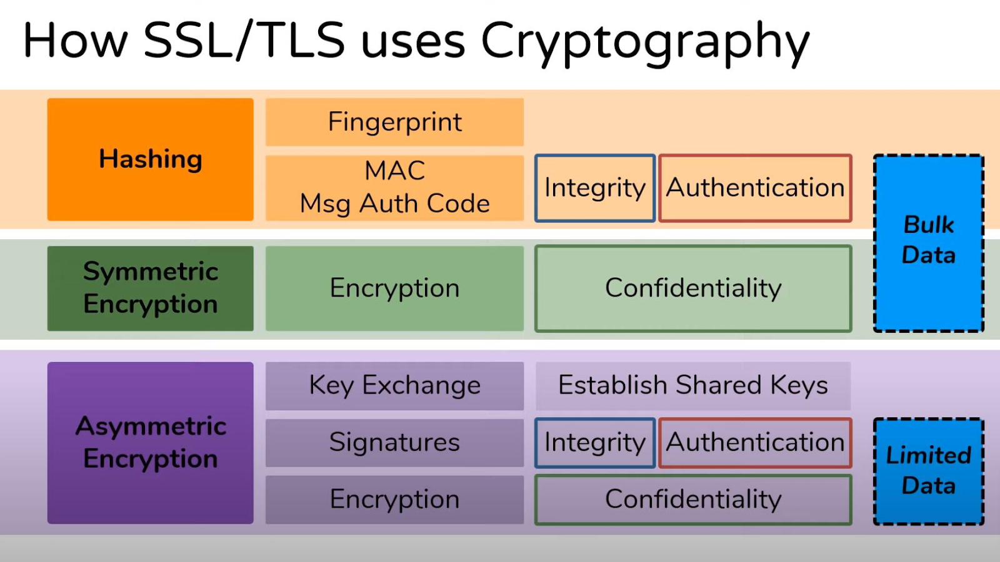

# How SSL/TLS uses Cryptography

This section explains how cryptographic tools (symmetric/asymmetric encryption, and hashing) secure Internet communications via SSL/TLS.

<figure><figcaption>
How SSL/TLS uses cryptographic tools to secure data transmission (image courtesy of Ed Harmoush, Practical Networking)
</figcaption></figure>

**Hashing Algorithms in Digital Signatures (SSL/TLS)**

Hashing is essential in SSL/TLS because it ensures **data integrity, authentication, and non-repudiation** in encrypted communications.&#x20;

When a website presents an SSL certificate, a cryptographic hash (like SHA-256) creates a unique **fingerprint** of the certificate data, which is then **signed** by a trusted Certificate Authority (CA) using asymmetric encryption. This allows browsers to **verify** that the certificate hasn’t been tampered with. Additionally, during the TLS handshake, hashing is used in **digital signatures** (e.g., RSA or ECDSA) to **authenticate** the server and in **HMAC** (Hash-based Message Authentication Code) to verify that transmitted data remains unaltered. Without hashing, attackers could forge certificates, manipulate encrypted sessions, or execute man-in-the-middle attacks, breaking the trust model of HTTPS. Thus, hashing acts as a foundational layer for securing web traffic.

Hashing ensures **data integrity** in digital signatures, while asymmetric encryption (RSA/ECDSA) provides **authentication**. In SSL/TLS, this combination secures websites, APIs, and online transactions.

Digital signatures rely heavily on cryptographic hashing to ensure authentication, integrity, and non-repudiation in secure communications like SSL/TLS. Here's how it works:

#### **1. Role of Hashing in Digital Signatures**

A digital signature is created using a combination of **hashing + asymmetric encryption**. The process involves:

**Step 1: Hashing the Data**

* The sender (e.g., a website) generates a **hash** of the message/data using a **cryptographic hash function** (e.g., SHA-256).
* This hash acts as a unique "fingerprint" of the data.

**Step 2: Encrypting the Hash with a Private Key**

* The sender **encrypts** this hash using their **private key** (asymmetric encryption, e.g., RSA or ECDSA).
* The encrypted hash becomes the **digital signature**.

**Step 3: Verification by the Receiver**

**Step 3: Verification by the Receiver**

* The receiver decrypts the signature using the sender’s **public key**, retrieving the original hash.
* They independently compute the hash of the received data.
* If the two hashes match, the data is **authentic and unaltered**.

***

#### **2. Why Hashing is Essential in SSL/TLS**

In **SSL/TLS** (used for HTTPS), digital signatures are used for:

**A. Certificate Verification**

* Websites present an **SSL certificate** signed by a Certificate Authority (CA).
* The CA signs the certificate’s hash with its private key.
* Your browser verifies it by checking the signature against the CA’s public key.

**B. Key Exchange (TLS Handshake)**

**B. Key Exchange (TLS Handshake)**

* In **TLS 1.2/1.3**, hashing ensures integrity during key exchange (e.g., verifying `ServerKeyExchange` messages).
* Example: **RSA-PSS** (Probabilistic Signature Scheme) uses hashing for secure signing.

**C. Message Authentication (HMAC)**

* **HMAC** (Hash-based Message Authentication Code) ensures that TLS records aren’t tampered with in transit.
* Uses hashes (SHA-256, SHA-384) combined with a secret key.

### References

Ed Harmoush. (n.d.). How SSL & TLS use Cryptographic tools to secure your data - Practical TLS. Practical Networking. https://www.youtube.com/watch?v=aCDgFH1i2B0
