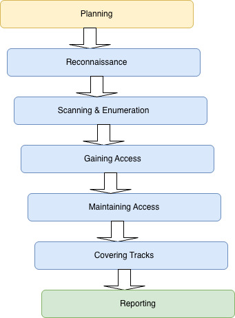

# Phases of the penetration testing process

## Learning objectives

* Describe the phases of the penetration testing process
* Describe best practices for writing the penetration test report

This section describes the phases of the penetration testing process—planning, reconnaissance, scanning and enumeration, gaining access (exploitation) and privilege escalation, maintaining access, covering tracks, and reporting—including the goals of each phase and key technologies used. Further, this section describes best practices for writing the penetration test report.

## Topics covered in this section

* **Introduction**
* **Reconnaissance**
* **Scanning and enumeration**
* **Gaining access**
* **Maintaining access**
* **Covering tracks**
* **The penetration test report**

### Introduction

The penetration testing process can be broken down into several phases: planning or preparation, reconnaissance, scanning and enumeration, gaining access (exploitation) and privilege escalation, post-exploitation (maintaining access and covering tracks), and reporting (NIST SP 800-115, 2008; Walker, 2012, 2017).

<figure><figcaption><p>The seven phases of the ethical hacking process</p></figcaption></figure>

In the planning phase, rules are identified, management approval is finalized and documented, and testing goals are set. The planning phase sets the groundwork for a successful penetration test. No actual testing occurs in this phase. (NIST SP 800-115, 2008, p. 5-2)

In the words of Walker (2012), "There are three main phases to a pen test—preparation, assessment, and conclusion" (p. 8). The preparation phase defines the timeline and scope of the penetration test, "the types of attacks allowed, and the individuals assigned to perform the activity" (p. 8).

The assessment phase (sometimes also known as the security evaluation phase) is exactly what it sounds like—the actual assaults on the security controls are conducted during this time. Lastly, the conclusion (or post-assessment) phase defines the time when final reports are prepared for the customer, detailing the findings of the tests (including the types of tests performed) and many times even providing recommendations to improve security. (Walker, 2012, p. 8)

Penetration tests should be seen as targeted exercises. Test objectives and the specific machines or applications to be tested are all specified upfront in a contractual agreement between the client and the ethical hacker during the planning phase. Each test objective will have its own set of parameters and processes. The agreement provides a precise description, typically in the form of specific IP addresses, domain names, or cloud instance identifiers, of the systems to be evaluated. "Precision is critical, as a minor error could lead to testing the wrong system or, in the worst case, the systems of an unrelated organization" (Palmer, 2001, p. 775).

For Walker (2017), the assessment phase or “act of hacking” is comprised of five main phases: 1) Reconnaissance, which involves the steps taken to gather evidence and information on the target; 2) scanning and enumeration, which takes the information gathered in reconnaissance and applies tools and techniques to gather more in-depth information on the targets; 3) gaining access, where “true attacks are leveled against the targets enumerated in the second phase”; 4) maintaining access, where hackers attempt to ensure they have a way back into the compromised system; and 5) covering tracks, where “attackers attempt to conceal their success and avoid detection by security professionals” (p. 36). In practice, assessment phases run concurrently and continuously throughout a penetration test (Walker, 2017).

For the purposes of this section, ethical hacking refers to the comprehensive process of 1) planning or preparing for a penetration test, 2) performing a penetration test (what Walker, 2012/2017 and EC-Council identify as the assessment phase of the penetration test and which is common to both malicious and ethical hackers), and 3) reporting on the findings of the penetration test. This comprehensive process is illustrated in the diagram "The seven phases of the ethical hacking process".

Typical penetration testing activities:

1. **Reconnaissance** – predominantly passive information gathering.
2. **Scanning** – active probing (mostly Nmap) for host discovery, port scanning, and service/OS detection.
3. **Enumeration** – extraction of information from discovered services (user accounts, shares, SNMP data, etc.). This may uncover weak configurations that could be exploited immediately (e.g., default credentials, anonymous access).
4. **Vulnerability scanning (optional)** – using tools like OpenVAS or Nessus to identify known CVEs, missing patches, and misconfigurations. Can be run after port scanning (fast) or after enumeration (stealthier).
5. **Exploitation** (gaining access and privilege escalation) – attempting to exploit the discovered weaknesses (whether from enumeration or vulnerability scanning) to gain access.
6. **Post‑Exploitation** – maintaining access and covering tracks.

### Reconnaissance

Penetration tests begin with an extensive information gathering phase to build a profile of the target user or system to determine entry points. Reconnaissance can be passive or active, but most reconnaissance activities are passive in nature. Passive reconnaissance involves gathering information from the public domain (OSINT) in places like Internet registries, Google, newspapers, and public records. At this stage "the target does not even know generally that they are the subject of surveillance". Active reconnaissance includes "anything that requires the hacker to interact with the organization", including social engineering activities (Walker, 2017, p. 45).

OSINT involves collating technical information on an organization’s public-facing systems. “Internet registries, coupled with services such as Shodan or VPN Hunter, can highlight and identify an organization’s Web servers, mail servers, remote access endpoints and many other Internet-facing devices” (cipher.com). During OSINT, the penetration tester identifies potential weaknesses and entry points across the organization’s security posture, including its network, applications, website, wireless networks, physical facilities, cloud-based systems, and employees.

Automated OSINT is used by hackers and penetration testers to gather and analyze intelligence about a specific target from social networks, including names, online handles, jobs, friends, likes/dislikes, interactions, locations, pictures, etc. Recon-ng and Maltego are examples of such automated OSINT tools, designed to streamline the collection, analysis, and organization of intelligence across multiple data sources.

Faircloth (2011) proposes an iterative five stage reconnaissance phase: Intelligence Gathering, Footprinting, Human Recon, Verification, and Vitality. Building on Faircloth (2011), follows is a table summarizing the stages of the reconnaissance phase. The first four stages—Intelligence Gathering, Footprinting, Human Recon, and Verification—rely exclusively on passive reconnaissance techniques, gathering information from public sources without directly interacting with the target’s systems. The Vitality stage introduces active reconnaissance, using direct probes to confirm reachability, and serves as the transition into the enumeration phase.

**Table: Stages of Reconnaissance (Adapted from Faircloth, 2011)**

| Stage                      | Objectives                                                                                                                                         | Output                                                                                                                                                                                                         | Tools                                                                                                                                               |
| :------------------------- | :------------------------------------------------------------------------------------------------------------------------------------------------- | :------------------------------------------------------------------------------------------------------------------------------------------------------------------------------------------------------------- | :-------------------------------------------------------------------------------------------------------------------------------------------------- |
| **Intelligence Gathering** | To learn as much about the target, its business, its organizational structure, and its business partners as possible.                              | The output of this phase is a list of company names, partner organization names, and DNS names which reflect the entire target organization including all of its brands, divisions, and local representations. | Search engines; Financial databases; Business reports; ICANN/WHOIS; RWHOIS; Domain name registries and registrars; Web archives; Data mining tools. |
| **Footprinting**           | To mine as many DNS host names as possible from the domains or company names collected and translate those into IP addresses or IP address ranges. | The output of this phase is a list of DNS host names, IP addresses, and IP address ranges.                                                                                                                     | DNS; ICANN/WHOIS; DIG; SMTP; Data mining tools; Censys.                                                                                             |
| **Human Recon**            | To analyze the human perspective of the target and gain as much intelligence as possible about the people associated with the organization.        | The output of this phase is a list of names, job titles, contact information, and other personal details about the people associated with the organization.                                                    | Search engines; Email lists and web site posts; Social networking services; Publicly available records.                                             |
| **Verification**           | To confirm the validity of information collected in the prior phases.                                                                              | This phase rarely produces new output, but can clean up existing output by removing invalid data. Some additional information can sometimes be gathered as a side-product of the verification.                 | DNS; WHOIS; DIG.                                                                                                                                    |
| **Vitality**               | To confirm the reachability of the IP addresses identified in prior phases. This is a phase which spreads between reconnaissance and enumeration.  | The output of this phase is a list of IP addresses from prior phases which have been confirmed as reachable.                                                                                                   | PING; Port scanners; Mapping tools.                                                                                                                 |

There is no clear cutoff point between passive and active intelligence gathering techniques. The definition of passive is not always consistent across the field. The confusion includes whether the information gathering can be performed without the knowledge of the organization under investigation (i.e., remains stealthy) and whether the process of testing can be traced back to the tester's location or IP address.

### Scanning and enumeration

Building on the information gathered during reconnaissance, security analysts now begin the discovery phase to gather in-depth technical details about the targets. Scanning and enumeration can be "something as simple as running a ping sweep or a network mapper to see what systems are on the network, or as complex as running a vulnerability scanner to determine which ports may be open on a particular system" (Walker, 2012, p. 9).

While recon may find that a network has 500 machines connected to a single subnet inside a building, scanning would uncover which ones are Windows machines and which ones are running FTP, web servers, or remote administration services. Enumeration would then extract usernames, share names, and configuration details from those services.

**Scanning vs Enumeration Key Goals and Open Source Tools**

| Scanning                                      | Enumeration                                                   |
| --------------------------------------------- | ------------------------------------------------------------- |
| **"What's alive and what ports are open?"**   | **"What can I extract from those services?"**                 |
| Broad, network-level discovery                | Targeted, service-specific probing                            |
| Identifies targets and potential entry points | Extracts data: usernames, shares, configurations              |
| **Tools:** `nmap`, `masscan`, `arp-scan`      | **Tools:** `enum4linux`, Metasploit aux modules, `ldapsearch` |

The core technical activities of the **scanning and enumeration phase** move from identifying potential targets to actively discovering and cataloging detailed information about them. 

This process typically follows a logical sequence:

- Host discovery – to identify live hosts on a network.
- Port scanning – to discover open ports on those hosts.
- Service and version detection – to confirm the actual service type and extract software names/versions via basic banner grabbing (manual enumeration).
- OS fingerprinting – to identify a host's operating system.
- Enumeration (beyond banner grabbing) – to extract detailed data (users, shares, configurations) using Nmap’s enumeration scripts or dedicated tools.
- Vulnerability scanning (optional) – to run automated checks for known CVEs using dedicated vulnerability scanners (OpenVAS, Nessus). It can be run after port scanning (fast) or after enumeration (stealthier but slower).
- Vulnerability identification – to map findings from enumeration and vulnerability scanning (whether using dedicated vulnerability scanners like OpenVAS or using Nmap’s vulnerability detection scripts) to known CVEs, misconfigurations, and weaknesses.

#### Passive vs active discovery techniques

Both passive and active scanning and enumeration techniques exist. Passive techniques involve no direct contact with the target, resulting in very low detection risk. However, they are usually slower and less precise, making them best suited for early reconnaissance, compliance testing, or situations where avoiding alerts is critical. Active techniques, by contrast, send direct probes to the target, which carries a high risk of detection. They are faster and produce highly detailed results, making them ideal for post‑reconnaissance validation and comprehensive deep‑dive testing. 

Key scanning activities include network scanning (host discovery), port scanning, and vulnerability scanning. Common enumeration techniques include banner grabbing, SMB enumeration, NetBIOS enumeration, SNMP enumeration, and using protocols like LDAP, NTP, and SMTP.

Network scanning, port scanning, and vulnerability scanning are all typically active techniques because they involve sending probes to the target. Network scanning and port scanning can be performed with Nmap (active tool). Vulnerability scanning is typically performed with dedicated automated scanners such as OpenVAS and Nessus. However, passive network scanning and service detection tools do exist—e.g., fingerprinting with `p0f` to infer network topology and hosts without sending packets, and detecting running services with Wireshark—but they are less common in penetration testing.

**`p0f`** is a passive TCP/IP stack fingerprinting tool. It analyzes captured network traffic (without sending any probes) to infer the operating system of a target host by examining characteristics such as:

- TCP window size
- Time-to-live (TTL)
- TCP options (e.g., maximum segment size, selective acknowledgment)
- Initial sequence numbers

Because it does not generate any packets of its own, `p0f` is completely stealthy and well-suited for passive reconnaissance. Its primary output is an estimate of the remote operating system (e.g., “Linux 2.6.x”, “Windows 10”, “iOS”). 

The enumeration techniques banner grabbing, SMB enumeration, NetBIOS enumeration, SNMP enumeration, and using protocols like LDAP, NTP, and SMTP are generally active as they require direct queries to the target services. There are passive variants—for example, capturing banner information from unencrypted traffic already on the wire using packet analyzers such as Wireshark—but in practice, enumerators actively send requests to extract the data.

**Scanning and Enumeration Techniques – Active vs Passive**

Here’s a classification based on how these techniques are typically applied during a penetration test.

| Category        | Technique                  | Type    | Example Tools                                                             | Notes                                                                                                                           |
| --------------- | -------------------------- | ------- | ------------------------------------------------------------------------- | ------------------------------------------------------------------------------------------------------------------------------- |
| **Scanning**    | Network scanning           | Active  | `nmap`, `masscan`, `arp-scan`                                             | Sending probes (ICMP, ARP, TCP SYN/ACK) to discover live hosts.                                                                 |
| **Scanning**    | Port scanning              | Active  | `nmap`, `masscan`                                                         | Directly connecting to ports (SYN, Connect, UDP scans) to determine open/closed/filtered states.                                |
| **Scanning**    | Vulnerability scanning     | Active  | Nessus, OpenVAS, `nmap` (vuln scripts)                                    | Sending specific payloads or checks to identify known vulnerabilities.                                                          |
| **Scanning**    | Passive network discovery  | Passive | `p0f`, Wireshark                                                          | Analyzing existing network traffic to infer live hosts, OS, and network topology without sending probes.                        |
| **Scanning**    | Passive OS fingerprinting  | Passive | `p0f`                                                                     | Examining TCP/IP stack characteristics (TTL, window size, options) from captured traffic to identify OS.                        |
| **Enumeration** | Banner grabbing            | Active  | `nmap -sV`, `netcat`, `telnet`                                            | Connecting to a service to read its welcome banner.                                                                             |
| **Enumeration** | Banner grabbing (passive)  | Passive | Wireshark, `tcpdump`                                                      | Capturing banners from unencrypted traffic already on the wire (e.g., FTP, SMTP, HTTP).                                         |
| **Enumeration** | NetBIOS enumeration        | Active  | `nbtscan`, `nmblookup`, Nmap NSE (`nbstat.nse`)                           | Sending queries to NetBIOS Name Service (UDP 137) to list hosts, names, and MAC addresses.                                      |
| **Enumeration** | SMB enumeration            | Active  | `enum4linux`, `smbclient`, Nmap NSE (`smb-enum-shares`, `smb-enum-users`) | Querying SMB (TCP 445) to list shares, users, groups, and policies.                                                             |
| **Enumeration** | SNMP enumeration           | Active  | `snmpwalk`, `snmp-check`, Nmap NSE (`snmp-info`)                          | Using SNMP queries (UDP 161) to walk MIBs and extract system information. Often relies on default community strings.            |
| **Enumeration** | LDAP enumeration           | Active  | `ldapsearch`, `adidnsdump`, Nmap NSE (`ldap-search`)                      | Querying LDAP directories (TCP 389 / 636) to retrieve user objects, groups, OUs, and email addresses.                           |
| **Enumeration** | NTP enumeration            | Active  | `ntpdc`, `ntpq`, Nmap NSE (`ntp-monlist`)                                 | Using NTP commands (UDP 123) to query monlist, peers, and system information.                                                   |
| **Enumeration** | SMTP enumeration           | Active  | `smtp-user-enum`, Nmap NSE (`smtp-enum-users`)                            | Using `VRFY`, `EXPN`, or `RCPT TO` commands (TCP 25) to validate user accounts.                                                 |
| **Enumeration** | Credential / data sniffing | Passive | Wireshark, `tcpdump`, `dsniff`                                            | Capturing unencrypted credentials (e.g., FTP, Telnet, HTTP Basic) or application data from network traffic without interaction. |

**NSE** stands for **Nmap Scripting Engine**, which is the built‑in framework within Nmap for writing and running scripts. All scripts that come with Nmap (or are written for it) are NSE scripts.

Passive discovery usually occurs earlier, during the reconnaissance phase, and focuses on information already publicly available or observable without direct interaction.

#### Nmap (Network Mapper)

Nmap is a key technology used in the discovery phase (scanning and enumeration) of the penetration testing process. Nmap sends custom ICMP, TCP, and UDP packets to probe a target. One purpose of these probes is host discovery – identifying live hosts on a network (hence its original name, network mapper). Other probes perform port scanning and service/version detection. The target’s responses form unique patterns (sometimes called fingerprints), which Nmap uses to identify running software, protocols, and the operating system. Because its primary function is to scan networks and enumerate open ports and services, Nmap is popularly referred to as a network scanner.

As a network mapper, Nmap can discover hosts on a network and map out the topology, IP ranges, and relationships between devices. As a network scanner, Nmap can probe specific targets to identify open ports, running services, operating systems, and potential vulnerabilities.

Basic Nmap syntax:

```
nmap <scan options> <target>
```

The following command runs a basic host discovery and a fast port scan.

```
nmap -F <target>
```

**Command syntax:**

- **`nmap`** – the command-line tool used for discovering live hosts and identifying open ports/services.
- **`-F`** – stands for fast mode. Nmap scans only the top 100 most frequently used ports (e.g., 22/SSH, 80/HTTP, 443/HTTPS, 3389/RDP, etc.), rather than scanning all 65,535 ports. This makes the scan much quicker, which is useful for a preliminary reconnaissance.
- **`<target>`** – the target you specify. This can be an IP address (e.g., `192.168.1.10`), a hostname (e.g., `example.com`), or a network range (e.g., `192.168.1.0/24`).

When you run `nmap -F <target>`, Nmap first performs **host discovery** using four probes:

- An **ICMP echo request** (ping)
- A **TCP SYN to port 443** (HTTPS)
- A **TCP ACK to port 80** (HTTP)
- An **ICMP timestamp request** (if the user has appropriate privileges)

If any probe receives a response, the host is considered alive. Then Nmap performs a **port scan** (by default, a SYN scan `-sS` if run with root privileges, or a TCP connect scan `-sT` if run without root privileges) on the top 100 ports to identify which ports are open. 

Every Nmap scan (including `-F`, `-sS`, `-sT`, etc.) first runs host discovery using those four probes, unless you override it with `-Pn` to skip host discovery or `-sn` (no port scan) to do only host discovery without port scanning.

The command outputs a list of open ports (limited to top 100) on live hosts and often the service names associated with them (based on port number guesses).

**Classic Nmap scanning activities:**

 - Network scanning (`-sn`) to find live hosts.
 - Port scanning (`-sS`, `-sT`, etc.) to identify open ports.
 - Service/version detection (`-sV`) (basic enumeration via banner grabbing).
 - OS fingerprinting (`-O`).  

#### Host discovery

Nmap is used to discover live hosts on a network and then probe those hosts to identify which ports are open (listening), closed, or filtered. Nmap sends the four probes (ICMP echo, SYN to 443, ACK to 80, ICMP timestamp request) to identify live hosts. Use `-sn` to perform a ping sweep (no port scan). 

```bash
nmap -sn <target>
```

For example, running `nmap -sn 192.168.1.0/24` performs a ping sweep (no port scan) to discover which hosts are alive on the subnet `192.168.1.0/24`. Any response (including a RST) confirms the host is alive.

**Syntax Explanation**

| Part             | Meaning                                                                                                                                                                                                                   |
| ---------------- | ------------------------------------------------------------------------------------------------------------------------------------------------------------------------------------------------------------------------- |
| `nmap`           | The command-line network scanning tool.                                                                                                                                                                                   |
| `-sn`            | **Ping scan (no port scan)**. Sends ICMP echo requests, TCP SYN to port 443, TCP ACK to port 80, and ICMP timestamp requests to determine **which hosts are online**. Does **not** probe any ports beyond this discovery. |
| `192.168.1.0/24` | Target network in CIDR notation. `/24` means a subnet mask of `255.255.255.0`, so addresses from `192.168.1.1` to `192.168.1.254` are scanned.                                                                            |

Nmap sends an ICMP echo request to a target host to check connectivity. If an ICMP echo reply is received, this confirms the host is live. Nmap sends a TCP SYN to port 443 on the target host. If it receives a SYN‑ACK, it can be assumed that the port is open. However, `-sn` does not care whether port 443 is open – it only uses the response (SYN‑ACK or RST) to infer that the host is alive. A RST (if port is closed) still confirms the host exists.

Why a TCP ACK to port 80 (HTTP)? Many firewalls block incoming SYN packets (new connections) but allow ACK packets that appear to belong to an existing connection. An ACK to port 80 (usually open on web servers) can slip through such rules, revealing hosts that would otherwise remain hidden.

#### Port scanning

Port scanning refers to probing each port (sending probing packets to each port) to see whether it is open, closed, or filtered. Open ports represent potential communication channels to running services.

If it identifies a live host, Nmap proceeds to identify open ports:

- **SYN scan** (`-sS`, default with root privileges) sends a SYN packet. An open port replies with SYN‑ACK; Nmap then sends RST to tear down the half‑open connection. This is stealthy and fast.
- **TCP connect scan** (`-sT`, default without root privileges) completes the full three‑way handshake (SYN, SYN‑ACK, ACK) then closes the connection. Slower and more detectable.

**Port Scanning Example 1:** 

`nmap -p22 192.168.1.1` scans to determine whether port 22 is open, closed, or filtered. It does **not** retrieve the **banner** or version string. At this stage, running services are **inferred** by port number (e.g., port 22 suggests SSH), but not confirmed.

**Port scanning Example 2:**

`nmap -p- 192.168.1.10` scans all 65,535 TCP ports to determine what ports are open, closed, or filtered. 

Here’s how Nmap distinguishes between a listening (open), filtered, and closed port.

1. Listening (open) port

A port is considered open (listening) if the target machine actively responds to a connection attempt in a way that indicates acceptance.

- **SYN scan (`-sS`)** : Nmap sends a TCP packet with the SYN flag set.
    
    - **Expected response from an open port:** `SYN-ACK` (the target agrees to establish a connection).
    - Nmap immediately replies with a `RST` to tear down the half-open connection (making the scan stealthy).
        
- **TCP connect scan (`-sT`)** : Nmap completes the full three-way handshake (`SYN` → `SYN-ACK` → `ACK`), then closes the connection with `RST` or `FIN`.

2. Filtered port

A port is marked filtered when Nmap receives no response or an ICMP error message that suggests a firewall or packet filter is blocking the probe.

- **No response (timeout)**: Nmap sends the SYN packet but never receives a reply (no SYN-ACK or not even a `RST`). After retransmissions (default 10 seconds), it assumes the packet was dropped by a firewall. This is the most common indication of a filtered port.
- **ICMP unreachable (type 3, code 0, 1, 2, 3, 9, 10, 13)**: The target network or an intermediate firewall returns an ICMP error like “administratively prohibited” (code 13) or “host unreachable” (code 1). This also results in `filtered` state.

3. Closed port (not listening, but no filter)

The target sends a `RST` packet. This means the host exists and the packet reached it, but no process is listening. Nmap marks this as `closed`, not `filtered`.

#### Service and version detection (basic enumeration)

After port scanning finds open ports, version detection (`-sV`) actively probes those ports to **confirm the actual service type** (e.g., SSH vs a custom service on port 22) and extract the **software name and version number** (e.g., `OpenSSH 8.9p1`).

`-sV` (service/version scanning) scans the application layer. Service detection (often called service fingerprinting) **confirms** what service is running on open ports (e.g., SSH, but also which SSH daemon, e.g., OpenSSH, and optionally its version). This is part of `-sV` in Nmap. **Version detection** is the part of `-sV` that extracts the specific version number (e.g., OpenSSH 8.2p1). This may also reveal **hints** about the underlying operating system, though full **OS fingerprinting** is a separate technique.

**Service and Version Detection Example 1:**

On running `nmap -sV -p22 192.168.1.1`:

1. **Host discovery** – Nmap sends the four probes ICMP echo, SYN to 443, ACK to 80, and ICMP timestamp request to see if `192.168.1.1` is alive.
2. **If the host responds** (any reply), Nmap then scans port 22 to check if it is open.
3. **If port 22 is open**, `-sV` performs version detection to identify the service and version (e.g., SSH, OpenSSH_8.2p1).

`-sV` performs its own full TCP handshake or application‑layer probe (some services, e.g., HTTP: `GET /`, require Nmap to send data first) for each open port to elicit a banner or response from the service, regardless of whether the preceding port scan used `-sS` (SYN) or `-sT` (TCP connect), i.e., whether -sS or -sT is used for the port scanning.

For TCP services like SSH, `-sV` completes a full three‑way handshake (SYN, SYN‑ACK, ACK). Once the connection is established, Nmap reads the banner (if the server sends one immediately, as SSH does) or sends its own probe. For **UDP** or **non‑TCP** services, Nmap sends custom probes without a connection handshake.

So, Nmap does a full TCP handshake to **elicit a banner** or response from the service, then:

- Waits for a banner (if the service sends one).
- Sends service‑specific probe strings (e.g., `SSH-` for SSH, `HEAD / HTTP/1.0\r\n\r\n` for HTTP, etc.)
- Analyzes the response to determine service name and version.

That response **confirms** the actual service type (e.g., SSH), reveals the SSH software (e.g., OpenSSH), version number, and sometimes OS **hints**.

A typical SSH banner might read `SSH-2.0-OpenSSH_8.2p1 Ubuntu-4ubuntu0.5`, revealing the software (`OpenSSH`), version (`8.2p1`), and often the underlying OS distribution (`Ubuntu`). Similarly, an HTTP `GET` request to a web server on port 80 might return a header such as `Server: nginx/1.18.0`, directly identifying the software and version. 

A typical SSH banner: `SSH-2.0-OpenSSH_8.2p1 Ubuntu-4ubuntu0.5`

- Software: `OpenSSH`
- Version: `8.2p1`
- OS hint: `Ubuntu`

A typical HTTP response header: `Server: nginx/1.18.0`

- Software: `nginx`
- Version: `1.18.0`

> _When Nmap performs version detection (`-sV`), Nmap initiates a connection to the open port and sends a series of carefully crafted probes (e.g., specific protocol requests, malformed packets, or known commands). The target’s response—its banner, error messages, or behavior—acts as a fingerprint. Nmap compares this fingerprint against its internal database of known service signatures to identify the exact software and version._

Note that for some services (e.g., SSH), the server sends its banner before Nmap sends any probe. Nmap still reads that banner as part of the fingerprint. 

> _The TCP handshake establishes a connection; the probes are the application‑layer questions Nmap asks once connected. Both are part of version detection, but they serve different purposes._

**Two distinct steps in version detection:**

| Step              | What happens                                              | Example                                                                                                                                               |
| ----------------- | --------------------------------------------------------- | ----------------------------------------------------------------------------------------------------------------------------------------------------- |
| **TCP handshake** | Low‑level connection establishment (SYN → SYN‑ACK → ACK). | Nmap and target agree on a TCP connection.                                                                                                            |
| **Probes**        | Nmap sends application‑layer data after the handshake.    | For HTTP: `GET / HTTP/1.0`; for SMTP: `HELO test`; for SSH: Nmap reads the server’s banner, then sends its own SSH version string as a further probe. |

The probes are not the handshake. The handshake (establishing the TCP connection) opens the channel; the probes are the questions Nmap asks once the channel is open. The probes are the application‑layer data exchanged after the handshake (or, for some services like SSH, the server sends its banner immediately after the handshake, before Nmap sends anything; that banner is still not the handshake – it is an application‑layer response).

However, there is a subtle exception: Nmap can send some `-sV` probes before a full handshake for certain services (e.g., a SYN scan with a TCP option that triggers a specific response). But in standard usage, the handshake happens first, then the probes.

**Service and Version Detection Example 2:** 

On running `nmap -sV -p- 192.168.1.10`:

Nmap performs a comprehensive scan of the single host 192.168.1.10.

**Syntax Explanation**

| Part           | Meaning                                                                                                                                                                                                                                                                                                                 |
| -------------- | ----------------------------------------------------------------------------------------------------------------------------------------------------------------------------------------------------------------------------------------------------------------------------------------------------------------------- |
| `nmap`         | The command-line network scanning tool.                                                                                                                                                                                                                                                                                 |
| `-p-`          | **Scan all ports to discover open ports via default SYN scan, or TCP connect scan if run without privileges**. The hyphen without a range means ports 1 through 65535 (all TCP ports), equivalent to `-p 1-65535` (terminology tip: here `1-65535` is the argument to the `-p` option).                                 |
| `-sV`          | **Version detection via full TCP handshake for TCP services + subsequent application-layer probes (or reads banners).** After discovering open ports, Nmap connects to the open ports to probe the services to determine their exact name, version, and sometimes additional information (e.g., `Apache httpd 2.4.41`). |
| `192.168.1.10` | Target IP address – a single host.                                                                                                                                                                                                                                                                                      |

On running `nmap -sV -p- 192.168.1.10`:
1. **Host discovery** – Nmap sends the four probes (ICMP echo, SYN to 443, ACK to 80, ICMP timestamp request) to see if `192.168.1.10` is alive.
2. **If the host responds** (any reply), Nmap then scans all ports to check if they are open.
3. **If ports are open**, `-sV` performs version detection to identify the service and version (e.g., SSH, OpenSSH_8.2p1).

On running `nmap -sV -p- 192.168.1.10`, Nmap determines which ports are **open**, **closed**, or **filtered** using a **port scanning technique (by default, SYN scan `-sS` if run with root privileges, otherwise TCP connect scan `-sT`).**  Only after that does Nmap perform version detection (`-sV`) on the open ports.

Implied in the command syntax `nmap -sV -p- <target>` is the existence of options (flags) -sS or -sT: 

- If you run Nmap with **root/administrator privileges**, it uses the **SYN scan** (`-sS`).
- If you run **without privileges**, it falls back to the **TCP connect scan** (`-sT`).

So the syntax can be made more explicit by adding `-sS` or `-sT`. For example, if requesting a SYN scan along with version detection:

sudo nmap -sS -sV -p- 192.168.1.10 # SYN scan (requires root)

nmap -sT -sV -p- 192.168.1.10 # TCP connect scan (no root needed)

If you request `-sS` without root, Nmap falls back to `-sT` and typically displays a warning like.

> _"SYN scan requires root privileges. Falling back to TCP connect scan."_

#### OS fingerprinting

The OS information derived from an SSH banner is only a hint (e.g., Ubuntu). For accurate OS detection, Nmap uses **TCP/IP stack fingerprinting** (`-O`). Nmap sends a series of crafted packets and analyzes responses (TCP window size, initial sequence numbers, IPID, etc.) to guess the operating system (e.g., `Linux 5.15`, `Windows 10`). This is a separate technique from banner grabbing.

#### Enumeration

Enumeration is the active process of connecting to discovered services and querying them for detailed information. This includes everything from simple banner grabbing (reading the initial banner) to more complex interactions (listing users, shares, directories, SNMP tables, LDAP entries, authentication methods, etc.). 

Common enumeration techniques include banner grabbing (typically via version detection), SMB enumeration (users, shares), NetBIOS enumeration, SNMP enumeration (walking MIBs), and enumeration through protocols such as LDAP (user objects, groups), NTP (user validation), and SMTP (user validation). These techniques can be performed using Nmap’s NSE scripts (e.g., `smb-enum-users`, `ldap-search`), dedicated tools (`enum4linux`, `snmpwalk`, `ldapsearch`), or a combination.

Below are concrete examples, ordered from foundational enumeration (banner grabbing) to deeper service‑specific enumeration, illustrating how enumeration can extract usernames, shares, and configurations.

**Example 1: Banner Grabbing (Foundational Enumeration)**

- **Scanning result:** Nmap detects open ports and performs version detection (`-sV`), revealing the running service and version, e.g., `Apache httpd 2.4.41` on port 80, `OpenSSH 8.2p1` on port 22.
- **Enumeration action:** The tester connects manually (e.g., `nc`, `telnet`, or a simple HTTP request) to read the service banner.
- **Extracted data:** Service name, version, and sometimes operating system hints. This information helps narrow down default configurations and potential vulnerabilities.

```bash
# Manual banner grab on HTTP
printf "HEAD / HTTP/1.0\r\n\r\n" | nc 192.168.1.10 80
# Manual banner grab on SSH
nc 192.168.1.10 22
# Nmap banner script
nmap --script banner -p80,22 192.168.1.10
```

- **Output example:**

- HTTP: `Server: Apache/2.4.41 (Ubuntu)`
- SSH: `SSH-2.0-OpenSSH_8.2p1 Ubuntu-4ubuntu0.5`

`nmap -p22 192.168.1.1` only checks if port 22 is open (e.g., SYN scan → SYN‑ACK or RST). `nmap -sV -p22 192.168.1.1` does the same port scan plus connects to the open port, sends probes, and grabs the banner to determine the service and version. That second command (`-sV`) performs **banner grabbing as a foundational enumeration technique** – it extracts the SSH version string (e.g., `SSH-2.0-OpenSSH_8.2p1`). 

> **`-sV` = port scan + banner grabbing / service version detection**  
> and that banner grabbing is the first and simplest form of enumeration on that port.

**Example 2: SSH Enumeration (Beyond Banner Grabbing)**

- **Scanning result:** Nmap shows port 22 (SSH) open, with version detection (`-sV`) revealing e.g., `OpenSSH 8.2p1`.
- **Enumeration action:** The tester moves beyond banner grabbing to enumerate supported authentication methods, host keys, and (if vulnerable) valid usernames.
- **Extracted data:** Allowed authentication methods (password, publickey, keyboard‑interactive), host key fingerprints and algorithms, SSH protocol version, and (if vulnerable to CVE‑2018‑15473 or similar) valid usernames.

```bash
nmap --script ssh-auth-methods,ssh-hostkey -p22 192.168.1.10
ssh-audit 192.168.1.10
nmap --script ssh-brute -p22 --script-args userdb=users.txt,passdb=pass.txt 192.168.1.10
```

- **Output example:**

- Authentication methods: `publickey, password`
- Host key: `ssh-rsa AAAAB3NzaC1yc2EAAA...` (fingerprint `SHA256:abc123`)
- Usernames (if vulnerable): `root`, `admin`, `ubuntu`

**Example 3: HTTP Enumeration (Beyond Banner Grabbing)**

- **Scanning result:** Nmap shows port 80 (HTTP) or 443 (HTTPS) open, and service detection (`-sV`) reports a web server (e.g., `nginx/1.18.0` or `Apache httpd 2.4.41`).
- **Enumeration action:** The tester moves beyond the initial banner to enumerate hidden directories, software versions, and configuration details.
- **Extracted data:** Hidden directories (e.g., `/admin`, `/backup`, `/phpmyadmin`), server headers, supported HTTP methods, framework or CMS information (WordPress, Drupal), and sometimes user emails or source code disclosures.

```bash
nmap --script http-enum,http-headers -p80 192.168.1.10
gobuster dir -u http://192.168.1.10 -w /usr/share/wordlists/dirb/common.txt
whatweb http://192.168.1.10
```

- **Output example:**

- Directories: `/admin` (401 Unauthorized), `/backup.zip` (200 OK), `/robots.txt` (Disallow: `/secret`)
- Server: `nginx/1.18.0`
- CMS: `WordPress 5.8` (from `/wp-content/`)

**Summary Table**

|Service (Port)|Scan Finding|Enumeration Action|Extracted Data|
|---|---|---|---|
|Generic (any)|Open port, version detected|Banner grabbing (`nc`, Nmap `banner` script)|Service name, version, OS hints|
|SMB (445)|Open port|`enum4linux`, NSE scripts|Usernames, shares, group info|
|SNMP (161)|Open port, community string|`snmpwalk`|System config, users, processes|
|LDAP (389)|Open port|`ldapsearch`, `adidnsdump`|User objects, OUs, emails|
|SSH (22)|Open port, version detected|`ssh-auth-methods`, `ssh-audit`|Auth methods, host keys, valid usernames|
|HTTP (80/443)|Open port, version detected|`http-enum`, `gobuster`, `whatweb`|Hidden directories, CMS, server headers|
|SMTP (25)|Open port, `VRFY` support|`smtp-user-enum`|Valid user accounts|

These examples show how enumeration transforms a list of open ports into actionable intelligence – exactly the step between “what’s alive” and “what can I exploit.” 

#### Vulnerability scanning 

Vulnerability scanning can be performed using Nmap’s NSE vulnerability detection scripts, or using dedicated vulnerability scanners such as OpenVAS. Vulnerability scanning can be run after port scanning (fast) or after enumeration (stealthier but slower). It is typically performed after enumeration, but some testers run it concurrently with enumeration. Running it after enumeration allows you to use any discovered credentials for authenticated scans, which yield more accurate results.

Although Nmap’s NSE scripts can send probes for specific CVEs, a specialized vulnerability scanner like OpenVAS is commonly used to discover known vulnerabilities. A vulnerability scanner “actively communicates with the target system, sends the malicious packets and analyses the results, which can then be exported to PDF, HTML, CSV and other formats” (Rasskazov, 2013, p. 58). 

Enumeration may or may not find a clear path. If enumeration reveals an easy win (e.g., a service with a default admin password), a tester might skip straight to exploitation. However, in a thorough assessment, a vulnerability scan is still valuable because:

- It uncovers **missing patches** and **CVEs** that are not detectable through manual enumeration.
- It provides **documentation** (reports, risk ratings) needed for formal assessments.
- It can be run **authenticated** using credentials gathered during enumeration, revealing even deeper vulnerabilities.

**If enumeration does not uncover a vulnerability worth exploiting**, the vulnerability scanner becomes even more critical—it’s the primary method to identify technical vulnerabilities (e.g., unpatched software) that can provide an entry point.

#### Vulnerability identification

Vulnerability identification is the process of synthesizing findings from multiple sources to pinpoint weaknesses that can be exploited. These sources include service/version detection (via banner grabbing), enumeration of misconfigurations (e.g., via Nmap’s enumeration scripts), lightweight vulnerability checks (e.g., via Nmap's vulnerability detection scripts), and full‑featured dedicated vulnerability scanners. In practice, vulnerability identification is not a separate phase but an ongoing analysis that happens as you gather information. 

Vulnerability assessment, as a broader discipline, refers to the systematic process of identifying, classifying, and prioritizing vulnerabilities. It can be performed manually (by analyzing service versions, misconfigurations, and enumeration results) or with automated tools (OpenVAS, Nessus, etc.) that scan for known CVEs, missing patches, and misconfigurations beyond what enumeration revealed. This step produces a prioritized list of weaknesses. Vulnerability identification is the core output of that assessment.

**Detection of weak vulnerabilities via banner grabbing (basic enumeration):**  

As discussed in the service/version detection section, identifying software names and versions (e.g., OpenSSH 7.4) allows the tester to map them to known CVEs. This is a passive form of vulnerability identification.

**Detection of weak configurations and misconfigurations:**  

This is not vulnerability scanning in the CVEs-and-patches sense, but rather identifying issues such as:

- Default or blank passwords (e.g., `mysql-empty-password` script)
- Anonymous FTP or SNMP access
- Exposed network shares
- Information disclosure (e.g., `http-git` finding exposed `.git` folders)
- User enumeration (`smb-enum-users`)

These are configuration weaknesses that may lead to compromise. They are often discovered through Nmap’s NSE enumeration scripts. While NSE can perform some enumeration, deeper techniques for NetBIOS (`nbstat.nse`), SNMP (`snmp-*`), and LDAP querying (`ldap-*`) often require specialized tools like `enum4linux`, `snmpwalk`, or `ldapsearch`.

**Checking for known software vulnerabilities using:**  

Nmap includes NSE scripts that actively probe the running services and software that Nmap discovered on open ports during earlier scanning (e.g., SMB, HTTP, SSH, SSL/TLS) for specific, well‑known CVEs. Examples include:

- `smb-vuln-ms17-010` – checks if a host is vulnerable to EternalBlue (detection only, not exploitation)
- `http-vuln-cve2017-5638` – checks for Apache Struts2 RCE
- `ssl-heartbleed` – tests for the Heartbleed vulnerability

NSE vulnerability scripts are a form of lightweight vulnerability scanning. They are similar to what dedicated vulnerability scanners (OpenVAS, Nessus) do, but with important differences:

- **Scope:** Nmap has a limited set of vulnerability checks; dedicated scanners have thousands of plugins.
- **Depth:** Dedicated scanners can perform authenticated scans, configuration audits, and more nuanced checks that Nmap does not.
- **Reporting:** Nmap outputs simple text; dedicated scanners provide risk ratings, remediation steps, and compliance reports.

Thus, Nmap can perform targeted, lightweight vulnerability scans, but it is not a replacement for tools like Nessus or OpenVAS. It is best used for quick checks during an assessment, especially for high-profile vulnerabilities.

Some NSE scripts go beyond detection and can actually exploit a vulnerability to gain access. For example, `http-shellshock` can execute commands on a vulnerable server; `ftp-brute` can perform brute‑force login attempts. While Nmap is not a dedicated exploitation framework (like Metasploit), it can perform limited exploitation. 

**Discovering vulnerabilities on target hosts using dedicated vulnerability scanners:**

Tools like OpenVAS and Nessus perform comprehensive vulnerability scans by actively probing **target hosts, their open ports, running services, software versions, operating systems, and configurations**. They uncover missing patches, compliance violations, weak settings, and a wide range of CVEs that Nmap cannot detect. They provide prioritized reports with remediation guidance, making them essential for formal assessments.

The tester analyzes all gathered information—service versions, enumerated misconfigurations, Nmap script results, and dedicated scanner outputs—to pinpoint weaknesses. For example:

- **From service/version detection:** "OpenSSH 7.4" → known vulnerability CVE.
- **From enumeration:** "SMB signing disabled" → misconfiguration.
- **From Nmap vulnerability script:** `smb-vuln-ms17-010` reports "Windows host is missing critical patch" → EternalBlue vulnerability.
- **From dedicated vulnerability scanner:** "Missing patch MS17-010" → critical vulnerability.

(Note that the same vulnerability, such as MS17‑010, can be detected by both dedicated scanners and Nmap’s `smb-vuln-ms17-010` script.)

In short, vulnerability identification draws from multiple complementary sources, and effective testers use all of them to build a complete picture of the target’s weak spots.

### Gaining access

The actual hacking—the penetration—occurs in the gaining access phase, where true attacks are leveled against the targets enumerated during scanning and enumeration. Attacks in this phase range from simple—such as connecting to an open, unsecured wireless access point and exploiting it—to highly complex, like crafting and delivering a buffer overflow or SQL injection against a web application (Walker, 2012). In this phase, the ethical hacker tests identified vulnerabilities to quantify the actual risk posed by each weakness.

In the enumeration phase, we successfully obtained user account information. But if the user account lacks administrator (root) privileges or access to interesting shares (network shares that contain valuable data or credentials, such as `C$` and `ADMIN$` in Windows SMB environments), escalating access privileges becomes necessary. After all, the goal of hacking is gaining access to data or services. An interesting share is any share that (a) contains sensitive data, (b) allows write access (for planting backdoors or ransomware), or (c) can be used to pivot (e.g., a share mapped to a file server that also hosts scripts executed by other machines).

In a penetration test, once initial access is gained (e.g., through a compromised user account), two related but distinct concepts come into play: **privilege escalation** and **lateral movement**. Privilege escalation refers to increasing one’s level of access _on the same compromised system_ – for example, moving from a standard user to `SYSTEM` (Windows) or `root` (Linux). Lateral movement, by contrast, involves moving from the initially compromised system to _other systems_ on the network, typically using the same or similar privileges (e.g., using a captured password hash to log into another workstation). The two concepts are often chained together: a tester may escalate privileges on one machine to dump credentials, then use those credentials to move laterally to a more valuable target, where further privilege escalation might be required. The table below summarizes the key differences.

|Aspect|Privilege Escalation|Lateral Movement|
|---|---|---|
|**Scope**|Same host|Different host|
|**Goal**|Gain higher privileges (e.g., admin, root)|Expand foothold to other machines|
|**Typical techniques**|Kernel exploits, service misconfigurations, sudo abuse, DLL injection|Pass‑the‑hash, RDP, PsExec, SSH key reuse, scheduled tasks|

**Four primary methods for obtaining administrator (root) privileges:**

Next, we’ll go over some of the basics on escalating your current privilege level on a target system. Basically you have four real hopes for obtaining administrator (root) privileges on a machine.  

**1. Password cracking** – Obtaining the password of an administrator or root account should be your primary aim. This may involve brute‑forcing, dictionary attacks, or extracting hashes and cracking them offline.

**2. Exploiting vulnerabilities** – Take advantage of unpatched security flaws in the operating system or applications. In addition to running vulnerability scanners (e.g., OpenVAS, Nessus), you should stay aware of recently disclosed vulnerabilities through public sources:

- **CVE Details (Common Vulnerabilities and Exposures)** – A dictionary of publicly known security vulnerabilities.
- **Exploit-DB** – A repository of actual exploit code for specific vulnerabilities.
- **Vendor Security Advisories** – Official notices about patches from Microsoft, Apple, Linux distributors, etc.
- **Full Disclosure Mailing Lists** – Where researchers publish zero‑day or newly patched vulnerabilities.

**3. Using exploitation frameworks** – Tools like Metasploit can automate the process of selecting an exploit and payload. You enter the target’s IP address and port, choose an exploit, add a payload, and the framework handles the rest. Metasploit has a free version (Framework) and a commercial version (Metasploit Pro). It will be discussed in more depth later in this book.

**4. Social engineering** – Tricking users into executing malicious code remains highly effective. For example, you can send an email with a malicious attachment (e.g., a PDF crafted to exploit an unpatched Adobe Reader flaw) and ask the user to open it. More often than not, they will.

### Maintaining access

After successfully gaining initial access, the attacker (or ethical hacker) must ensure they can return to the compromised system later, especially if the target might be rebooted, patched, or investigated. The goal of maintaining access is to establish persistence – a reliable, often stealthy foothold that survives reboots and routine system changes.

Attackers leave back doors in compromised systems to retain future access, particularly if the machine is turned into a zombie (used to launch further attacks) or used for ongoing intelligence gathering—for example, placing a sniffer on the compromised host to monitor traffic on a specific subnet. Maintaining access can be achieved through Trojans, rootkits, or various other techniques.

**Common Persistence Techniques**

| Technique                                   | Description                                                                                                 | Example Tools / Methods                                                    |
| ------------------------------------------- | ----------------------------------------------------------------------------------------------------------- | -------------------------------------------------------------------------- |
| **Backdoor user accounts**                  | Creating a hidden or privileged user account for persistent access.                                         | `net user hacker$ P@ssw0rd /add` (Windows); adding UID 0 account on Linux. |
| **Scheduled tasks / cron jobs**             | Automating re‑execution of a backdoor at specific times or intervals.                                       | `schtasks`, `crontab`                                                      |
| **Startup scripts / run keys**              | Launching a backdoor when the system boots or a user logs in.                                               | Windows Registry `Run` keys; `~/.bashrc`, `init.d` on Linux.               |
| **Web shells**                              | Uploading a script (PHP, ASP, JSP) to a web server for remote command execution via HTTP.                   | `weevely`, `b374k`, custom scripts.                                        |
| **Trojans**                                 | Disguising malicious software as legitimate programs to maintain remote control.                            | Remote Access Trojans (RATs) like `Poison Ivy`, `DarkComet`.               |
| **Rootkits**                                | Hiding files, processes, network connections, and registry entries from administrators and security tools.  | `Knark` (Linux), `HackerDefender` (Windows), `Azazel` (user‑mode).         |
| **Service hijacking / backdoored services** | Replacing or wrapping a legitimate service with a version that includes a backdoor.                         | `netcat` listener bound to a service port; `socat`.                        |
| **SSH key persistence**                     | Adding an attacker’s public key to `authorized_keys` for password‑free remote access.                       | `echo "ssh-rsa AAAA..." >> ~/.ssh/authorized_keys`                         |
| **Persistence via cloud / APIs**            | In cloud environments, creating long‑term access through API keys, IAM roles, or trusted instance profiles. | Stolen AWS keys; backdoor Lambda functions.                                |

#### Stealth considerations

Maintaining access is not just about staying connected – it is about **not being detected**. Good practices include:

- **Low and slow communication** – Using long sleep intervals between beaconing to avoid network‑based detection.
- **Domain fronting** – Hiding command‑and‑control (C2) traffic inside legitimate HTTPS requests to popular services (e.g., content delivery networks).
- **Living off the land** – Using built‑in system tools (PowerShell, WMI, `ssh`, `scp`) instead of uploading new binaries.
- **Log manipulation** – Clearing or editing only relevant entries (not the entire log) to remove evidence of backdoor installation. (This overlaps with covering tracks.)

#### Note on privilege escalation

The concept of “escalation of privileges” is often discussed between the gaining access and maintaining access phases because a low‑privileged foothold may need to be elevated to administrator or root before effective persistence can be installed (e.g., installing a rootkit requires high privileges). However, privilege escalation is properly part of the gaining access phase; maintaining access assumes you already have sufficient privileges to install persistence mechanisms.

Maintaining access is a post‑exploitation activity that requires balancing reliability against stealth. The specific technique chosen depends on the target’s operating system, network architecture, and the tester’s objectives (short‑term test vs. long‑term red team engagement). After persistence is established, the tester proceeds to covering tracks.

### Covering tracks

In the covering tracks phase of the ethical hacking process, attackers attempt to conceal their presence on compromised machines to avoid detection. This phase is critical because forensic analysis or routine auditing could reveal the intrusion, jeopardizing the test or real attack.

To cover their tracks, attackers remove or modify log files, hide files using hidden attributes or directories, and use tunneling protocols to communicate with compromised systems. If logging is enabled and monitored (which is often not the case), log entries reveal attacks. Completely clearing a log file is itself a red flag to an attentive administrator; selective editing is a better approach. Corrupting the log file is another effective tactic—while an entirely empty log suggests an attack, corrupted files are common and administrators rarely attempt to repair them. Ultimately, this phase distinguishes skilled penetration testers from novices (Walker, 2012).

**Common Techniques For Covering Tracks**

|Technique|Description|Examples|
|---|---|---|
|**Log manipulation**|Removing or altering log entries that record attacker activity.|Selective editing of `auth.log`, `security.evt`; clearing only relevant lines rather than the entire log.|
|**Log corruption**|Damaging a log file to make it unreadable, rather than emptying it.|Corrupting the file header or overwriting random bytes; administrators may ignore corrupted files as accidental.|
|**Disabling auditing**|Turning off logging or monitoring services entirely (riskier, as it may trigger alerts).|`auditctl -e 0` (Linux); stopping Windows Event Log service.|
|**Hiding files and processes**|Using hidden attributes, alternate data streams, or rootkits to conceal tools.|`chflags hidden` (macOS); `attrib +h` (Windows); rootkits like `HackerDefender`.|
|**Timestomping**|Modifying file timestamps (creation, modification, access) to blend in with legitimate files.|`touch -t 202501011200 file` (Linux); `SetFileTime` (Windows).|
|**Clearing command history**|Removing evidence of commands executed on the system.|`history -c` (Linux); `Clear-History` (PowerShell); deleting `.bash_history`.|
|**Tunneling and proxy chaining**|Routing traffic through multiple intermediate systems to obscure the source of the attack.|SSH tunnels, VPNs, Tor, or SOCKS proxies.|
|**Covering network traces**|Removing or spoofing network logs (e.g., firewall, IDS, router logs) if access permits.|Editing `iptables` logs; clearing NetFlow records.|

**Stealth considerations:**

- **Low‑and‑slow cleaning** – Instead of deleting everything at once, spread log modifications over time to avoid detection patterns.
- **Living off the land** – Use native OS commands (e.g., `wevtutil` on Windows, `logger` on Linux) to manipulate logs rather than uploading suspicious binaries.

If logging is enabled and monitored (which is often not the case), log entries can reveal attacks. Completely clearing a log file is itself a red flag to an attentive administrator; selective editing is a better approach. Corrupting the log file is another effective tactic—while an entirely empty log suggests an attack, corrupted files are common and administrators rarely attempt to repair them. Ultimately, this phase distinguishes skilled penetration testers from novices (Walker, 2012).

---

The following table, Pen Source/Free Tools—for Network Penetration Testing (Shah & Mehtre, 2015, p. 45), offers a summary of common open source network penetration testing tools, including their function and operating system compatibility.

<figure><figcaption><p>Pen Source/Free Tools—for Network Penetration Testing (Shah &#x26; Mehtre, 2015, p. 45)</p></figcaption></figure>

---

### The penetration test report

The penetration test report is the primary deliverable of the entire engagement. As Velu (2013, p. 7) notes, “primarily, the pentesters and their work is judged by their report.” A well‑structured report communicates findings clearly to both management and technical staff, and provides and justifies actionable recommendations.

Typical vulnerability management software collects scan results from target systems and presents them in a comprehensive dashboard. Such software can build trends, sort findings by criticality, and track additional records (e.g., the percentage of computers with outdated software or weak password policies). The reporting component can generate compliance reports against widely used standards such as PCI DSS or ISO 27001, as well as against corporate policies. Dedicated scanners correlate findings, assign risk ratings, and identify false positives. Some vendors (e.g., Nexpose) bundle vulnerability management software with their scanners, while others (e.g., Nessus) sell it separately.

The report typically contains two main sections:

- **Executive Summary** – intended for management, focusing on business risk, overall security posture, and high‑level recommendations.
- **Technical Report** – intended for IT staff, containing detailed findings, exploit evidence, root cause analysis, and step‑by‑step remediation guidance.

Key considerations when writing the report include: identifying the audience (senior management vs IT staff), stating the purpose of testing, justifying the procedures used, and clearly specifying required actions. As Chaudhary (2013, p. 18) writes, “A report should present outcome of the whole project by including objectives, used methodology, successful exploits, root cause of those exploits and recommendations.” The report should assess technical risk, business risk, reputational risk, and compliance risk. Clients will prioritize remediation activities based on the classification of findings.

The final report compiles all discoveries made during the evaluation. Vulnerabilities are explained, and avoidance procedures are specified. If the ethical hacker’s activities were detected, the client’s staff response is described, and suggestions for improvement are offered. If social engineering testing revealed weaknesses, advice on raising awareness is provided. The main point of the exercise is not merely to list problems but to offer specific guidance on how to close vulnerabilities and keep them closed (Palmer, 2001).

The actual techniques employed by the testers are never revealed. Because the person delivering the report cannot be certain who will have access to it once it leaves the tester’s hands, revealing specific attack methods could expose the client to future misuse of that knowledge (Palmer, 2001).

The final report is typically delivered directly to an officer of the client organization in hard‑copy form. Ethical hackers have an ongoing responsibility to protect any retained information. In most cases, all information related to the work is destroyed at the end of the contract (Palmer, 2001).

### Key takeaways

* Phases of the penetration testing process are planning, reconnaissance, scanning and enumeration, exploitation, post-exploitation, and reporting
* The two phases of reconnaissance, and scanning and enumeration are intelligence gathering phases that serve to prepare for an exploit strategy against a target. Each of the two phases can be either passive or active
* Reconnaissance can be passive (e.g., OSINT, WHOIS, social media) or active (e.g., DNS queries, network probing)
* Reconnaissance uncovers information about the target company:
  * Company structure (partners, subsidiaries).
  * Employee details (names, roles, email formats).
  * Network infrastructure (domains, subdomains, IP ranges).
  * Publicly exposed services (via search engines, Shodan).
* Scanning is more intrusive than reconnaissance, often active. Scanning techniques include:
  * Host discovery (ICMP, ARP, TCP/UDP probes).
  * Port scanning (TCP SYN, Connect, UDP scans).
  * OS and service fingerprinting (banner grabbing, version detection).
  * Vulnerability scanning (automated tools like Nessus, OpenVAS).
* Scanning discovers live hosts, open ports, running services, and potential vulnerabilities
* Enumeration represents deeper probing to extract usable attack surfaces:
  * User accounts (via LDAP, SMB, SMTP, RPC).
  * Network shares and services (NFS, Samba, NetBIOS).
  * Application-specific data (SQL databases, SNMP, DNS records).
  * Email lists (harvested from exposed directories or breaches).
  * Results in a refined target list (e.g., vulnerable services, weak credentials).

### References

Chaudhary, H. (2013). Writing an effective penetration testing report. _PenTest Magazine, 3_(7), pp. 18-29.

Faircloth, J. (2011). _Penetration tester’s open source toolkit_. Retrieved from www.scopus.com

Graves, K. (2010). _CEH: Certified Ethical Hacker Study Guide_. Wiley Publishing.

NIST Special Publication 800-115: Technical Guide to Information Security Testing and Assessment (NIST 800-115). Retrieved January 21, 2020, from http://csrc.nist.gov/publications/nistpubs/800-115/SP800-115.pdf

Palmer, C. C. (2001). Ethical hacking. _IBM Systems Journal, 40_(3), 769-780.

Rasskazov, V. (2013). Analysing vulnerability scanning reports. _PenTest Magazine, 3_(7), pp. 51-60.

Shah, S., & Mehtre, B. M. (2015). An overview of vulnerability assessment and penetration testing techniques. _Journal of Computer Virology and Hacking Techniques, 11_(1), 27-49. doi:10.1007/s11416-014-0231-x

Velu, V. (2013). 200 OK on Audience. _PenTest Magazine, 3_(7), pp. 7-16.

Walker, M. (2012). Certified Ethical Hacker All-in-One Exam Guide. Columbus: McGraw-Hill Osborne.

Walker, M. (2017). CEH Certified Ethical Hacker All-in-One Exam Guide, Second Edition. New York, NY: McGraw-Hill Education.
