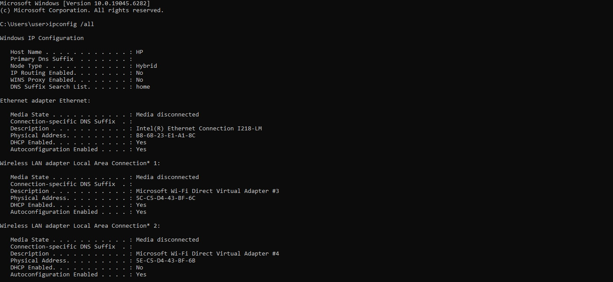

# Phases of the penetration testing process

## Learning objectives

* Describe the phases of the penetration testing process
* Describe best practices for writing the penetration test report

This section describes phases of the penetration testing process—planning, reconnaissance, scanning and enumeration, exploitation (gaining access and privilege escalation), and post-exploitation (maintaining access and covering tracks)—including the goals of each phase and key technologies used. Finally, this section covers best practices for writing the penetration test report.

## Topics covered in this section

* **Steps of the penetration testing process**
* **The penetration test report**

### Steps of the penetration testing process

Penetration tests have a tightly defined scope and are time sensitive. Penetration tests should be seen as targeted exercises. The scope of test activities and test objectives, a schedule for the test activities, and the specific machines or applications to be tested are all specified upfront in a contractual agreement between the client and ethical hacker during the planning phase. Each test objective will have its own set of parameters and processes. The contractual agreement specifies what is to be tested and how it is to be tested. The agreement,

provides a precise description, usually in the form of network addresses or modem telephone numbers, of the systems to be evaluated. Precision on this point is of the utmost importance, since a minor mistake could lead to the evaluation of the wrong system at the client’s installation or, in the worst case, the evaluation of some other organization’s system. (Palmer, 2001, p. 775)

The penetration testing process can be broken down into several phases: planning, reconnaissance, scanning and enumeration, exploitation (gaining access and privilege escalation), and post-exploitation (maintaining access and covering tracks) (NIST SP 800-115, 2008; Walker, 2017).

In the planning phase, rules are identified, management approval is finalized and documented, and testing goals are set. The planning phase sets the groundwork for a successful penetration test. No actual testing occurs in this phase. (NIST SP 800-115, 2008, p. 5-2)

In the words of Walker (2012, 2017), taken a whole, a pentest has three chronological steps: preparation, assessment, and conclusion.

The preparation phase defines the time period during which the actual contract is hammered out. The scope of the test, the types of attacks allowed, and the individuals assigned to perform the activity are all agreed upon in this phase. The assessment phase (sometimes also known as the security evaluation phase) is exactly what it sounds like—the actual assaults on the security controls are conducted during this time. Lastly, the conclusion (or post-assessment) phase defines the time when final reports are prepared for the customer, detailing the findings of the tests (including the types of tests performed) and many times even providing recommendations to improve security. (Walker, 2012, p. 8)

Beyond the planning or preparation phase, Walker (2017) proposes five main phases (the assessment phase) for a penetration test or “act of hacking” (Figure 1-2 Phases of ethical hacking): 1) Reconnaissance, which involves the steps taken to gather evidence and information on the target; 2) scanning and enumeration, which takes the information gathered in reconnaissance and applies tools and techniques to gather more in-depth information on the targets; 3) gaining access, where “true attacks are leveled against the targets enumerated in the second phase”; 4) maintaining access, where hackers attempt to ensure they have a way back into the compromised system; and 5) covering tracks, where “attackers attempt to conceal their success and avoid detection by security professionals” (p. 36). Some of the assessment phases run concurrently and continuously throughout a test.

<figure><figcaption>
Figure 1-2 Phases of ethical hacking (Walker, 2012, p. 8)
</figcaption></figure>

The ensuing discussion leans considerably on the five penetration testing phases as presented in Walker (2012, 2017), as it provides a comprehensive foundational framework for understanding the penetration testing process.

### Phase: Reconnaissance

Penetration tests begin with an extensive information gathering phase to build a profile of the target user or system to determine entry points into a computer system. In OSINT, “the penetration tester uncovers possible weaknesses and entry points within the security posture of the organization, including the network, applications, website and wireless networks, physical facilities, cloud-based systems, and employees” (cipher.com).&#x20;

Automated OSINT is used by hackers and penetration testers to gather and analyze intelligence about a specific target from social networks, including names, online handles, jobs, friends, likes/dislikes/interactions, locations, pictures, etc. (McLaughlin, 2012). Recon-ng and Maltego are intelligence gathering tools designed to facilitate the process of gathering, analyzing, and organizing OSINT.

Reconnaissance can be passive or active. Passive recon involves gathering information from the public domain in places like Internet registries, Google, newspapers, and public records. At this stage “the target does not even know generally that they are the subject of surveillance.” Active recon involves social engineering and “anything that requires the hacker to interact with the organization” (Walker, 2017, p. 45). The vast majority of OSINT activity is passive in nature.&#x20;

Recon involves collating technical information on an organization’s public-facing systems. “Internet registries, coupled with services such as Shodan or VPN Hunter, can highlight and identify an organization’s Web servers, mail servers, remote access endpoints and many other Internet-facing devices.” Recon methods include “gathering of competitive intelligence, using search engines, perusing social media sites, participating in the ever-popular dumpster dive, gaining network ranges, and raiding DNS for information” (Walker, 2017, p. 44).&#x20;

Faircloth (2011) proposes an iterative five stage reconnaissance phase: Intelligence Gathering, Footprinting, Human Recon, Verification, and Vitality. Table 17: Five Phases of Reconnaissance outlines the intelligence objectives, output (deliverables), and intelligence resources and tools for each phase. The last phase (Vitality) can be omitted in passive reconnaissance.

Table 17: Five Phases of Reconnaissance (Faircloth, 2011, p. 33)

<table data-header-hidden><thead><tr><th valign="top"></th><th valign="top"></th><th valign="top"></th><th valign="top"></th></tr></thead><tbody><tr><td valign="top">Phase</td><td valign="top">Objectives</td><td valign="top">Output</td><td valign="top">Tools</td></tr><tr><td valign="top">
Intelligence

Gathering
</td><td valign="top">To learn as much about the target, its business, its organizational structure, and its business partners as possible.</td><td valign="top">The output of this phase is a list of company names, partner organization names, and DNS names which reflect the entire target organization including all of its brands, divisions, and local representations.</td><td valign="top">
# Search engines

# Financial databases

# Business reports

# WHOIS

# RWHOIS

# Domain name registries and registrars

# Web archives

# Data mining tools
</td></tr><tr><td valign="top">Footprinting</td><td valign="top">To mine as many DNS host names as possible from the domains or company names collected and translate those into IP addresses or IP address ranges.</td><td valign="top">The output of this phase is a list of DNS host names, IP addresses, and IP address ranges.</td><td valign="top">
# DNS

# WHOIS

# DIG

# SMTP

# Data mining tools
</td></tr><tr><td valign="top">
Human

Recon
</td><td valign="top">To analyze the human perspective of the target and gain as much intelligence as possible about the people associated with the organization.</td><td valign="top">The output of this phase is a list of names, job titles, contact information, and other personal details about the people associated with the organization.</td><td valign="top">
# Search engines

# Email lists and web site posts

# Social networking services

# Publicly available records
</td></tr><tr><td valign="top">Verification</td><td valign="top">To confirm the validity of information collected in the prior phases.</td><td valign="top">This phase rarely produces new output, but can clean up existing output by removing invalid data. Some additional information can sometimes be gathered as a side-product of the verification.</td><td valign="top">
# DNS

# WHOIS

# DIG
</td></tr><tr><td valign="top">Vitality</td><td valign="top">To confirm the reachability of the IP addresses identified in prior phases. This is a phase which spreads between reconnaissance and enumeration.</td><td valign="top">The output of this phase is a list of IP addresses from prior phases which have been confirmed as reachable.</td><td valign="top">
# PING

# Port scanners

# Mapping tools
</td></tr></tbody></table>

A key argument is that there is no clear cutoff point between passive and active intelligence gathering techniques. Wheeler (2011) notes, “Although passive testing sounds harmless, beware that the definition of passive is not always consistent across the field. There are definitely gray areas to be aware of.” The confusion includes whether the use of third parties for services is considered passive testing (e.g., Ollmann, 2007), whether the process of testing can be traced back to the tester, and whether the information gathering can be performed without the knowledge of the organization under investigation (i.e., remains stealthy).

### Phase: Scanning and enumeration

Security analysts now apply the information they gathered in recon towards gathering more in-depth information on the targets.

This can be something as simple as running a ping sweep or a network mapper to see what systems are on the network, or as complex as running a vulnerability scanner to determine which ports may be open on a particular system. For example, whereas recon may have shown the network to have 500 or so machines connected to a single subnet inside a building, scanning and enumeration would tell me which ones are Windows machines and which ones are running FTP. (Walker, 2012, p. 9)

A tool like Nmap usually performs enumeration and scanning by launching custom TCP, UDP or ICMP packets against a given target. The target responds to the information requests in the form of a digital signature. This signature is key to identifying what software, protocols and OS is running the target device. Nmap scans can identify network services, OS number and version, software applications, databases, and configurations, all with high probability.&#x20;

p0f is a passive monitoring Nmap alternative. p0f is a passive fingerprinting tool that does not generate network traffic. It is used to analyze network traffic and identify patterns behind TCP/IP-based communications often blocked for Nmap active fingerprinting techniques. Passive fingerprinting uses sniffer traces from the remote system to determine the operating system of the remote host. p0f uses a fingerprinting technique based on analyzing the structure of a TCP/IP packet to determine the OS and other configuration properties of a remote host. It includes powerful network-level fingerprinting features, and the ability to analyze application-level payloads such as HTTP, and can be used for detecting NAT, proxy and load balancing setups.

Table 18: Pen Source/Free Tools—for Network Penetration Testing (Shah & Mehtre, 2015, p. 45)

<figure><figcaption>
Table 18: Pen Source/Free Tools—for Network Penetration Testing (Shah &#x26; Mehtre, 2015, p. 45)
</figcaption></figure>

Passive network sniffers can monitor and capture data packets passing through a given network in real time. “Sniffers operate at the data link layer of the network. Any data sent across the LAN is actually sent to each and every machine connected to the LAN. This is called passive since sniffers placed by the attackers passively wait for the data to be sent and capture them.” Placing a packet sniffer on a network in promiscuous mode allows a malicious intruder to capture and analyze all of the network traffic such as payloads containing confidential information.&#x20;

### Phase: Gaining access

Now true attacks are leveled against the targets enumerated in the second phase.

These attacks can be as simple as accessing an open and nonsecured wireless access point and then manipulating it for whatever purpose, or as complex as writing and delivering a buffer overflow or SQL injection against a web application. (Walker, 2012, p. 10)

### Phase: Maintaining access

Now hackers attempt to ensure they have a way back into the compromised system.

Back doors are left open by the attacker for future use—especially if the system in question has been turned into a zombie (a machine used to launch further attacks from) or if the system is used for further information gathering—for example, a sniffer can be placed on a compromised machine to watch traffic on a specific subnet. Access can be maintained through the use of Trojans, rootkits, or any number of other methods. (Walker, 2012, p. 10)

The concept of “escalation of privileges” between phases 3 and 4 refers to actions taken by a hacker to promote his access to root or administrative levels.

### Phase: Covering tracks

Now, in the final phase of security assessment, hackers attempt to conceal their presence in the compromised machines to avoid detection.

Steps taken here consist of removing or altering log files, hiding files with hidden attributes or directories, and even using tunneling protocols to communicate with the system. If auditing is even turned on and monitored, and often it is not, log files are an indicator of attacks on a machine. Clearing the log file completely is just as big an indicator to the security administrator watching the machine, so sometimes selective editing is your best bet. Another great method to use here is simply corrupting the log file itself—whereas a completely empty log file screams an attack is in progress, files get corrupted all the time and, chances are, the administrator won’t bother to try to rebuild it. In any case, good pen testers are truly defined in this phase. (Walker, 2012, p. 10)

### The penetration test report

A vulnerability scanner “actively communicates with the target system, sends the malicious packets and analyses the results, which can then be exported to PDF, HTML, CSV and other formats” (Rasskazov, 2013, p. 58). Typical vulnerability management software obtains the results and provides a comprehensive dashboard to present the results. “It can build trends, sort the results by criticality, and keep additional records, for example business purpose of the system or location” (Rodger, 2013, p. 48). The software’s reporting component can generate the compliance reports against widely used standards, for example PCI DSS, ISO 27001, or against the corporate policies, for example the percentage of computers with outdated software or weak password policy. Nexpose and other vendors include the vulnerability management software in the package with vulnerability scanners, while other vendors (e.g., Nessus) sell the software separately.

The penetration test report typically two sections: The executive summary and the technical report. “Primarily, the pentesters and their work is judged by their report” (Velu, 2013, p. 7). Pen test report writers address key considerations: Who is the audience of the report (e.g., senior management or IT staff), the purpose of testing, necessary procedures are justified, and required actions stated clearly. “A report should present outcome of the whole project by including objectives, used methodology, successful exploits, root cause of those exploits and recommendations” (Chaudhary, 2013, p.18). The report will offer an assessment of technical risk, business risk, reputational risk, and compliance risk. The key part of a penetration testing is the findings: Customers will want to prioritize the remediation activities according to classification of the findings.

The final report is a collection of all of the ethical hacker’s discoveries made during the evaluation. Vulnerabilities that were found to exist are explained and avoidance procedures specified. If the ethical hacker’s activities were noticed at all, the response of the client’s staff is described and suggestions for improvements are made. If social engineering testing exposed problems, advice is offered on how to raise awareness. This is the main point of the whole exercise: it does clients no good just to tell them that they have problems. The report must include specific advice on how to close the vulnerabilities and keep them closed. The actual techniques employed by the testers are never revealed. This is because the person delivering the report can never be sure just who will have access to that report once it is in the client’s hands. (Palmer, 2001, p. 779)

The final report is typically delivered directly to an officer of the client organization in hard-copy form. The ethical hackers would have an ongoing responsibility to ensure the safety of any information they retain, so in most cases all information related to the work is destroyed at the end of the contract. (Palmer, 2001, p. 779)

### Key takeaways

* Phases of the penetration testing process are planning, reconnaissance, scanning and enumeration, exploitation, post-exploitation, and reporting
* The two phases of reconnaissance, and scanning and enumeration are intelligence gathering phases that serve to prepare for an exploit strategy against a target. Each of the two phases can be either passive or active
* Reconnaissance can be passive (e.g., OSINT, WHOIS, social media) or active (e.g., DNS queries, network probing)
* Reconnaissance uncovers information about the target company:
  * Company structure (partners, subsidiaries).
  * Employee details (names, roles, email formats).
  * Network infrastructure (domains, subdomains, IP ranges).
  * Publicly exposed services (via search engines, Shodan).
* Scanning is more intrusive than reconnaissance, often active. Scanning techniques include:
  * Host discovery (ICMP, ARP, TCP/UDP probes).
  * Port scanning (TCP SYN, Connect, UDP scans).
  * OS & service fingerprinting (banner grabbing, version detection).
  * Vulnerability scanning (automated tools like Nessus, OpenVAS).
* Scanning discovers live hosts, open ports, running services, and potential vulnerabilities
* Enumeration represents deeper probing to extract usable attack surfaces:
  * User accounts (via LDAP, SMB, SMTP, RPC).
  * Network shares & services (NFS, Samba, NetBIOS).
  * Application-specific data (SQL databases, SNMP, DNS records).
  * Email lists (harvested from exposed directories or breaches).
  * Results in a refined target list (e.g., vulnerable services, weak credentials).

### References

NIST Special Publication 800-115: Technical Guide to Information Security Testing and Assessment (NIST 800-115). Retrieved January 21, 2020, from http://csrc.nist.gov/publications/nistpubs/800-115/SP800-115.pdf

Walker, M. (2012). Certified Ethical Hacker Exam Guide. Columbus: McGraw-Hill Osborne.

Walker, M. (2017). CEH Certified Ethical Hacker All-in-One Exam Guide, Second Edition. New York, NY: McGraw-Hill Education.
