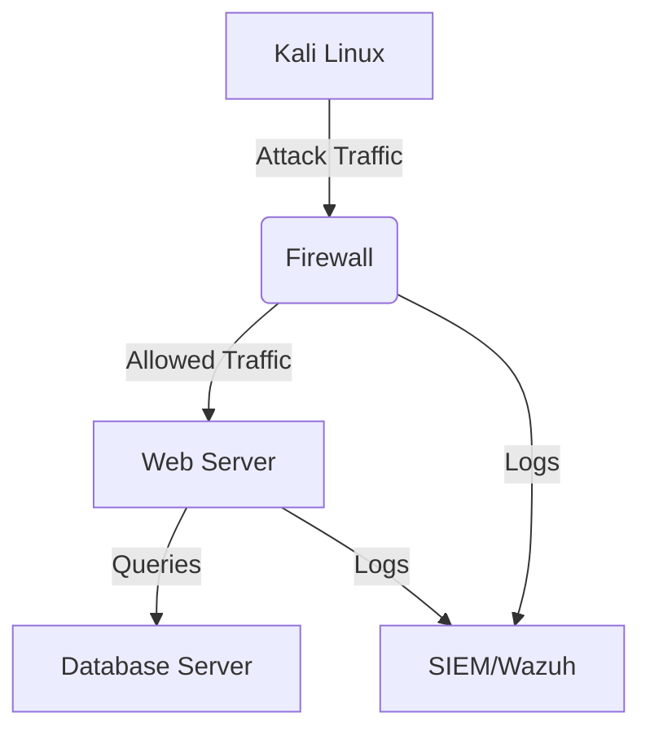

# Setting up a cybersecurity lab

## Learning objectives

- Design, configure, verify, and operate a fully functional virtual cybersecurity lab using exclusively open source technologies
- Document the lab design, deployment, and validation process using a suitable open source documentation platform
- Design a multi-component cybersecurity lab architecture by following a provided design pipeline
- Compare open source virtualization tools and select one appropriate for your lab design
- Build a virtual network with functional security layers, including firewall, IDS/IPS, and monitoring (SIEM)
- Configure target systems (web/database servers) and an attack platform (Kali Linux) to validate the lab

This section provides a practical hands-on guide to constructing a complete cybersecurity lab environment from the ground up using only free and open-source tools. You will learn to architect a realistic network containing defensive security controls—such as firewalls (e.g., nftables and OPNsense), intrusion detection systems/intrusion prevention systems (e.g., Suricata and Snort), and security monitoring (e.g., Wazuh XDR/SIEM)—alongside both target services (e.g., Apache and MySQL) and an offensive security workstation (Kali Linux). The guide walks you through the entire process: from selecting a virtualization platform that matches your host hardware, to designing your lab's topology, implementing and configuring each component, verifying connectivity and functionality, and finally documenting the entire project. By the end, you will have a fully isolated, functional virtual lab where you can safely launch simulated attacks, observe defensive telemetry, and develop practical cybersecurity skills.

## Topics covered in this section

* **Choose a project documentation platform**
* **Design the cybersecurity lab (choose a design pipeline)**
* **Choose a virtualization environment**
* **Build the lab**

### Choose a project documentation platform

Before configuring any virtual hardware, establishing a documentation repository is a critical first step. A well-structured lab log prevents configuration drift, ensures repeatability, and serves as a future reference for troubleshooting. Select one of the following platforms to capture your design diagrams, firewall rules, and test results.

**Comparison Table: Documentation Platforms**

|Feature|GitHub|GitHub Wiki|GitHub Pages|GitBook|
|---|---|---|---|---|
|**Type**|Git Repository|Wiki (Markdown)|Static Website|Professional Docs|
|**Hosting**|Free (GitHub)|Free (GitHub)|Free (GitHub)|Free (limited) / Paid|
|**Collaboration**|Yes (Git/GitHub UI)|Yes (Git/GitHub UI)|Via Git|Real-time (paid)|
|**Version Control**|Yes (Git)|Yes (Git)|Yes (Git)|Yes (Git integration)|
|**Customization**|Raw Markdown/Text|Basic (Markdown only)|Full (HTML/CSS/JS + SSGs*)|Medium (themes & plugins)|
|**Search**|Code-aware search|Basic (GitHub search)|Custom (Algolia/Google possible)|Full-text|
|**Diagrams/Visuals**|Rendered in Markdown files|Images only|Images + JS diagrams (e.g., Mermaid)|Embeds|
|**Export Options**|Clone / Zip|Markdown|HTML/PDF|PDF/HTML/ePub|
|**Best For**|Code + Docs in one place|Quick technical notes|Professional project websites|Developer/API docs|
|**Limitations**|Not a structured doc site|No styling/themes|Requires Git/static-site setup|Free tier is limited|

_SSGs = Static Site Generators (e.g., Jekyll, MkDocs, Docusaurus)._

**Clarifications:**

- **For a simple, Git-backed workflow:** Use a standard **GitHub** repository. Store Markdown files alongside your lab configuration scripts and network diagrams for a single source of truth.
- **For quick, linked notes:** **GitHub Wiki** provides a lightweight, version-controlled wiki that lives alongside your repository.
- **For a polished project website:** **GitHub Pages + MkDocs** generates a free, searchable, and professional-looking static site from Markdown source files.
- **For developer-centric documentation:** **GitBook** offers a clean interface and strong API reference features, though the free tier includes usage limitations and it is a proprietary cloud service.

#### Diagramming Tools: [Draw.io](https://draw.io/) vs Mermaid.js

For network topologies and flowcharts, you will need a dedicated diagramming tool alongside your text documentation.

|Platform/Tool|Type|Version Control Friendly|Best Use Case|
|---|---|---|---|
|**[Draw.io](https://draw.io/)**|GUI (Drag-and-drop)|Yes (save `.drawio` source file in Git)|Complex network diagrams, custom shapes, visual topologies.|
|**Mermaid.js**|Code-based (Markdown-like syntax)|Yes (diagram is code/text)|Simple flowcharts, sequence diagrams, and diagrams that need to update automatically with documentation changes.|

**How to Embed [Draw.io](https://draw.io/) Diagrams in Your Documentation Platform**

|Platform|Embed Method|Mermaid.js Support|
|---|---|---|
|**GitHub (Repo)**|Export as `.png` or `.svg` → place in repo → reference in Markdown using ``.|✅ Yes (native rendering in Markdown files)|
|**GitHub Wiki**|Export as `.png`/`.svg` → upload to Wiki → reference in Markdown.|❌ No (Markdown-only)|
|**GitHub Pages**|Export as `.svg` → place in `docs/images/` → embed with standard Markdown or HTML.|✅ Yes (with MkDocs/Jekyll plugins)|
|**GitBook**|Export as `.png`/`.svg` → upload or embed cloud link.|✅ Yes (native support)|

**Recommendation:**

- Use **Mermaid.js** for simple, version-controlled diagrams (e.g., data flow, sequence steps) directly within your Markdown files.
- Use **[Draw.io](https://draw.io/)** for complex network infrastructure designs. **Crucially, save the `.drawio` source file in your documentation repository.** This ensures you can edit the diagram later without starting from a static image.

Example Mermaid.js Flowchart:

### Design the cybersecurity lab (choose a design pipeline)

**Design Pipeline 1 (ARM64):**

nftables (firewall) + Suricata (IDS/IPS) + web server (Apache) + database server (MySQL) + Wazuh (SIEM/XDR) + Kali Linux

**Design Pipeline 2 (AMD64):**

OPNsense (firewall) + Suricata (IDS/IPS) + web server (Apache) and/or database server (MySQL) + Wazuh (SIEM/XDR) + Kali Linux

**Design Pipeline 3 (AMD64):**

pfSense (firewall) + Snort (IDS/IPS) + web server (Apache) and/or database server (MySQL) + Wazuh (SIEM/XDR) + Kali Linux

**🔥 Open Source Firewall Compatibility Table**

**Key:** ✔ = Supported | ✕ = Not Supported | Bare Metal = replaces host OS

| Firewall      | Linux Host (x86/ARM) | Windows Host (x86) | macOS Host (Intel) | macOS Host (ARM) | Notes                                                              |
| ------------- | -------------------- | ------------------ | ------------------ | ---------------- | ------------------------------------------------------------------ |
| **OPNsense**  | ✔ (VM)               | ✔ (VM)             | ✔ (VM)             | ✕                | FreeBSD-based. Bare metal requires wiping host OS. No ARM support. |
| **pfSense**   | ✔ (VM)               | ✔ (VM)             | ✔ (VM)             | ✕                | FreeBSD-based, same as OPNsense.                                   |
| **IPTables**  | ✔ (Native)           | ✕                  | ✕                  | ✕                | Legacy Linux kernel firewall.                                      |
| **nftables**  | ✔ (Native)           | ✕                  | ✕                  | ✕                | Modern Linux firewall (replaces IPTables).                         |
| **UFW**       | ✔ (Native)           | ✕                  | ✕                  | ✕                | Ubuntu/Debian simplified firewall.                                 |
| **Firewalld** | ✔ (Native)           | ✕                  | ✕                  | ✕                | RHEL/CentOS frontend for IPTables/nftables.                        |
| **macOS PF**  | ✕                    | ✕                  | ✔ (Native)         | ✔ (Native)       | Built-in BSD `pf` firewall (CLI-only).                             |

**Clarifications:**

- **OPNsense/pfSense:** 
   * **VM Support:** Works on x86 hosts (Linux/Windows/Intel macOS).
   * **macOS ARM:** ✕ No VM support (FreeBSD lacks ARM virtualization drivers).
   * **Bare Metal:** x86 only (wipes host OS).
- **Linux Firewalls (IPTables/nftables/UFW/Firewalld):**
   * **Native to Linux** (no VM or cross-platform support).
- **macOS PF:**
   * Native on both Intel/ARM Macs (CLI-only).

**🛡️ Open Source IDS/IPS Compatibility Table**

**Key:** ✔ = Supported | ✕ = Not Supported | ⚠ = Partial/Experimental

| Technology     | Linux Host (x86/ARM) | Windows Host (x86) | macOS Host (Intel/ARM) | Notes                                                                   |
| -------------- | -------------------- | ------------------ | ---------------------- | ----------------------------------------------------------------------- |
| **Suricata**   | ✔ (Native/VM)        | ✔ (Native/WSL2)    | ✔ (Native/VM)          | Multi-threaded, supports inline IPS. ARM64 works on Raspberry Pi 4+.    |
| **Zeek (Bro)** | ✔ (Native)           | ⚠ (WSL2/Cygwin)    | ✔ (Native)             | Network analysis, not real-time IPS. ARM64 supported via source builds. |
| **Snort**      | ✔ (Native)           | ✔ (Native)         | ✔ (Native)             | Legacy IDS/IPS. ARM support limited.                                    |

**Clarifications:**

* **Windows Subsystem for Linux (WSL)**
  * Lets you run Linux binaries natively on Windows.
  * ⚠️ Limited networking (WSL2 uses a virtual NIC).
* **x86-64**
  * x86-64 is also known as x64, x86\_64, AMD64, and Intel 64.
  * x86-64 is a CPU architecture. It is used by:
    * Windows (e.g., Windows 10/11 x64).
    * Linux (x86-64 distributions).
    * FreeBSD (OPNsense’s base).
    * macOS (Intel Macs).

### Choose a virtualization environment

**Open Source and Free Virtualization Tools**

| **Virtual Machine**           | **Host OS**            | **License**        | **Multiple VMs** | **Snapshots** | **Cloning** | **Notes**                                                         |
| ----------------------------- | ---------------------- | ------------------ | ---------------- | ------------- | ----------- | ----------------------------------------------------------------- |
| **Oracle VM VirtualBox**      | macOS, Windows, Linux  | GPLv2              | ✅ Yes            | ✅ Yes         | ✅ Yes       | Fully open-source. Best balance of features & usability.          |
| **VMware Workstation Player** | Windows, Linux         | Free (Proprietary) | ❌ No (Single VM) | ✅ Yes         | ✅ Yes       | Free version restricts to 1 running VM. Good for lightweight use. |
| **VMware Fusion Player**      | macOS (Intel/ARM) only | Free (Proprietary) | ✅ Yes            | ✅ Yes         | ✅ Yes       | Better macOS integration.                                         |
| **QEMU**                      | macOS, Windows, Linux  | GPLv2              | ✅ Yes (via CLI)  | ❌ No\*        | ✅ (Manual)  | Advanced, needs KVM for best performance. No native snapshot UI.  |

**Clarifications:**

* **For open-source & full features** → **VirtualBox** (cross-platform, supports multiple VMs, snapshots, cloning).
* **For macOS-only free use** → **VMware Fusion Player** (better performance than VirtualBox but single-VM limit).
* **For lightweight Windows/Linux use** → **VMware Workstation Player** (free but single-VM limit).

**QEMU: Emulation vs. Virtualization**

* QEMU by itself is primarily an emulator—it can emulate entire systems (CPU, memory, devices) even on different architectures (e.g., running ARM on x86). This makes it flexible but slower than hardware-assisted virtualization.
* QEMU + KVM (Kernel-based Virtual Machine) enables full hardware-assisted virtualization (like VMware or VirtualBox) when running on Linux.
  * KVM is a Linux kernel module that turns the host OS into a Type-1 hypervisor (bare-metal virtualization). It allows QEMU to run VMs with near-native performance by using CPU virtualization extensions (Intel VT-x / AMD-V).
* On Windows, QEMU can use WHPX (Windows Hypervisor Platform) for acceleration, but performance may not be as good as KVM on Linux or dedicated hypervisors like VMware/Hyper-V.
  * WHPX is a hypervisor-based acceleration feature on Windows 10/11 Pro and Enterprise editions. It allows virtualization software (like QEMU) to use hardware-assisted virtualization (Intel VT-x / AMD-V).

### Build the lab

Building a fully functional virtual lab entails:

  * **Configure subnet interfaces and verify connectivity**
  * **Configure and verify the firewall**
  * **Configure and verify the IDS/IPS**
  * **Configure and verify a web server (e.g., nginx or Apache) and/or a database server (e.g., MySQL)**
  * **Configure and verify SIEM/EDR (e.g., Wazuh)**
  * **Configure and verify Kali Linux**
  * **Launch attacks from Kali Linux and publish the project**

#### Walk through/example 1 using Design Pipeline 1 (ARM64):

nftables (firewall) + Suricata (IDS/IPS) + web server (Apache) + database server (MySQL) + Wazuh (SIEM/XDR) + Kali Linux

Cybersecurity virtual lab in VMware Fusion on M1 Mac:

* [Lab design and configuring interfaces](https://drive.proton.me/urls/TM4PKAVGM4#48yHrBXTk0nA)
* [Testing/troubleshooting network connectivity](https://drive.proton.me/urls/VRKY3A12FC#Vjc5DoAfwaHh)
* [Configuring nftables on the Debian firewall](https://drive.proton.me/urls/6CWHJ0269M#Se4xqwyz4UNv)
* [Configuring Suricata on the Debian IDS/IPS](https://drive.proton.me/urls/NH9SG0ZZW4#QOf2lieJuOTS)
* [Setting up Apache HTTP Server on Ubuntu](https://drive.proton.me/urls/9NJRE0HBNR#V6Lb057YQUeF)
* [Setting up MySQL Server on Ubuntu](https://drive.proton.me/urls/XG01TWTEX0#R4dutVB8XUq5)
* [Setting up Wazuh (SIEM/XDR) on Ubuntu server](https://drive.proton.me/urls/R74XWK7XSW#7x1OsbPmpCmr)
* Setting up Kali Linux for security testing

#### Walk through/example 2 using Design Pipeline 2 (AMD64):

OPNsense (firewall) + Suricata (IDS/IPS) + web server (Apache) and/or database server (MySQL) + Wazuh (SIEM/XDR) + Kali Linux

Cybersecurity virtual lab in VirtualBox on Windows (YouTube playlist. 16 videos):

[Virtual Cyber Security Lab Building Series by LS111 Cyber Security Education](https://www.youtube.com/playlist?list=PLjjkJroii8DDb0QZpWLo978VXcLp8-xW3)

<figure><figcaption>
Cybersecurity virtual lab design (courtesy of LS111 Cyber Security Education)
</figcaption></figure>

### Key takeaways

- Lab Design is Architectural: A functional cybersecurity lab is built by integrating specific, discrete components into a logical pipeline: a firewall, an IDS/IPS, target services (web/database servers), a SIEM for monitoring, and an attack platform like Kali Linux.
- Tool Compatibility is Foundational: Successfully building a virtual lab requires ensuring that your chosen virtualization software, guest operating systems, and security tools are all compatible with each other and with your host machine's architecture (x86/AMD64 vs. ARM64). Performance and functionality depend on this alignment.
- Emulation vs. Virtualization: Pure emulation (like QEMU alone) emulates different hardware architectures for flexibility but sacrifices speed, while hardware-assisted virtualization (like QEMU+KVM or VirtualBox) uses host CPU extensions for near-native performance when running same-architecture systems.
- Tool Selection is Critical: The choice of every component depends heavily on your host operating system and CPU architecture, as not all open-source tools are cross-platform. You must consult compatibility tables to make viable choices (e.g., OPNsense does not run on ARM macOS).
- Documentation is Part of the Process: Choosing a suitable documentation platform (like a GitHub Wiki or MkDocs) for planning, recording configurations, and storing diagrams is essential for project management, knowledge retention, and sharing your work.
- Build, Test, Validate: The core lab setup process is iterative: after building virtual machines, you must configure networking, verify connectivity, and methodically configure each component before finally testing the entire system's functionality with simulated attacks.

### References

Bejtlich, R. (2013). _The practice of network security monitoring: Understanding incident detection and response_. No Starch Press.

Chee, B. J. S., & Franklin, C., Jr. (2010). _Virtualization: A beginner's guide_. McGraw-Hill Osborne Media.

LS111 Cyber Security Education. (n.d.). _Virtual cyber security lab building series_ [YouTube playlist]. Retrieved June 3, 2024, from https://www.youtube.com/playlist?list=PLjjkJroii8DDb0QZpWLo978VXcLp8-xW3
